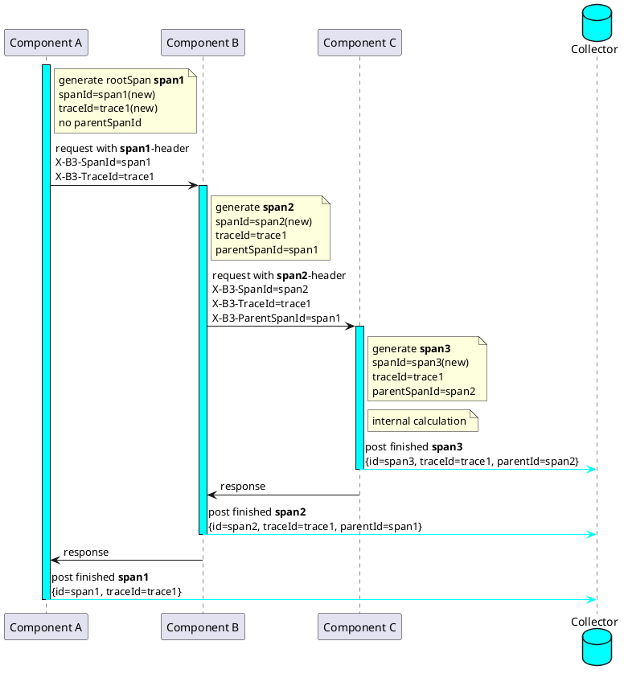
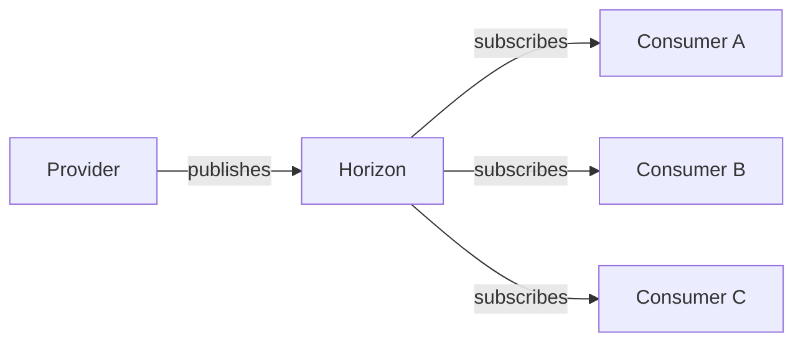
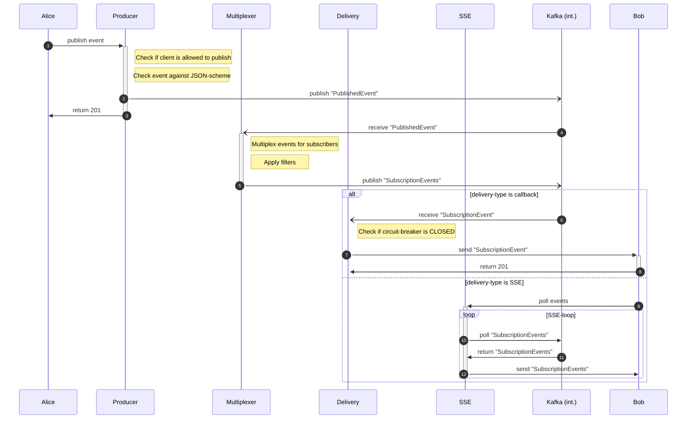
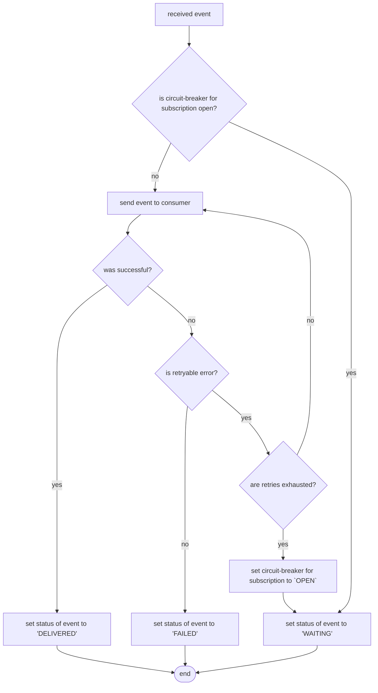
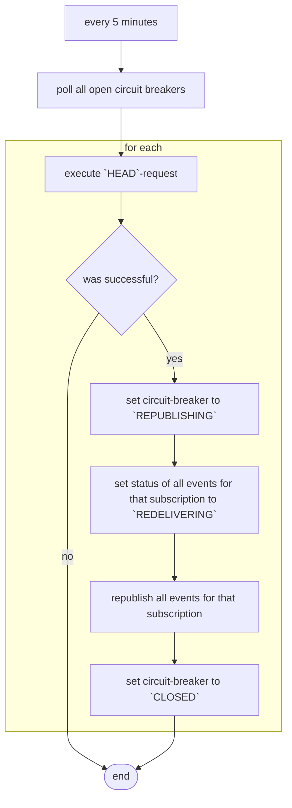

# API Security on StarGate

**Table of Contents** 

[[_TOC_]]

**The communication is secured using standard Open ID connect protocol on T‧AR‧D‧I‧S**

**A standard OAuth 2.0 "Client credential flow" is used to secure the APIs exposed on the Gateway.**


### Communication between two services

[](img/Slide13.PNG)


# Sample Code


We also provide sample codes for customers in order to ease implementation at their end. The code is hosted on the [Magenta CICD GitLab](https://gitlab.devops.telekom.de/tardis/samplecode), which is a public platform. You can just create an account, if you don't already have one.
If you want to provide sample code or so-called reference implementation, you can submit it [here](https://gitlab.devops.telekom.de/tardis/samplecode/customer-samplecode/collection)!


## API clients and provider (Rover)

Client to help application to get an access Token and forward access token with the request. For providers, we have an example to protect your API!

Here you can find the [Samplecode](https://gitlab.devops.telekom.de/tardis/samplecode/api-consumer-and-provider) for both partys grouped by the programming languages provided so far


## Event consumer and provider (Horizon)

Example implementation of the Horizon interfaces for publishing and subscribing applications.

Here you can find the [Samplecode](https://gitlab.devops.telekom.de/tardis/samplecode/event-provider-and-consumer) for both partys grouped by the programming languages provided so far

## Drax Tracing Examples
See the examples in [Guardians Drax Knowledge-Sheet](https://developer.telekom.de/docs/src/tardis_customer_handbook/drax/CustomerKnowledgeSheetDrax/).


Below you can find the customer journeys for both, API usage and Publish/subscribe.

## API Journey for API Consumer/Provider on StarGate via Rover/MissionControl

[](img/API_Journey.png)

## Horizon Journey

[](img/pubsub-journey.png)


# Overview of Roles to permission management

Please refer [Chevron onboarding doc](../chevron/) for more details.

[](img/Slide22.PNG)

[](img/Slide23.PNG)

[](img/Slide24.PNG)

[](img/Slide25.PNG)

[](img/Slide26.PNG)

[](img/Slide27.PNG)

[](img/Slide28.PNG)

[](img/Slide29.PNG)


# T‧AR‧D‧I‧S

!!! info "Upcoming T‧AR‧D‧I‧S Events"
    Upcoming deep dives, system demos and open calls can be found [here](https://yam-united.telekom.com/pages/eni-hub/apps/events/tardis-events).
    The latest recording of `Stargate Onboarding Technical Deep Dive` can be found [here](https://yam-united.telekom.com/pages/eni-hub/apps/blog/tardis-blog/view/17f8e05a-1915-43f2-954b-5bde8cb7688f).

**Telekom Architecture for Decoupling and Integration of Service.**

A suite of product components providing solutions for common and recurring aspect.


## StarGate

**StarGate is a managed gateway to cater Hybrid API management in DT-IT**

Provides gateway mesh functionality to offer seamless exposure and consumption of APIs even cross clouds.

This means a service exposed on AWS, CaaS (DE4 Env), AppAgile, Biere … can be seamless consumed from all those cloud environments with approved security.

API security based on OpenID Connect.

Rover ctl tool to facilitate the automation of endpoint publishing and Subscription from CI/CD pipelines.

Integration between StarGate and IRIS (M2M IDP) to enable Authentication and Authorization for published APIs.

[](img/Slide3.PNG)

## IRIS

**OpenID Connect Identity Server based on Keycloak and customized for API use**

Keycloak in two flavors.

**M2M(Machine2Machine) Keycloak** integrated with the Stargate for self service onboarding of APIs.

**H2M(Human to Machine) Keykloak** integrated with ADFS (Active Directory Federation Service) which provides out of the box login and CIAM Roles for Telekom (emea1 & emea2)

[](img/Slide4.PNG)

## Gateway Mesh

GW Mesh allows secure and seamless exposure and consumption of APIs across cloud environments.

[](img/Slide5.PNG)

## Stargate & Rover

Command line tool to facilitate runtime configuration of APIs on StarGate & IRIS from CI/CD pipelines.

[](img/Slide8.PNG)

## Chevron

**In-House product that enables consistent identity and permission management for APIs**

Permission service which to resolve CIAM Roles into fine grained RBAC (Role based access control)

[](img/Slide6.PNG)

## Horizon

**Pub/Sub integration pattern exposed via Rest APIs**
Powerful and flexible: Event types, selection filter, response filter, Delivery via callback or server send events (streaming)

[](img/Horizon.PNG)

## Guardians

**Logging, Monitoring and Tracing infrastructure based on EFK stack, Prometheus/Grafana and Jaeger**

Provides endpoints for writing, managed target databases ("Elasticsearch as a Service") and controlled data access via sophisticated UIs

Running on CaaS (currently DE3 only, DE4 under construction) and AWS

[](img/Guardians.png)

## CloudWalker

**File transfer solution that allows transfer of large files over gateway**

[](img/cloudwalker.png)

## Maverick

Maverick is our Developer Portal

[](img/DeveloperPortal.png)

## Spectre

Spectre is our API listening solution.

[](img/Spectre.png)

## Support

**T‧AR‧D‧I‧S Support Information**

For Support Information please visit [Support Section](support/).


# Environment Overview

On T‧AR‧D‧I‧S, we are offering different types of environments:

* **Runtime** environments:  
  These are environments that each run in their own, dedicated clusters.  
* **Virtual** environments:  
  These environments all **share** one physical cluster which we call **QA**,  
  they were created and named to facilitate the historic, well-established release container testing stages.  
  There is also an [entry in our FAQ](https://developer.telekom.de/docs/src/tardis_faqs/#which-environment-should-i-use) on which environment to use. 

The **hierarchy** of these environments is as follows, 
with respect to e. g. stability or maturity of features and deployments. 

`playground` → `QA` → `preprod` → `prod` 

I. e. this means we **recommend** to move from playground onto a more mature environment 
whenever you are done experimenting and playing around. 
This is also because we will deploy new features and fixes according to the hierarchy, 
which in turn means that **on playground things may break**. 

=== "Runtime"

    | Environment | Status | Purpose |
    |:------------|:------:|:--------|
    | playground  | :white_check_mark: Available | SandBox, great for experiments |
    | preprod     | :white_check_mark: Available | Integration/Testing with partner system |
    | prod        | :white_check_mark: Available | Production |

=== "Virtual envrionments"

    | Environment | Status | Purpose |
    |:------------|:------:|:--------|
    | av          | :white_check_mark: Available | Release Testing OSS |
    | bond        | :white_check_mark: Available | Testing Environment |
    | frv         | :white_check_mark: Available | Production Reference OSS |
    | cit2        | :white_check_mark: Available | Release Testing BSS |
    | cit4        | :white_check_mark: Available | Production Reference BSS |
    | rv          | :white_check_mark: Available | Last & Performance OSS |
    | sit         | :white_check_mark: Available | System Integration Test |

Customers can use any of these Environments. Although, it is advised to always use Preprod env before going to Prod.

## StarGate and Iris

Applications should always communicate with the nearest StarGate available next to their runtime Applications.

If your application runs on HITNET or CNDTAG or OTC & AppAgile or CaaS then please use CaaS as Zone in `Rover.yml`

If your application runs on AWS then select use AWS as Zone in `Rover.yml`

### StarGate ZONE: AWS

=== "Runtime"

    | Environment | Stargate                          | IRIS M2M|
    |-------------|-----------------------------------|--------------------|
    | playground  | https://stargate-playground.live.dhei.telekom.de |  https://iris-playground.live.dhei.telekom.de/auth/realms/default |
    | preprod     | https://stargate-preprod.live.dhei.telekom.de | https://iris-preprod.live.dhei.telekom.de/auth/realms/default |
    | prod        | https://stargate.prod.dhei.telekom.de |  https://iris.prod.dhei.telekom.de/auth/realms/default |

=== "Virtual envrionments"

    | Environment | Stargate                          | IRIS M2M|
    |-------------|-----------------------------------|--------------------|
    | av          | https://stargate.qa.dhei.telekom.de/av |  https://iris.qa.dhei.telekom.de/auth/realms/av |
    | bond        | https://stargate.qa.dhei.telekom.de/bond |  https://iris.qa.dhei.telekom.de/auth/realms/bond |
    | frv         | https://stargate.qa.dhei.telekom.de/frv |  https://iris.qa.dhei.telekom.de/auth/realms/frv |
    | cit2        | https://stargate.qa.dhei.telekom.de/cit2 |  https://iris.qa.dhei.telekom.de/auth/realms/cit2 |
    | cit4        | https://stargate.qa.dhei.telekom.de/cit4 |  https://iris.qa.dhei.telekom.de/auth/realms/cit4 |
    | rv          | https://stargate.qa.dhei.telekom.de/rv |  https://iris.qa.dhei.telekom.de/auth/realms/rv |
    | sit         | https://stargate.qa.dhei.telekom.de/sit |  https://iris.qa.dhei.telekom.de/auth/realms/sit |

### StarGate ZONE: CaaS

=== "Runtime"

    | Environment | Stargate                          | IRIS M2M|
    |-------------|-----------------------------------|--------------------|
    | playground  | https://stargate-playground.caas-t01.telekom.de | https://iris-playground.caas-t01.telekom.de/auth/realms/default |
    | preprod     | https://stargate-preprod.caas-t01.telekom.de | https://iris-preprod.caas-t01.telekom.de/auth/realms/default |
    | prod        | https://stargate.caas-p01.telekom.de | https://iris.caas-p01.telekom.de/auth/realms/default |

=== "Virtual envrionments"

    | Environment | Stargate                          | IRIS M2M|
    |-------------|-----------------------------------|--------------------|
    | av          | https://stargate-qa.caas-t01.telekom.de/av |  https://iris-qa.caas-t01.telekom.de/auth/realms/av |
    | bond        | https://stargate-qa.caas-t01.telekom.de/bond |  https://iris-qa.caas-t01.telekom.de/auth/realms/bond |
    | frv         | https://stargate-qa.caas-t01.telekom.de/frv |  https://iris-qa.caas-t01.telekom.de/auth/realms/frv |
    | cit2        | https://stargate-qa.caas-t01.telekom.de/cit2 |  https://iris-qa.caas-t01.telekom.de/auth/realms/cit2 |
    | cit4        | https://stargate-qa.caas-t01.telekom.de/cit4 |  https://iris-qa.caas-t01.telekom.de/auth/realms/cit4 |
    | rv          | https://stargate-qa.caas-t01.telekom.de/rv |  https://iris-qa.caas-t01.telekom.de/auth/realms/rv |
    | sit         | https://stargate-qa.caas-t01.telekom.de/sit |  https://iris-qa.caas-t01.telekom.de/auth/realms/sit |

### StarGate ZONE: Cetus (CaaS T21, P21 - TPC)

=== "Runtime"

    | Environment | Stargate                                            | IRIS M2M           |
    |-------------|-----------------------------------------------------|--------------------|
    | playground  | https://stargate-cetus.playground.tardis.telekom.de | https://iris-cetus.playground.tardis.telekom.de/auth/realms/default |
    | preprod     | https://stargate-cetus.preprod.tardis.telekom.de    | https://iris-cetus.preprod.tardis.telekom.de/auth/realms/default    |
    | prod        | https://stargate-cetus.prod.tardis.telekom.de    | https://iris-cetus.prod.tardis.telekom.de/auth/realms/default    |


=== "Virtual envrionments"

    | Environment | Stargate                          | IRIS M2M|
    |-------------|-----------------------------------|--------------------|
    | av          | https://stargate-cetus.qa.tardis.telekom.de/av   |  https://iris-cetus.qa.tardis.telekom.de/auth/realms/av |
    | bond        | https://stargate-cetus.qa.tardis.telekom.de/bond |  https://iris-cetus.qa.tardis.telekom.de/auth/realms/bond |
    | frv         | https://stargate-cetus.qa.tardis.telekom.de/frv  |  https://iris-cetus.qa.tardis.telekom.de/auth/realms/frv |
    | cit2        | https://stargate-cetus.qa.tardis.telekom.de/cit2 |  https://iris-cetus.qa.tardis.telekom.de/auth/realms/cit2 |
    | cit4        | https://stargate-cetus.qa.tardis.telekom.de/cit4 |  https://iris-cetus.qa.tardis.telekom.de/auth/realms/cit4 |
    | rv          | https://stargate-cetus.qa.tardis.telekom.de/rv   |  https://iris-cetus.qa.tardis.telekom.de/auth/realms/rv |
    | sit         | https://stargate-cetus.qa.tardis.telekom.de/sit  |  https://iris-cetus.qa.tardis.telekom.de/auth/realms/sit |

### Spacegate ZONE: Space

=== "Runtime"

    | Environment | Spacegate                          | IRIX M2M|
    |-------------|-----------------------------------|--------------------|
    | playground  | https://playground.spacegate.telekom.de |  https://playground.spacegate.telekom.de/auth/realms/default |
    | preprod     | https://preprod.spacegate.telekom.de | https://preprod.spacegate.telekom.de/auth/realms/default |
    | prod        | https://api.telekom.de |  https://api.telekom.de/auth/realms/default |

=== "Virtual envrionments"

    | Environment | Stargate                          | IRIX M2M|
    |-------------|-----------------------------------|--------------------|
    | av          | https://qa.spacegate.telekom.de/av |  https://qa.spacegate.telekom.de/auth/realms/av |
    | bond        | https://qa.spacegate.telekom.de/bond |  https://qa.spacegate.telekom.de/auth/realms/bond |
    | frv         | https://qa.spacegate.telekom.de/frv |  https://qa.spacegate.telekom.de/auth/realms/frv |
    | cit2        | https://qa.spacegate.telekom.de/cit2 |  https://qa.spacegate.telekom.de/auth/realms/cit2 |
    | cit4        | https://qa.spacegate.telekom.de/cit4 |  https://qa.spacegate.telekom.de/auth/realms/cit4 |
    | rv          | https://qa.spacegate.telekom.de/rv |  https://qa.spacegate.telekom.de/auth/realms/rv |
    | sit         | https://qa.spacegate.telekom.de/sit |  https://qa.spacegate.telekom.de/auth/realms/sit |

### Spacegate ZONE: Canis (CaaS T21, P21 - TPC)

=== "Runtime"

    | Environment | Spacegate                          | IRIX M2M|
    |-------------|-----------------------------------|--------------------|
    | playground  | https://spacegate-canis.playground.tardis.telekom.de | https://spacegate-canis.playground.tardis.telekom.de/auth/realms/default |
    | preprod     | https://spacegate-canis.preprod.tardis.telekom.de    | https://spacegate-canis.preprod.tardis.telekom.de/auth/realms/default    |
    | prod        | https://sg-api.telekom.de    | https://sg-api.telekom.de/auth/realms/default    |

=== "Virtual envrionments"

    | Environment | Stargate                                          | IRIX M2M           |
    |-------------|---------------------------------------------------|--------------------|
    | av          | https://spacegate-canis.qa.tardis.telekom.de/av   |  https://spacegate-canis.qa.tardis.telekom.de/auth/realms/av   |
    | bond        | https://spacegate-canis.qa.tardis.telekom.de/bond |  https://spacegate-canis.qa.tardis.telekom.de/auth/realms/bond |
    | frv         | https://spacegate-canis.qa.tardis.telekom.de/frv  |  https://spacegate-canis.qa.tardis.telekom.de/auth/realms/frv  |
    | cit2        | https://spacegate-canis.qa.tardis.telekom.de/cit2 |  https://spacegate-canis.qa.tardis.telekom.de/auth/realms/cit2 |
    | cit4        | https://spacegate-canis.qa.tardis.telekom.de/cit4 |  https://spacegate-canis.qa.tardis.telekom.de/auth/realms/cit4 |
    | rv          | https://spacegate-canis.qa.tardis.telekom.de/rv   |  https://spacegate-canis.qa.tardis.telekom.de/auth/realms/rv   |
    | sit         | https://spacegate-canis.qa.tardis.telekom.de/sit  |  https://spacegate-canis.qa.tardis.telekom.de/auth/realms/sit  |

## Mission Control UI

=== "Runtime"

    | Environment | Mission Control                   | Purpose|
    |-------------|-----------------------------------|--------------------|
    | playground  | https://missioncontrol-playground.live.dhei.telekom.de | APIs overview in Playground |
    | preprod     | https://missioncontrol-preprod.live.dhei.telekom.de | APIs overview  in Preprod |
    | prod        | https://missioncontrol.prod.dhei.telekom.de | APIs overview in Production |

=== "Virtual envrionments"

    | Environment | Mission Control                   | Purpose|
    |-------------|-----------------------------------|--------------------|
    | av          | https://missioncontrol.qa.dhei.telekom.de/?env=av | APIs overview in AV |
    | bond        | https://missioncontrol.qa.dhei.telekom.de/?env=bond | APIs overview in BOND |
    | frv         | https://missioncontrol.qa.dhei.telekom.de/?env=frv | APIs overview in FRV |
    | cit2        | https://missioncontrol.qa.dhei.telekom.de/?env=cit2 | APIs overview in CIT2 |
    | cit4        | https://missioncontrol.qa.dhei.telekom.de/?env=cit4 | APIs overview in CIT4 |
    | rv          | https://missioncontrol.qa.dhei.telekom.de/?env=rv | APIs overview in RV |
    | sit         | https://missioncontrol.qa.dhei.telekom.de/?env=sit | APIs overview in SIT |


## Raccoon Grafana UI

| Environment | Raccoon/Grafana         | Purpose|
|-------------|-----------------------------------|--------------------|
| playground, preprod and qa  | <https://grafana-rocket-raccoon-guardians.live.dhei.telekom.de> | Query T‧AR‧D‧I‧S metrics for playground, preprod and virtual test envs |
| prod        | <https://grafana-rocket-raccoon-guardians.prod.dhei.telekom.de> | Query T‧AR‧D‧I‧S metrics for production |

## Drax Jaeger UI

| Environment | Drax/JaegerUI         | Purpose|
|-------------|-----------------------------------|--------------------|
| playground and preprod  | <https://drax-guardians.live.dhei.telekom.de> | Query T‧AR‧D‧I‧S traces for playground and preprod |
| qa  | <https://drax-guardians.qa.dhei.telekom.de> | Query T‧AR‧D‧I‧S traces for virtual test environments |
| prod        | <https://drax-guardians.prod.dhei.telekom.de> | Query T‧AR‧D‧I‧S traces for production |

## Quill Kibana UI

| Environment | Quill/Kibana           | Purpose|
|-------------|-----------------------------------|--------------------|
| prod | <https://7ca5edff9d1f46f59c863f3c93aa3eea.otc-ece.telekom.de> | Query T‧AR‧D‧I‧S log messages for production  (CIAM role "tardis.maintainer" needed). Respective indices are `log-prod-*`, the originating cluster can be gathered from attribute `clusterID` |
| playground, preprod, qa | <https://9a5aa1833ffa419ea660e38b2822e085.otc-ece.telekom.de> | Query T‧AR‧D‧I‧S log messages for all non prod customer facing environments (CIAM role "tardis.maintainer" needed). Respective indices are `log-live-*`, the originating cluster can be gathered from attribute `clusterID`  |

## Drax Collector

### Protocols:

| Name        | Protocol | Description                                                                                                   |
|-------------|----------|---------------------------------------------------------------------------------------------------------------|
| `grpc`      | gRPC     | Accepts spans in jaeger model.proto format                                                                    |
| `http`      | HTTP     | Accepts spans directly from clients in jaeger.thrift format with binary thrift protocol (POST to /api/traces) |
| `zipkin`    | HTTP     | Accepts Zipkin spans in Thrift, JSON and Proto (/api/v1/spans or /api/v2/spans)                               |
| `otlp-grpc` | gRPC     | Accepts traces in [OpenTelemetry OTLP gRPC](https://opentelemetry.io/docs/specs/otlp/#otlpgrpc) format        |
| `otlp-http` | HTTP     | Accepts traces in [OpenTelemetry OTLP HTTP](https://opentelemetry.io/docs/specs/otlp/#otlphttp) format        |

### Endpoints for zone: AWS

| Environment        | Protocol-Name | Endpoint                                                                     | 
|--------------------|---------------|------------------------------------------------------------------------------|
| playground/preprod | `grpc`        | ```grpc://collector-grpc-drax-guardians.live.dhei.telekom.de:443```          | 
| playground/preprod | `http`        | ```https://collector-http-drax-guardians.live.dhei.telekom.de:443```         | 
| playground/preprod | `zipkin`      | ```https://collector-zipkin-http-drax-guardians.live.dhei.telekom.de:443 ``` |
| playground/preprod | `otlp-grpc`   | ```grpc://collector-otlp-grpc-drax-guardians.live.dhei.telekom.de:443```     |
| playground/preprod | `otlp-http`   | ```https://collector-otlp-http-drax-guardians.live.dhei.telekom.de:443```    |
| qa (virtual envs)  | `grpc`        | ```grpc://collector-grpc-drax-guardians.qa.dhei.telekom.de:443```            |
| qa (virtual envs)  | `http`        | ```https://collector-http-drax-guardians.qa.dhei.telekom.de:443```           |
| qa (virtual envs)  | `zipkin`      | ```https://collector-zipkin-http-drax-guardians.qa.dhei.telekom.de:443```    |
| qa (virtual envs)  | `otlp-grpc`   | ```grpc://collector-otlp-grpc-drax-guardians.qa.dhei.telekom.de:443```       |
| qa (virtual envs)  | `otlp-http`   | ```https://collector-otlp-http-drax-guardians.qa.dhei.telekom.de:443```      |
| prod               | `grpc`        | ```grpc://collector-grpc-drax-guardians.prod.dhei.telekom.de:443```          |
| prod               | `http`        | ```https://collector-http-drax-guardians.prod.dhei.telekom.de:443```         |
| prod               | `zipkin`      | ```https://collector-zipkin-http-drax-guardians.prod.dhei.telekom.de:443```  |  
| prod               | `otlp-grpc`   | ```grpc://collector-otlp-grpc-drax-guardians.prod.dhei.telekom.de:443```     |   
| prod               | `otlp-http`   | ```https://collector-otlp-http-drax-guardians.prod.dhei.telekom.de:443```    |

### Endpoints for zone: CaaS

| Environment       | Protocol-Name | Endpoint                                                                              | 
|-------------------|---------------|---------------------------------------------------------------------------------------|
| playground        | `grpc`        | ```grpc://collector-grpc-drax-guardians-playground.caas-t01.telekom.de:443```         | 
| playground        | `http`        | ```https://collector-http-drax-guardians-playground.caas-t01.telekom.de:443```        | 
| playground        | `zipkin`      | ```https://collector-zipkin-http-drax-guardians-playground.caas-t01.telekom.de:443``` |
| playground        | `otlp-grpc`   | ```grpc://collector-otlp-grpc-drax-guardians-playground.caas-t01.telekom.de:443```    |
| playground        | `otlp-http`   | ```https://collector-otlp-http-drax-guardians-playground.caas-t01.telekom.de:443```   |
| preprod           | `grpc`        | ```grpc://collector-grpc-drax-guardians-preprod.caas-t01.telekom.de:443```            | 
| preprod           | `http`        | ```https://collector-http-drax-guardians-preprod.caas-t01.telekom.de:443```           | 
| preprod           | `zipkin`      | ```https://collector-zipkin-http-drax-guardians-preprod.caas-t01.telekom.de:443```    |
| preprod           | `otlp-grpc`   | ```grpc://collector-otlp-grpc-drax-guardians-preprod.caas-t01.telekom.de:443```       |
| preprod           | `otlp-http`   | ```https://collector-otlp-http-drax-guardians-preprod.caas-t01.telekom.de:443```      |
| qa (virtual envs) | `grpc`        | ```grpc://collector-grpc-drax-guardians-qa.caas-t01.telekom.de:443```                 |
| qa (virtual envs) | `http`        | ```https://collector-http-drax-guardians-qa.caas-t01.telekom.de:443```                |
| qa (virtual envs) | `zipkin`      | ```https://collector-zipkin-http-drax-guardians-qa.caas-t01.telekom.de:443```         |
| qa (virtual envs) | `otlp-grpc`   | ```grpc://collector-otlp-grpc-drax-guardians-qa.caas-t01.telekom.de:443```            |
| qa (virtual envs) | `otlp-http`   | ```https://collector-otlp-http-drax-guardians-qa.caas-t01.telekom.de:443```           |
| prod              | `grpc`        | ```grpc://collector-grpc-drax-guardians-prod.caas-p01.telekom.de:443```               |
| prod              | `http`        | ```https://collector-http-drax-guardians-prod.caas-p01.telekom.de:443```              |
| prod              | `zipkin`      | ```https://collector-zipkin-http-drax-guardians-prod.caas-p01.telekom.de:443```       |  
| prod              | `otlp-grpc`   | ```grpc://collector-otlp-grpc-drax-guardians-prod.caas-p01.telekom.de:443```          |   
| prod              | `otlp-http`   | ```https://collector-otlp-http-drax-guardians-prod.caas-p01.telekom.de:443```         |

### Endpoints for zone: Cetus 

| Environment        | Protocol-Name | Endpoint                                                                        |
|--------------------|---------------|---------------------------------------------------------------------------------|
| playground         | `grpc`        | ```grpc://collector-grpc-drax-cetus.playground.tardis.telekom.de:443```         |
| playground         | `http`        | ```https://collector-http-drax-cetus.playground.tardis.telekom.de:443```        |
| playground         | `zipkin`      | ```https://collector-zipkin-http-drax-cetus.playground.tardis.telekom.de:443``` |
| playground         | `otlp-grpc`   | ```grpc://collector-otlp-grpc-drax-cetus.playground.tardis.telekom.de:443```    |
| playground         | `otlp-http`   | ```https://collector-otlp-http-drax-cetus.playground.tardis.telekom.de:443```   |
| preprod            | `grpc`        | ```grpc://collector-grpc-drax-cetus.preprod.tardis.telekom.de:443```            |
| preprod            | `http`        | ```https://collector-http-drax-cetus.preprod.tardis.telekom.de:443```           |
| preprod            | `zipkin`      | ```https://collector-zipkin-http-drax-cetus.preprod.tardis.telekom.de:443```    |
| preprod            | `otlp-grpc`   | ```grpc://collector-otlp-grpc-drax-cetus.preprod.tardis.telekom.de:443```       |
| preprod            | `otlp-http`   | ```https://collector-otlp-http-drax-cetus.preprod.tardis.telekom.de:443```      |
| qa                 | `grpc`        | ```grpc://collector-grpc-drax-cetus.qa.tardis.telekom.de:443```                 |
| qa                 | `http`        | ```https://collector-http-drax-cetus.qa.tardis.telekom.de:443```                |
| qa                 | `zipkin`      | ```https://collector-zipkin-http-drax-cetus.qa.tardis.telekom.de:443```         |
| qa                 | `otlp-grpc`   | ```grpc://collector-otlp-grpc-drax-cetus.qa.tardis.telekom.de:443```            |
| qa                 | `otlp-http`   | ```https://collector-otlp-http-drax-cetus.qa.tardis.telekom.de:443```           |
| prod               | `grpc`        | ```grpc://collector-grpc-drax-cetus.prod.tardis.telekom.de:443```               |
| prod               | `http`        | ```https://collector-http-drax-cetus.prod.tardis.telekom.de:443```              |
| prod               | `zipkin`      | ```https://collector-zipkin-http-drax-cetus.prod.tardis.telekom.de:443```       |
| prod               | `otlp-grpc`   | ```grpc://collector-otlp-grpc-drax-cetus.prod.tardis.telekom.de:443```          |
| prod               | `otlp-http`   | ```https://collector-otlp-http-drax-cetus.prod.tardis.telekom.de:443```         |


<!-- SDDHEI-3364
| Schiff | playground         | ```grpc://collector-grpc-drax-guardians.tardis-1.reftmdc.bn.das-schiff.telekom.de:443```         | Collector grpc endpoint for traces (used by jaeger agent, TLS enabled)   |
| Schiff | playground         | ```https://collector-http-drax-guardians.tardis-1.reftmdc.bn.das-schiff.telekom.de:443```        | Collector http endpoint for traces: /api/traces                          |
| Schiff | playground         | ```https://collector-zipkin-http-drax-guardians.tardis-1.reftmdc.bn.das-schiff.telekom.de:443``` | Collector zipkin endpoint for traces: /api/v1/spans or /api/v2/spans     |
-->

## Trusted Issuers

For more informations regarding  Last Mile Security, you can find the documentation [here](https://developer.telekom.de/docs/src/tardis_customer_handbook/StarGate/#last-mile-security-gateway-token)

For more informations regarding Legacy Last Mile Security, you can find the documentation [here](https://developer.telekom.de/docs/src/tardis_customer_handbook/StarGate/#legacy-last-mile-security) 

### StarGate ZONE: AWS

=== "Runtime"

    | Environment | Last Mile Security (recommended)   | Legacy Last Mile Security |
    |-------------|-----------------------------------|--------------------|
    | playground  | https://stargate-playground.live.dhei.telekom.de/auth/realms/default |  https://iris-playground.live.dhei.telekom.de/auth/realms/default |
    | preprod     | https://stargate-preprod.live.dhei.telekom.de/auth/realms/default | https://iris-preprod.live.dhei.telekom.de/auth/realms/default |
    | prod        | https://stargate.prod.dhei.telekom.de/auth/realms/default |  https://iris.prod.dhei.telekom.de/auth/realms/default |

=== "Virtual envrionments"

    | Environment | Last Mile Security (recommended) | Legacy Last Mile Security |
    |-------------|-----------------------------------|--------------------|
    | av          | https://stargate.qa.dhei.telekom.de/auth/realms/av |  https://iris.qa.dhei.telekom.de/auth/realms/av |
    | bond        | https://stargate.qa.dhei.telekom.de/auth/realms/bond|  https://iris.qa.dhei.telekom.de/auth/realms/bond |
    | frv         | https://stargate.qa.dhei.telekom.de/auth/realms/frv  |  https://iris.qa.dhei.telekom.de/auth/realms/frv |
    | cit2        | https://stargate.qa.dhei.telekom.de/auth/realms/cit2 |  https://iris.qa.dhei.telekom.de/auth/realms/cit2 |
    | cit4        | https://stargate.qa.dhei.telekom.de/auth/realms/cit4 |  https://iris.qa.dhei.telekom.de/auth/realms/cit4 |
    | rv          | https://stargate.qa.dhei.telekom.de/auth/realms/rv |  https://iris.qa.dhei.telekom.de/auth/realms/rv |
    | sit         | https://stargate.qa.dhei.telekom.de/auth/realms/sit |  https://iris.qa.dhei.telekom.de/auth/realms/sit |

### StarGate ZONE: CaaS

=== "Runtime"

    | Environment | Last Mile Security (recommended) | Legacy Last Mile Security |
    |-------------|-----------------------------------|--------------------|
    | playground  | https://stargate-playground.caas-t01.telekom.de/auth/realms/default | https://iris-playground.caas-t01.telekom.de/auth/realms/default |
    | preprod     | https://stargate-preprod.caas-t01.telekom.de/auth/realms/default | https://iris-preprod.caas-t01.telekom.de/auth/realms/default |
    | prod        | https://stargate.caas-p01.telekom.de/auth/realms/default | https://iris.caas-p01.telekom.de/auth/realms/default |

=== "Virtual envrionments"

    | Environment | Last Mile Security (recommended)  | Legacy Last Mile Security |
    |-------------|-----------------------------------|--------------------|
    | av          | https://stargate-qa.caas-t01.telekom.de/auth/realms/av |  https://iris-qa.caas-t01.telekom.de/auth/realms/av |
    | bond        | https://stargate-qa.caas-t01.telekom.de/auth/realms/bond |  https://iris-qa.caas-t01.telekom.de/auth/realms/bond |
    | frv         | https://stargate-qa.caas-t01.telekom.de/auth/realms/frv |  https://iris-qa.caas-t01.telekom.de/auth/realms/frv |
    | cit2        | https://stargate-qa.caas-t01.telekom.de/auth/realms/cit2 |  https://iris-qa.caas-t01.telekom.de/auth/realms/cit2 |
    | cit4        | https://stargate-qa.caas-t01.telekom.de/auth/realms/cit4 |  https://iris-qa.caas-t01.telekom.de/auth/realms/cit4 |
    | rv          | https://stargate-qa.caas-t01.telekom.de/auth/realms/rv |  https://iris-qa.caas-t01.telekom.de/auth/realms/rv |
    | sit         | https://stargate-qa.caas-t01.telekom.de/auth/realms/sit |  https://iris-qa.caas-t01.telekom.de/auth/realms/sit |

### StarGate ZONE: Cetus (CaaS T21 - TPC)

=== "Runtime"

    | Environment | Last Mile Security (recommended) |
    |-------------|-----------------------------------|
    | playground  | https://stargate-cetus.playground.tardis.telekom.de/auth/realms/default |
    | preprod     | https://stargate-cetus.preprod.tardis.telekom.de/auth/realms/default |
    | prod        | https://stargate-cetus.prod.tardis.telekom.de/auth/realms/default |

=== "Virtual envrionments"

    | Environment | Last Mile Security (recommended)  |
    |-------------|-----------------------------------|
    | av          | https://stargate-cetus.qa.tardis.telekom.de/auth/realms/av |
    | bond        | https://stargate-cetus.qa.tardis.telekom.de/auth/realms/bond |
    | frv         | https://stargate-cetus.qa.tardis.telekom.de/auth/realms/frv |
    | cit2        | https://stargate-cetus.qa.tardis.telekom.de/auth/realms/cit2 |
    | cit4        | https://stargate-cetus.qa.tardis.telekom.de/auth/realms/cit4 |
    | rv          | https://stargate-cetus.qa.tardis.telekom.de/auth/realms/rv |
    | sit         | https://stargate-cetus.qa.tardis.telekom.de/auth/realms/sit |

### Spacegate

=== "Runtime"

    | Environment | Last Mile Security (recommended)    | Legacy Last Mile Security |
    |-------------|-----------------------------------|--------------------|
    | playground  | https://playground.spacegate.telekom.de/spacegate/auth/realms/default |  https://playground.spacegate.telekom.de/auth/realms/default |
    | preprod     | https://preprod.spacegate.telekom.de/spacegate/auth/realms/default | https://preprod.spacegate.telekom.de/auth/realms/default |
    | prod        | https://api.telekom.de/spacegate/auth/realms/default |  https://api.telekom.de/auth/realms/default |

=== "Virtual envrionments"

    | Environment | Last Mile Security (recommended)   | Legacy Last Mile Security |
    |-------------|-----------------------------------|--------------------|
    | av          | https://qa.spacegate.telekom.de/spacegate/auth/realms/av |  https://qa.spacegate.telekom.de/auth/realms/av |
    | bond        | https://qa.spacegate.telekom.de/spacegate/auth/realms/bond |  https://qa.spacegate.telekom.de/auth/realms/bond |
    | frv         | https://qa.spacegate.telekom.de/spacegate/auth/realms/frv |  https://qa.spacegate.telekom.de/auth/realms/frv |
    | cit2        | https://qa.spacegate.telekom.de/spacegate/auth/realms/cit2 |  https://qa.spacegate.telekom.de/auth/realms/cit2 |
    | cit4        | https://qa.spacegate.telekom.de/spacegate/auth/realms/cit4 |  https://qa.spacegate.telekom.de/auth/realms/cit4 |
    | rv          | https://qa.spacegate.telekom.de/spacegate/auth/realms/rv |  https://qa.spacegate.telekom.de/auth/realms/rv |
    | sit         | https://qa.spacegate.telekom.de/spacegate/auth/realms/sit |  https://qa.spacegate.telekom.de/auth/realms/sit |

### Spacegate ZONE: Canis (CaaS T21 - TPC)

=== "Runtime"

    | Environment | Last Mile Security (recommended)    |
    |-------------|-----------------------------------|
    | playground  | https://spacegate-canis.playground.tardis.telekom.de/spacegate/auth/realms/default |
    | preprod     | https://spacegate-canis.preprod.tardis.telekom.de/spacegate/auth/realms/default|
    | prod        | https://sg-api.telekom.de/spacegate/auth/realms/default |

=== "Virtual envrionments"

    | Environment | Last Mile Security (recommended)   |
    |-------------|-----------------------------------|
    | av          | https://spacegate-canis.qa.tardis.telekom.de/spacegate/auth/realms/av |
    | bond        | https://spacegate-canis.qa.tardis.telekom.de/spacegate/auth/realms/bond |
    | frv         | https://spacegate-canis.qa.tardis.telekom.de/spacegate/auth/realms/frv |
    | cit2        | https://spacegate-canis.qa.tardis.telekom.de/spacegate/auth/realms/cit2 |
    | cit4        | https://spacegate-canis.qa.tardis.telekom.de/spacegate/auth/realms/cit4 |
    | rv          | https://spacegate-canis.qa.tardis.telekom.de/spacegate/auth/realms/rv |
    | sit         | https://spacegate-canis.qa.tardis.telekom.de/spacegate/auth/realms/sit |


## JSON Web Key Set URLs

For more informations regarding  JSON Web Key set, please see the official [RFC7517](https://www.ietf.org/rfc/rfc7517.txt)

### StarGate ZONE: AWS

=== "Runtime"

    | Environment | JSON Web Key Set URL  |
    |-------------|-----------------------------------|
    | playground  | https://stargate-playground.live.dhei.telekom.de/auth/realms/default/protocol/openid-connect/certs |
    | preprod     | https://stargate-preprod.live.dhei.telekom.de/auth/realms/default/protocol/openid-connect/certs |
    | prod        | https://stargate.prod.dhei.telekom.de/auth/realms/default/protocol/openid-connect/certs |

=== "Virtual envrionments"

    | Environment | JSON Web Key Set URL  |
    |-------------|-----------------------------------|
    | av          | https://stargate.qa.dhei.telekom.de/auth/realms/av/protocol/openid-connect/certs  | 
    | bond        | https://stargate.qa.dhei.telekom.de/auth/realms/bond/protocol/openid-connect/certs  |
    | frv         | https://stargate.qa.dhei.telekom.de/auth/realms/frv/protocol/openid-connect/certs   | 
    | cit2        | https://stargate.qa.dhei.telekom.de/auth/realms/cit2/protocol/openid-connect/certs  |
    | cit4        | https://stargate.qa.dhei.telekom.de/auth/realms/cit4/protocol/openid-connect/certs  | 
    | rv          | https://stargate.qa.dhei.telekom.de/auth/realms/rv/protocol/openid-connect/certs  |
    | sit         | https://stargate.qa.dhei.telekom.de/auth/realms/sit/protocol/openid-connect/certs  |

### StarGate ZONE: CaaS

=== "Runtime"

    | Environment | JSON Web Key Set URL  |
    |-------------|-----------------------------------|
    | playground  | https://stargate-playground.caas-t01.telekom.de/auth/realms/default/protocol/openid-connect/certs | 
    | preprod     | https://stargate-preprod.caas-t01.telekom.de/auth/realms/default/protocol/openid-connect/certs |
    | prod        | https://stargate.caas-p01.telekom.de/auth/realms/default/protocol/openid-connect/certs |

=== "Virtual envrionments"

    | Environment | JSON Web Key Set URL  |
    |-------------|-----------------------------------|
    | av          | https://stargate-qa.caas-t01.telekom.de/auth/realms/av/protocol/openid-connect/certs | 
    | bond        | https://stargate-qa.caas-t01.telekom.de/auth/realms/bond/protocol/openid-connect/certs | 
    | frv         | https://stargate-qa.caas-t01.telekom.de/auth/realms/frv/protocol/openid-connect/certs | 
    | cit2        | https://stargate-qa.caas-t01.telekom.de/auth/realms/cit2/protocol/openid-connect/certs | 
    | cit4        | https://stargate-qa.caas-t01.telekom.de/auth/realms/cit4/protocol/openid-connect/certs | 
    | rv          | https://stargate-qa.caas-t01.telekom.de/auth/realms/rv/protocol/openid-connect/certs | 
    | sit         | https://stargate-qa.caas-t01.telekom.de/auth/realms/sit/protocol/openid-connect/certs | 

### StarGate ZONE: Cetus (CaaS T21 - TPC)

=== "Runtime"

    | Environment | JSON Web Key Set URL  |
    |-------------|-----------------------------------|
    | playground  | https://stargate-cetus.playground.tardis.telekom.de/auth/realms/default/protocol/openid-connect/certs | 
    | preprod     | https://stargate-cetus.preprod.tardis.telekom.de/auth/realms/default/protocol/openid-connect/certs |
    | prod        | https://stargate-cetus.prod.tardis.telekom.de/auth/realms/default/protocol/openid-connect/certs |

=== "Virtual envrionments"

    | Environment | JSON Web Key Set URL  |
    |-------------|-----------------------------------|
    | av          | https://stargate-cetus.qa.tardis.telekom.de/auth/realms/av/protocol/openid-connect/certs | 
    | bond        | https://stargate-cetus.qa.tardis.telekom.de/auth/realms/bond/protocol/openid-connect/certs | 
    | frv         | https://stargate-cetus.qa.tardis.telekom.de/auth/realms/frv/protocol/openid-connect/certs | 
    | cit2        | https://stargate-cetus.qa.tardis.telekom.de/auth/realms/cit2/protocol/openid-connect/certs | 
    | cit4        | https://stargate-cetus.qa.tardis.telekom.de/auth/realms/cit4/protocol/openid-connect/certs | 
    | rv          | https://stargate-cetus.qa.tardis.telekom.de/auth/realms/rv/protocol/openid-connect/certs | 
    | sit         | https://stargate-cetus.qa.tardis.telekom.de/auth/realms/sit/protocol/openid-connect/certs | 

### Spacegate ZONE: AWS

=== "Runtime"

    | Environment | JSON Web Key Set URL  |
    |-------------|-----------------------------------|
    | playground  | https://playground.spacegate.telekom.de/spacegate/auth/realms/default/protocol/openid-connect/certs |
    | preprod     | https://preprod.spacegate.telekom.de/spacegate/auth/realms/default/protocol/openid-connect/certs |
    | prod        | https://api.telekom.de/spacegate/auth/realms/default/protocol/openid-connect/certs |

=== "Virtual envrionments"

    | Environment | JSON Web Key Set URL  |
    |-------------|-----------------------------------|
    | av          | https://qa.spacegate.telekom.de/spacegate/auth/realms/av/protocol/openid-connect/certs | 
    | bond        | https://qa.spacegate.telekom.de/spacegate/auth/realms/bond/protocol/openid-connect/certs |
    | frv         | https://qa.spacegate.telekom.de/spacegate/auth/realms/frv/protocol/openid-connect/certs | 
    | cit2        | https://qa.spacegate.telekom.de/spacegate/auth/realms/cit2/protocol/openid-connect/certs |
    | cit4        | https://qa.spacegate.telekom.de/spacegate/auth/realms/cit4/protocol/openid-connect/certs |
    | rv          | https://qa.spacegate.telekom.de/spacegate/auth/realms/rv/protocol/openid-connect/certs |
    | sit         | https://qa.spacegate.telekom.de/spacegate/auth/realms/sit/protocol/openid-connect/certs |

### Spacegate ZONE: Canis (CaaS T21 - TPC)

=== "Runtime"

    | Environment | JSON Web Key Set URL  |
    |-------------|-----------------------------------|
    | playground  | https://spacegate-canis.playground.tardis.telekom.de/spacegate/auth/realms/default/protocol/openid-connect/certs |
    | preprod     | https://spacegate-canis.preprod.tardis.telekom.de/spacegate/auth/realms/default/protocol/openid-connect/certs |
    | prod        | https://sg-api.telekom.de/spacegate/auth/realms/default/protocol/openid-connect/certs |

=== "Virtual envrionments"

    | Environment | JSON Web Key Set URL  |
    |-------------|-----------------------------------|
    | av          | https://spacegate-canis.qa.tardis.telekom.de/spacegate/auth/realms/av/protocol/openid-connect/certs | 
    | bond        | https://spacegate-canis.qa.tardis.telekom.de/spacegate/auth/realms/bond/protocol/openid-connect/certs |
    | frv         | https://spacegate-canis.qa.tardis.telekom.de/spacegate/auth/realms/frv/protocol/openid-connect/certs | 
    | cit2        | https://spacegate-canis.qa.tardis.telekom.de/spacegate/auth/realms/cit2/protocol/openid-connect/certs |
    | cit4        | https://spacegate-canis.qa.tardis.telekom.de/spacegate/auth/realms/cit4/protocol/openid-connect/certs |
    | rv          | https://spacegate-canis.qa.tardis.telekom.de/spacegate/auth/realms/rv/protocol/openid-connect/certs |
    | sit         | https://spacegate-canis.qa.tardis.telekom.de/spacegate/auth/realms/sit/protocol/openid-connect/certs |


## API Exposure & Subscription overview

Please refer [Rover onboarding doc](../rover/) for more details. 


[](img/Slide10.PNG)
[](img/Slide11.PNG)
[](img/Slide12.PNG)
[](img/Slide20.PNG)
[](img/Slide13.PNG)
[](img/Slide14.PNG)
[](img/Slide19.PNG)


# Zone Concept

T‧AR‧D‧I‧S is available on various cloud environments, such as AWS and CaaS. When you register an application in T‧AR‧D‧I‧S, you have to specify, with which instance your application should communicate. It is recommended to choose the instance with the least induced latency and least amount of firewall clearances, e.g. if your application is running on AWS, then select also a T‧AR‧D‧I‧S instance on AWS as your *nearest gateway*.

## What is a Zone?
You can specify which instance to use, by setting the *zone* attribute in your rover.yaml. Each available zone can be mapped to a physical cloud instance, e.g. AWS. However there are a few more criteria associated with each zone, based on which you have to make your decision. Here is a full list:

1. **Cloud Instance**: each zone is located on a given cloud environment
2. **Connectivity**: due to security reasons, there are zones which are restricted to internal (hitnet) communication and zones with external (internet) connectivity
3. **Security Classification**: based on the underlying infrastructure, the zones support different operating models, such as DE3 and DE4
4. **Organization**: as T‧AR‧D‧I‧S is being rolled out to more subsidiaries and natcos, there can be dedicated zones
5. **Functional Aspects**: for technical reasons, there might be the necessity to provide additional zones

What else is there to know?

1. All zones are connected via the **Gateway Mesh**. You don't need to care, in which zone your counterpart resides.
2. Depending on the selected zone, the URLs on the gateway (StarGate) and identity provider (Iris) will be different.
3. An application can only have one zone. It is not possible to use the same client credentials for different zones.
4. While for each zone, there are specific instances of the StarGate and Iris, this is not the case for other components, e.g. Horizon and CloudWalker. To reduce cost, some zones on the same infrastructure "share" these components. Example: events published to the *aws* and *space* zone will both be processed by the same Horizon instance on AWS.

Below is a schematic overview of how zones are organized on the various clusters:
[](img/zoneconcept.png)

## List of Availabale Zones

Please consider following criteria when choosing a zone for your application:

| Zone   | Created | EOL | Cloud         | Internet | Security | Organization |
|--------|---------|-----|---------------|----------|----------|--------------|
| aws    | 20Q2    |     | AWS           | no       | DE3      | General      |
| caas   | 20Q3    | [2023](https://yam-united.telekom.com/pages/7f935f2b-0f34-4755-8147-39c39d1ea6f4/apps/wiki/dea63b9a-394a-4202-b38b-423b7c251af0/list/view/264dc21f-ab95-4e87-99bc-d8a433df5d55) | CaaS (x86 SF) | no       | DE4      | General      |
| space  | 20Q4    |     | AWS           | yes      | DE3      | General      |
| spacex | 21Q4    | [2023](https://yam-united.telekom.com/pages/7f935f2b-0f34-4755-8147-39c39d1ea6f4/apps/wiki/dea63b9a-394a-4202-b38b-423b7c251af0/list/view/264dc21f-ab95-4e87-99bc-d8a433df5d55) | CaaS (x86 SF) | yes      | DE4      | General      |
| cetus  | 22Q2    |     | CaaS (TPC)    | no       | DE4      | General      |
| canis  | 22Q2    |     | CaaS (TPC)    | yes      | DE4      | General      |

!!! info "Why are the new zones named like stellar constellations?"
    Excellent question! As you can see, over time the number of zones is only growing and each zone has various properties with all sorts of possible combinations. We did not want to end up with zone names as complex as *caas-tpc-de6-int-tmpl*, so we needed to find some kind of abstraction. And as T‧AR‧D‧I‧S is at home in the universe, we decided to name our new zones after stellar constellations. **Hint**: it is no coincidence that the new zones on CaaS also start with a "C".

## How to switch zones

If you need your application(s) to switch zones, there are different ways you can choose depending on

* whether you are provider or consumer
* whether you transfer API calls (StarGate), events (Horizon) or files (CloudWalker) and
* what is the migration strategy of your counterpart

Please read thoroughly, the steps varies for API, events and filetypes.

### Migrating APIs

**Case: "In place Update"**

With this usecase, you are chaning the zone from e.g. caas to cetus.

Required changes for Consumer

1. Change the zone (e.g. caas -> cetus) in your rover.yaml
2. Apply the new rover.yaml. Check Mission Control
3. change client-secret, token-URL, Gateway-URL of your application

Changes for consumer

* client-secret
* token URL
* gateway URL

Required changes for Provider

1. Change the zone (e.g. caas -> cetus) in your rover.yaml
2. Apply the new rover.yaml. Check Mission Control
3. change your public key verification URL and trusted issuer URL of your application

Changes for provider

* Public key URL / Certificate URL / Trusted Issuer

!!! info
    This usecase has a short service interruption, depending on how "fast" you are changing your required changes of the step 3 above.


**Case: "Parallel Usage"**

With this usecase, you are cloning your existing Rover file and renaming your application

Required changes for Consumer

1. Clone your rover.yaml, but change the application name (e.g. myapp-new) and the zone
2. Apply the new rover.yaml. Check Mission Control
!!! info "BLOCKED"
    Your application is in state BLOCKED.
3. Get all the approvals for your new subscriptions
4. Reconfigure your application to work with new and old Rover configuration
5. Delete the old Rover file with `roverctl delete -f <my-old-rover-file>`

Changes for consumer

* client-secret
* token URL
* gateway URL

Required changes for Provider

1. Clone your rover.yaml, but change the application name (e.g. myapp-new) and the zone
2. Apply the new rover.yaml. Check Mission Control
3. Reconfigure your application to work with new and old Rover configuration
4. Delete the old Exposure with `roverctl delete -f <my-old-rover-file>`
5. Subscriptions will remain approved to the new application

Changes for provider

* Public key URL / Certificate URL / trusted Issuer

!!! info
    This usecase has a short service interruption, depending on how "fast" you are changing your required changes of the step 3 above.

### Migrating Events

**Migration of event consumers:**

[](img/horizon-zone-migration-consumers.png)

**Case: Callback consumer moves to new zone**  

Required changes for callback consumer

* zone in rover.yaml
* trusted issuer (if needed: public key URL, certificate URL)

Note:  
As soon as the consumer applies the rover configuration with the new zone, incoming events are not trusted as long as the trusted issuer has not been adjusted. If the gateway token doesn't match the configured trusted issuer the consumer service might respond with 401 which is a retryable error for Horizon. It's possible that this will lead to an open circuit-breaker.
As soon as the trusted issuer is changed to match the new zone, the circuit-breaker would close again assuming head requests are supported on the callback endpoint.
You can circumvent this by additionally creating a new consumer application with a different name in the new zone that also subscribes to the eventType (parallel consumer).
But if it's technically possible for you, we recommend to just configure the consumer service both trusted issuers, one for the old zone and one for the new zone.  

Service interruption:  
Delays in event consumption expected (open circuit-breaker). No service interruption expected when service has been configured to trust issuers from both zones or if having two consumer applications registered in parallel.  

**Case: SSE consumer moves to new zone**  

Required changes for SSE consumer

* zone in rover.yaml
* client ID and client secret (client credentials)
* token URL
* SSE endpoint

Note:  
As soon as the consumer applies the rover configuration with the new zone, fetching new events will fail as long as the client credentials, the token URL and the SSE endpoint have not been adjusted according to the new zone (details in MissionControl). This will most likely lead to an unexpected delay in event consumption depending on the SSE consumer's fetching frequency.
You can circumvent this by additionally creating a new consumer application with a different name in the new zone that also subscribes to the eventType (parallel consumer).

Service interruption:  
Delays in event consumption expected depending on SSE fetching frequency. No service interruption if having two consumer applications registered in parallel.   


**Migration of event providers:**

[](img/horizon-zone-migration-providers.png)


**Case: Provider moves to new zone**  

Required changes for provider

* zone in rover.yaml
* client ID and client secret (client credentials)
* token URL
* publishing endpoint

Note:  
As soon as the provider applies the rover configuration with the new zone, publishing new events will fail as long as the client credentials, the token URL and the publishing endpoint have not been adjusted according to the new zone (details in MissionControl). This would most likely lead to a service interruption.  
If this risk cannot be taken, creating a new provider application with a different name and a different eventType in the new zone could solve this problem (parallel provider). In this case it's important that provider notifies the consumer about this new eventType and grants new approvals accordingly. Consumer would need to subscribe to the old and new eventType while the relocation process is ongoing.

Service interruption:  
Yes, if not having two provider applications/eventTypes registered in parallel.  

Important note regarding SSE:  
If an event provider should move to a new zone, it is important to pay attention during the relocation whether the existing consumers of the corresponding event type fetch the events via SSE.  
If this is the case, it might be possible that the SSE consumer will lose events, depending on the publishing or consuming frequency. This is because the event data is always temporarily stored in the provider's zone and as soon as the provider has moved to a different zone, the SSE consumer won't fetch any events from the provider's old zone anymore. If there were events in the old zone which have not been fetched yet, the SSE consumer won't have chance anymore to receive them.  
To solve this problem, the event provider needs to create a new application and event type in the new zone which makes it possible for SSE consumers to consume data from both zones in parallel.   
Provider and consumer need to get in contact with each other in order to align on a point in time at which the old application/eventType can be removed safely so that no event will be missing out on the consumer side.  

As event provider please check in advance whether your consumers use SSE and might be affected from possible event loss.  

### Migrating Files

**Option "Parallel Usage"**

1. Service interruption: no
2. Steps:
    1. Clone your rover.yaml, but change the application name (e.g. myapp-new), the fileType and the zone
    2. Apply the new rover.yaml. Check Mission Control
    3. If your app is a receiver, get all the approvals for your subscriptions
    4. When you have all approvals, switch to your new client credentials, StarGate- and Iris-URL
    5. If your app is a sender, tell all your recipients to switch to your cloned app with new fileType

Changes for sender

* client-id
* client-secret
* token URL
* Gateway URL

Changes for receiver

* Public key URL / Certificate URL / trusted Issuer
* SSE URL (if used)


**Option "In place Update recipient" (recommended for recipient only)**

1. Service interruption: yes (needs reapproval)
2. Steps:
    1. Change the zone (e.g. caas -> cetus) in your rover.yaml
    2. Change the filetype name in case sender migrated in parallel run and created new filetype
    3. Apply the new rover.yaml. Check Mission Control
    4. Get all the approvals for your subscriptions
    5. Switch to new public key URL / trusted Issuer (and SSE URL + credentials if used)

Changes for recipient

* Public key URL / Certificate URL / trusted Issuer
* SSE URL + credentials (if used)

**Option "In place Update sender" (although not recommended)**

We do not recommend to migrate sender via "in place update". In case you did migrate sender in similar way as recipient, do contact team Deimos to manually trigger necessarry background jobs otherwise the transfer will not work after migration.


# CloudWalker

{ width=250 }

Your file transfer solution.

## Introduction

CloudWalker is event based asynchronous file transfer over the T‧AR‧D‧I‧S, respecting given gateway limitations.
It is located in T‧AR‧D‧I‧S universe behind the Stargate/Spacegate gateway, uses Iris for authentication, is configured via Rover and notifies customers via Horizon events. 


## What we provide

CloudWalker provides a service to safely transfer files between two or more applications. It delivers files internally and also to external parties. The transfer is resumable and can handle network issues, application downtimes and crashes. It also respects the rules and regulations introduced by the ENI Hub's API gateway. This includes the request payload size limitations.

CloudWalker is currently available in AWS and CaaS platform and is compliant for DE3 and DE4 applications. 

As a base, we provide API endpoints exposed in T‧AR‧D‧I‧S 
To simplify the integration we developed our own sender and recipients clients for almost effortless integration.
For customers in need of bit of customization, but avoiding necessity to start from scratch we offer SDK.

### The API

At its core, our service is an API exposed on the ENI Hub's API gateway. This gives you the most freedom to use CloudWalker in the way that best suits your needs. It also leaves you with a lot of work, as you have to write the integration yourself. Detailed implementation guide can be found [here](#detailed-implementation-guideline).

### The Client applications

To make things easier for you we developed client applications. These are standalone Java applications you can deploy beside your own application. To run clients, it is required to have at least JRE v11 installed in your environment. Set them up once, point them in the right direction and your files will be picked up and transferred automatically. [details](#Connect with the CloudWalker core services)

### The SDKs

In addition to the API and the Clients we provide SDKs, libraries written in Java. These should fill the gap between the client applications that may be too heavy and the API that may be too much work to use. The SDKs, for both the sender and recipient side were inspired by the Amazon SDK for S3. [details](#Connect with the CloudWalker core services)

### Features

The client applications use the SDKs internally, so every feature provided by the SDK is available in the client application as well.

#### Encryption

CloudWalker requires E2E encryption while using provided client application or SDK. The encryption logic is implemented in the SDKs and is in based on OpenPGP. Using encryption is mandatory, thus providing the key is unavoidable. Sender/publisher encrypts payload with public key(s) provided by subscribed recipients. Recipient(s) use their matching private key for decryption. We do not provide any tool for key pair creation.

##### Delivery notifications
As a **sender** you may receive file delivered notification as a confirmation the file has been successfully downloaded by recipient(s).
It is Horizon event triggered by our core service when recipient downloaded complete file. See the [Getting started](#getting-started) section for examples.

#### Compression

Although mandatory encryption comes hand in hand with compression, there might be need to compress data even more. The compression logic is implemented in the SDKs and uses modern compression algorithms. 

#### Custom metadata 

There might be need to send certain information before file transfer itself, to filter incoming communication or trigger different post processing of the file. We enable the option to append custom metadata to transferred file, so sender can attach various information, which will be delivered to recipient with first Horizon notification. Metadata are read from specified folder and need to be uploaded before upload of corresponding file. With current implementation we require a string with max. size of 65kB, which provides enough space and variability. 
Provided recipient client can enable metadata filter. Based on set key:value pair, recipient can filter incoming events. Only the ones matching filter will be downloaded.

#### Custom plugins

While integrating via SDK, we offer customers possibility to use their own custom plugins to either preprocess or post-process the data. 
On sender side, custom plugins will be called before our application logic and prepare the data before the upload. I.e. your application generates detailed logs, but you would like to not ship errors to your partner system. Your custom plugin can filter only relevant lines of the file and leave only this relevant content for upload.
Similar logic applies for recipient side. Our client can process data further after the download. For example move them to another location. Custom plugin will run after our application logic. 

As of version 1.6.0  also recipient client is capable of loading plugins. Plugin is a standalone jar file placed in predefined ${PLUGIN_DIRECTORY}. Client dynamically loads all classes that implements FileProcessor interface in provided folder to the JVM.

#### Customer's mAPI

There might occur a need to check the status of file transfer, or you can be simply curious, how your files are handled. For that case we created couple of endpoints for customers, where you can check the status of your files. Usage instructions, endpoints description and also prepared postman collections can be found [here](https://gitlab.devops.telekom.de/tardis/cloudwalker/-/tree/master/Management%20API).

#### Cloudwalker events

Our system is using events to notify the customers about important file transfer related moments. For example, you will be notified if there is a new file available for you, or someone downloaded your file and the transfer was successful. 
These events are sent via Horizon - the eventing system of T‧AR‧D‧I‧S There are two ways how events can be delivered. We call them delivery types and support *callbacks* and *server sent events*. You are free to choose which delivery type best fits your situation.
Throughout this document, you will find different examples of Cloudwalker events delivery types.

**Callback** - the events are delivered in the payload of an HTTP request made to the URL you specify. This URL needs to be publicly reachable.

**Server sent event** - you can get the events from an API endpoint provided to you in Mission control. You may find it under File type exposure or File type subscription.

Please see the Horizon documentation for more detailed explanation.

#### One application acting as sender and recipient

There is possibility to have one application in Mission Control acting as sender and as a recipient. It means, you can expose and subscribe to filetypes using one application's credentials. However, you still need two separated clients for upload and download. **Clients are not bidirectional.**
Respecting the declarative nature of onboarding, it means that only one rover file must be used for exposure and subscription. 

## How it works

[](img/CW_flow.png)

While writing the implementation, we were inspired by the [TUS](https://tus.io/) protocol. Implementation is no longer compatible, but the idea still stands. And the idea is very simple: take the file, divide it into reasonable parts, transfer the parts, put the file back together on the other side. 

CloudWalker FileVault consists of two core services. Our consumer service consumes data from sender application and our provider service provides data to recipients. 

Sender, as publisher of the files, is in control of all of his exposed filetypes. Sender approves subscription requests from recipients and also sets lifetime of files.
Once the file is uploaded to our FileVault, we store it on a cloud storage. Cloud storage differs based on platform. Successful upload to cloud triggers Horizon event, which sends new file notification to subscribed recipients. 

The recipient can decide if they want the file or not, based on the file metadata (name, extension, size, custom metadata...) sent with the new file notification. If they're interested, they can request the preparation of this file for downloading. Once we're ready to provide it for downloading, the recipient gets a file ready notification and a download link. The FileVault supports HTTP range requests as a way of downloading files.

When the file is downloaded, the sender might get a notification about this event, if subscribed to it.

## Getting started

Using CloudWalker is easy, but the onboarding can be a bit tricky.  One needs to enter T‧AR‧D‧I‧S universe to start using it's components, that's why some prerequisites need to be met. Read the guide below carefully and perform necessary steps for successful integration with us. Please verify, that communication between your applications and T‧AR‧D‧I‧S is enabled. Necessary T‧AR‧D‧I‧S FW clearances are mentioned here [IP addresses] (https://developer.telekom.de/docs/src/tardis_customer_handbook/support/ip-addresses-env/). Please open also port you set for CloudWalker (defaults are 9700 for recipient and 9500 for sender).

Initial step is same for everyone:

 - **register (create team) at Mission control and set up your Gitlab pipeline**

 Afterwards *sender* application needs to

- **define file type**
- **expose file type**

 *Recipient* application needs

- **subscribe for file type(s)**

Below the onboarding steps you may find an example scenario. 

### Register at Mission Control and setup Gitlab pipeline

To interact with products of the ENI Hub, you need to be able to access the API Gateway. API Consumer and Provider who wants to expose/consume any service available on Stargate/Spacegate needs to first create a Team. Please head over to [MissionControl](../mission-control/README.md) and follow their instructions.
For setting up Gitlab pipeline for using rover please follow the steps described in the [StarGate Tutorial](https://developer.telekom.de/docs/src/tardis_customer_handbook/StarGate/Stargate_Step-By-Step_Tutorial/#onboarding-via-mission-control). 
Externals coming from internet please use [Spacegate](../StarGate/Spacegate.md).  

### Sender/publisher exposing files

#### 1. Define file type
File type is a collection of files that you application wants to transfer or share or publish. Something similar to Horizon events. File types could be invoices, reports, billing data, vacation photos.. It does not mean only one type of file e.g. `*.txt` or `*.csv`. For example file type invoices can be collection of `*.txt`, `*.pdf`, `*.cvs` and `*.xml` files. Filetypes are unique per environment in whole T‧AR‧D‧I‧S, thatswhy one filetype can be published by only one sender, but one sender can publish multiple filetypes.

#### 2. Expose your file type

Once you have your file collection ready, you need to expose the filetype so interested recipient(s) are able to subscribe to it.
There are only three information needed for successful exposure:
* description/name of the file type you are publishing
* application name
* zone in which you are located 

If you're interested, you can get notifications when your file gets delivered. This optional **files.delivered** notification is sent, when file has been completely downloaded by a recipient. If you wish to expose the files also for recipients coming from Internet, you need to set visibility to world. 
You can learn more about Cloudwalker events, what they are and how they can be delivered to you in the [Cloudwalker events](#cloudwalker-events) section. 
Here an example of `rover.yaml` file, which you can adapt:

=== "single filetype sender, notifications via callback"

    ```yaml
    apiVersion: "rover.ei.telekom.de/v1"
    kind: "FileSpecification"
    metadata:
      name: "<name of your file type>"
    spec:
      type: "<name of your file type>"
      version: "1.0.0"
      category: "SYSTEM"
    
    ---
    
    apiVersion: tcp.ei.telekom.de/v1
    kind: Rover
    metadata:
      name:  <your sender app name>
    spec:
      zone: <aws, canis, cetus or space>
      exposures:
      - fileType: "<name of your file type>"
      fileDeliveredNotificationsUrl: "https://<HOST:PORT where sender is running>/files/notification-delivered"
      cloudwalkerEventDeliveryType: "callback"
      visibility: world
    ```

=== "single filetype sender, notifications via server sent events"

    ```yaml
    apiVersion: "rover.ei.telekom.de/v1"
    kind: "FileSpecification"
    metadata:
      name: "<name of your file type>"
    spec:
      type: "<name of your file type>"
      version: "1.0.0"
      category: "SYSTEM"
    
    ---
    
    apiVersion: tcp.ei.telekom.de/v1
    kind: Rover
    metadata:
      name:  <your sender app name>
    spec:
      zone: <aws, canis, cetus or space>
      exposures:
      - fileType: "<name of your file type>"
      cloudwalkerEventDeliveryType: "server_sent_event"
      visibility: world
    ```

=== "multiple filetype sender, notifications via callback"

    ```yaml
    kind: "FileSpecification"
    apiVersion: "rover.ei.telekom.de/v1"
    metadata:
      name: "<name of your first filetype>"
    spec:
      type: "<name of your first filetype>"
      version: "1.0.0"
      category: "SYSTEM"
    
    ---
    
    kind: "FileSpecification"
    apiVersion: "rover.ei.telekom.de/v1"
    metadata:
      name: "<name of your second filetype>"
    spec:
      type: "<name of your second filetype>"
      version: "1.0.0"
      category: "SYSTEM"
    
    ---
    
    apiVersion: tcp.ei.telekom.de/v1
    kind: Rover
    metadata:
      name: <your sender app name>
    spec:
      zone: <aws, canis, cetus or space>
      exposures:
      - fileType: "<name of your first filetype>"
        fileDeliveredNotificationsUrl: "https://<HOST:PORT where sender is running>/files/notification-delivered"
        cloudwalkerEventDeliveryType: "callback"
      - fileType: "<name of your second filetype>"
        fileDeliveredNotificationsUrl: "https://<HOST:PORT where sender is running>/files/notification-delivered"
        cloudwalkerEventDeliveryType: "callback"
    ```

=== "multiple filetype sender, notifications via server sent events"

    ```yaml
    kind: "FileSpecification"
    apiVersion: "rover.ei.telekom.de/v1"
    metadata:
      name: "<name of your first filetype>"
    spec:
      type: "<name of your first filetype>"
      version: "1.0.0"
      category: "SYSTEM"
    
    ---
    
    kind: "FileSpecification"
    apiVersion: "rover.ei.telekom.de/v1"
    metadata:
      name: "<name of your second filetype>"
    spec:
      type: "<name of your second filetype>"
      version: "1.0.0"
      category: "SYSTEM"
    
    ---
    
    apiVersion: tcp.ei.telekom.de/v1
    kind: Rover
    metadata:
      name: <your sender app name>
    spec:
      zone: <aws, canis, cetus or space>
      exposures:
      - fileType: "<name of your first filetype>"
        cloudwalkerEventDeliveryType: "server_sent_event"
      - fileType: "<name of your second filetype>"
        cloudwalkerEventDeliveryType: "server_sent_event"
    ```
 
Now, your file type(s) can be found in Mission control under Exposed FileTypes, where any interested recipients can subscribe for them. You are fully in control of your files, so when someone subscribes for them you will be notified and need to approve potential recipients.

### Recipient subscribing to files

You can start with opening Mission control Exposed FileTypes tab and finding the file types you are interested in. 
It is possible to subscribe to more than one file type from one or more publishers.
Again, there are three information needed for successful subscription:
* name of the file type you want subscribe to
* application name
* zone in which you are located 

CloudWalker uses Horizon notification to ensure asynchronous file transfer. Recipients are notified, that sender uploaded new file via **files.new** notification. Consequently, when recipient requests download of the file, he receives **files.ready** notification, which enables him to safely download file.
You can learn more about Cloudwalker events, what they are and how they can be delivered to you in the [Cloudwalker events](#cloudwalker-events) section.

Here an example of `rover.yaml` file, which you can use for subscription:

=== "recipient subscription for single filetype, Cloudwalker events via callback"
```yaml
apiVersion: tcp.ei.telekom.de/v1
kind: Rover
metadata:
  name: <your recipient app name>
spec:
  zone: <aws, canis, cetus or space>
  subscriptions:
  - fileType: "<name of file type you are subscribing to and getting events via callback>"
    fileNewNotificationsUrl: "https://<HOST:PORT where recipient is running>/api/v1/files/notification-new"
    fileReadyNotificationsUrl: "https://<HOST:PORT where recipient is running>/api/v1/files/notification-ready"
    cloudwalkerEventDeliveryType: "callback"
```

=== "recipient subscription for single filetype, Cloudwalker events via server sent events"
```yaml
apiVersion: tcp.ei.telekom.de/v1
kind: Rover
metadata:
  name: <your recipient app name>
spec:
  zone: <aws, canis, cetus or space>
  subscriptions:
  - fileType: "<name of file type you are subscribing to and getting events via server sent events>"
    cloudwalkerEventDeliveryType: "server_sent_event"
```

=== "recipient subscription for multiple filetypes, Cloudwalker events via callback"
```yaml
apiVersion: tcp.ei.telekom.de/v1
kind: Rover
metadata:
  name: <your recipient app name>
spec:
  zone: <aws, canis, cetus or space>
  subscriptions:
    - fileType: "<name of first file type you are subscribing to and getting events via callback>"
      fileNewNotificationsUrl: "https://<HOST:PORT where recipient is running>/api/v1/files/notification-new"
      fileReadyNotificationsUrl: "https://<HOST:PORT where recipient is running>/api/v1/files/notification-ready"
      cloudwalkerEventDeliveryType: "callback"
    - fileType: "<name of second file type you are subscribing to and getting events via callback>"
      fileNewNotificationsUrl: "https://<HOST:PORT where recipient is running>/api/v1/files/notification-new"
      fileReadyNotificationsUrl: "https://<HOST:PORT where recipient is running>/api/v1/files/notification-ready"
      cloudwalkerEventDeliveryType: "callback"
```

=== "recipient subscription for multiple filetypes, Cloudwalker events via server sent events"
```yaml
apiVersion: tcp.ei.telekom.de/v1
kind: Rover
metadata:
  name: <your recipient app name>
spec:
  zone: <aws, canis, cetus or space>
  subscriptions:
    - fileType: "<name of first file type you are subscribing to and getting events via server sent events>"
      cloudwalkerEventDeliveryType: "server_sent_event"
    - fileType: "<name of second file type you are subscribing to and getting events via server sent events>"
      cloudwalkerEventDeliveryType: "server_sent_event"
```

Publisher/sender of the files will be notified about the new subscription and needs to approve it before the actual file transfer is possible. 
You will be notified about approved subscription. 
**Suscriptions made to your own exposed filetypes are approved automatically. Sender and recipient are two different entities. One application can not be sender and recipient at the same time.**

### Connect with the CloudWalker core services

There are multiple options how to do this. As you may have read in the [What we provide](#what-we-provide) you may integrate with the API directly, use the SDKs in your application or use the standalone client application. Please see the [Downloads](#downloads) section for our products.

#### Sending files

##### The sender client application

The CloudWalker sender client application is a Java application that uploads files to the CloudWalker FileVault. It works by monitoring a directory and uploading all files in it. This means that you will have to deploy a standalone application and adjust your business so that the files you want to transport are placed into a directory accessible to this application. Additionally, if you're interested we can notify you through Horizon, the eventing system of T‧AR‧D‧I‧S, when your files are delivered to the recipients.

It works automatically, but requires some configuration. Please see the [Downloads](#downloads) section for more details.

##### The sender SDK

The CloudWalker sender SDK is a Java SDK that facilitates file uploading to the CloudWalker FileVault. It's a good solution when you don't want to or can't deploy a standalone application. Also, it can work with any file and doesn't need a dedicated directory as the client application.

It is easy to configure and use. Please see the [Downloads](#downloads) section for more details.

#### Receiving files

##### The recipient client application

The CloudWalker recipient client application is a Java application that downloads the files from the CloudWalker FileVault. This means that you will have to deploy a standalone application. Cloudwalker events, related to file transfer, will be delivered by Horizon, the eventing system of T‧AR‧D‧I‧S Also, you will need to adjust your business to pick up the files from a download directory.

The application works automatically, but requires some configuration. Please see the [Downloads](#downloads) section for more details.

##### The recipient SDK

The CloudWalker recipient SDK is a Java SDK that facilitates file downloading from the CloudWalker FileVault. It's a good solution when you don't want to or can't deploy a standalone application. It also gives you a a bit more freedom how to process the CloudWalker FileVault events (the file notifications).

It is easy to configure. As the download process is two phased, we recommend to make sure you understand it properly before using the SDK. Please see the [Downloads](#downloads) section for more details.

#### Detailed Implementation Guideline

Here is a specification when you are starting to implement the CloudWalker interface into your application. Apllication flow is described [here](https://gitlab.devops.telekom.de/tardis/cloudwalker/-/blob/master/Application%20flow%20for%20customers%20integrating%20via%20API/Application%20flow%20for%20customers%20integrating%20via%20API), please read carefully whole chapter.
Your messages need to be sent with a Bearer Token obtained from Iris.
If your message was sent successfully, CloudWalker will respond with an HTTP 2xx status code.
CloudWalker API consists of 2 microservices, for sending and receiving files.

##### CloudWalker as Consumer - files uploading

!!! note "API Specifications - Uploading files"
    Here you can find [CloudWalker Consumer API specification](https://developer.telekom.de/swagger-editor/?url=https://developer.telekom.de/docs/src/tardis_customer_handbook/CloudWalker/openapi/swagger-consumer.yaml) for files uploading.

1. Create a location where file will be stored:

2. Upload the file in chunks - maximum size of request body is limited to 4MB. Please note that the chunks need to be uploaded sequentially from the first to the last. In other words, Cloudwalker does not support parallel chunk upload.

3. (Optional) Receive file delivered notification. This is a Horizon event and the payload is in the example below. 
``` json
Header:
Content-Type: application/json
Body:
{
   "time":"datetime added by eventService",
   "id":"UUID",
   "source":"http://apihost/some/path/resource/1234",
   "specversion":"1.0",
   "type":"de.telekom.enihub.cfp.files.delivered.v1--(fileType)",
   "datacontenttype":"application/json",
   "dataref":"http://apihost/some/api/v1/resource/1234",
   "data":{
      "senderId":"(string) name of the application",
      "recipientId":"(string) whom was this file delivered",
	  "eventType":"fileDeliveredEvent",
      "fileId":"(uuid) if of the file",
      "name":"(string) name of the delivered file",
      "extension":"(string) extension of the delivered file",
      "size":"(long) size of the delivered file",
      "checksum":"(string) checksum of the delivered file",
      "date":"(localDateTime) when was the file delivered",
      "fileType":"(string) fileType of the delivered file"
   },
   "dataschema":"http://apihost/schema/definition.json"
}
```

##### CloudWalker as Provider - files downloading

!!! note "API Specifications - Downloading files"
    Here you can find [CloudWalker Provider API specification](https://developer.telekom.de/swagger-editor/?url=https://developer.telekom.de/docs/src/tardis_customer_handbook/CloudWalker/openapi/swagger-provider.yaml) for downloading files.

!!! important
    Events regarding files are broadcasted using Horizon component. Based upon notification, you can ask for file preparation and once file is prepared, you can download it.

1. Await a "file-new" notification. This is a Horizon event and the payload is in the example below.
``` json
Header:
Content-Type: application/json
Body:
{
   "time":"datetime added by eventService",
   "id":"UUID",
   "source":"http://apihost/some/path/resource/1234",
   "specversion":"1.0",
   "type":"de.telekom.enihub.cfp.files.new.v1--(fileType)",
   "datacontenttype":"application/json",
   "dataref":"http://apihost/some/api/v1/resource/1234",
   "data":{
	  "senderId":"(string) identification of sender of this file",
	  "eventType":"newFileEvent",
      "fileId":"(uuid) if of the new file",
      "name":"(string) name of the new file",
      "extension":"(string) extension of the new file",
      "size":"(long) size of the new file",
      "expirationDate":"(localDateTime) file is available to download until this time",
      "encrypted":"(boolean) flags if you need to decrypt the new file",
      "compressed":"(boolean) flags if you need to decompress the new file",
      "customMetadata":"(string) additional data provided by the sender of the new file",
      "fileType":"(string) fileType of the new file"
   },
   "dataschema":"http://apihost/schema/definition.json"
}
```

2. Request a download prepare

3. Await a "file-ready" notification. This is a Horizon event and the payload is in the example below.
``` json
Header:
Content-Type:   application/json
Body:
{
   "time":"datetime added by eventService",
   "id":"UUID",
   "source":"http://apihost/some/path/resource/1234",
   "specversion":"1.0",
   "type":"de.telekom.enihub.cfp.files.ready.v1--(fileType)",
   "datacontenttype":"application/json",
   "dataref":"http://apihost/some/api/v1/resource/1234",
   "data":{
	  "senderId":"(string) identification of sender of this file",
	  "eventType":"fileReadyEvent",
      "fileId":"(uuid) if of the ready file",
      "name":"(string) name of the ready file",
      "extension":"(string) extension of the ready file",
      "size":"(long) size of the ready file",
      "expirationDate":"(localDateTime) file is available to download until this time",
      "encrypted":"(boolean) flags if you need to decrypt the ready file",
      "compressed":"(boolean) flags if you need to decompress the ready file",
      "customMetadata":"(string) additional data provided by the sender of the ready file",
      "directDownloadLink":"(string) append this to the base recipient endpoint from mission control",
      "fileType":"(string) fileType of the ready file"
   },
   "dataschema":"http://apihost/schema/definition.json"
}
```

4. Download chunk of file using HTTP range requests - maximum size of request body is limited to 4MB.

5. Validate the checksum of the downloaded file using SHA256 algorithm.

### Example

So lets say that Alice and Bob are friends and they both develop applications at Telekom. At some point they decide they want to cooperate because Bob's application could really use the files that Alice's application creates. But how can they get the files from one app to the other? This is where CloudWalker comes into play. Let's get them started!

#### Register at Mission Control

No way around this. If you want to use ENI HUB stuff, you need access via [MissionControl](../mission-control/README.md).

#### File types exposure

Alice wants to **publish** files so she comes up with unique name for her files collection and expose those file types. The file she uses for her pipeline could look like this

```yaml
kind: "FileSpecification"
apiVersion: "rover.ei.telekom.de/v1"
metadata:
  name: "alice-awesome-reports"
spec:
  type: "alice-awesome-reports"
  version: "1.0.0"
  category: "SYSTEM"

---

apiVersion: tcp.ei.telekom.de/v1
kind: Rover
metadata:
  name:  alice-awesome-sender-app
spec:
  zone: aws
  exposures:
  - fileType: "alice-awesome-reports"
    fileDeliveredNotificationsUrl: "https://alices-application-host/files/notification-delivered"
    cloudwalkerEventDeliveryType: "callback"
```

Please note that the file.delivered notification is optional, depending on whether you want file delivery confirmations or not.
Alice is in complete control of her exposed file types and her approval is required every time someone subscribes for them. 
In this case Alice is choosing to have her Cloudwalker events delivered via callback and she specifies her publicly available endpoint, where she will receive them. Please see the [Cloudwalker events](#cloudwalker-events) section  for more information.

#### File types subscription

Bob wants to **receive** files so he checks in Mission control Exposed FileTypes produced by Alice and subscibes to them. The file he uses for his pipeline could look like this

```yaml
apiVersion: tcp.ei.telekom.de/v1
kind: Rover
metadata:
  name: bobs-epic-recipient-app
spec:
  zone: cetus
  subscriptions:
  - fileType: "alice-awesome-reports"
    cloudwalkerEventDeliveryType: "server_sent_event"
```
Alice is automatically notified that Bob subscribed to her file type and can approve or reject the subscription via Mission control. Bob gets notification about approval of his subscription.
The client application supports multiple ways of receiving Cloudwalker events. See the client documentation for details.
In this case, Bob decided he wants to get Cloudwalker events via the server sent event delivery type. Please see the [Cloudwalker events](#cloudwalker-events) section  for more information.

#### Connect with the CloudWalker FileVault

Now everything is set up for CloudWalker to transfer their files. Alice decides she wants to use the Sender SDK. So she integrates it into her application. Bob is comfortable with the CloudWalker recipient client application and so he deploys in beside his business application.
Now when Alice sends a file, Bob will receive it. 


## Downloads

=== "Sender"

	As a **Sender** you may find the

    * CloudWalker Sender Client Application (latest  released on 2023-06-26) [here](https://gitlab.devops.telekom.de/tardis/cloudwalker/-/tree/master/Upload%20Client),
    * CloudWalker Sender SDK [here](https://gitlab.devops.telekom.de/tardis/cloudwalker/-/tree/master/Upload%20SDK)
    
    **While upgrading the client to newer version, please ensure, that configuration file is adapted as well.**
     New readme containing examples with mandatory and optional configuration values can be found in dedicated folder per sender client. 
    In case of SDK, please refer to current documentation of SDK for provided examples
    Client and SDK can be found in Artifactory [here](https://artifactory.devops.telekom.de/ui/native/tardis-gradle/de/telekom/enihub/), please contact us for access rights. 

=== "Recipient"

    As a **Recipient** you may find the

    * CloudWalker Recipient Client Application (latest  released on 2023-06-26) [here](https://gitlab.devops.telekom.de/tardis/cloudwalker/-/tree/master/Download%20Client),
    * CloudWalker Recipient SDK [here](https://gitlab.devops.telekom.de/tardis/cloudwalker/-/tree/master/Download%20SDK).

    **While upgrading the client to newer version, please ensure, that configuration file is adapted as well.**
      New readme containing examples with mandatory and optional configuration values can be found in dedicated folder per recipient client.
    In case of SDK, please refer to current documentation of SDK for provided examples
     Client and SDK can be found in Artifactory [here](https://artifactory.devops.telekom.de/ui/native/tardis-gradle/de/telekom/enihub/), please contact us for access rights.

## Contact us

Please use our ticketing tool for any issues occurred during onboarding or use of our product [GARD for CloudWalker](https://jira.telekom.de/servicedesk/customer/portal/522/group/2776)

In case of any ideas, need of additional features or new requirements feel free to contact us at [team Deimos](mailto:DTIT_ENI_Hub_Team_Deimos@telekom.de).


# Guardians Drax Knowledge-Sheet 

[[_TOC_]]

## What has to be done?
You have to connect your application to a Drax-Collector endpoint 
(for the available URLs see [environment overview](https://developer.telekom.de/docs/src/tardis_customer_handbook/StarGate_Environment_Overview/#drax-jaeger-collector)).

The [jaeger-client libraries are being retired](https://www.jaegertracing.io/docs/1.35/client-libraries/), so you should no longer use them.
The collector still supports [all formats via different endpoints](https://developer.telekom.de/docs/src/tardis_customer_handbook/StarGate_Environment_Overview/#drax-jaeger-collector). 

!!! important
    Currently, T‧AR‧D‧I‧S supports [B3 HTTP Headers](https://github.com/opentracing/specification/blob/master/rfc/trace_identifiers.md#b3-http-headers)!
    [Trace-Context HTTP Headers](https://github.com/opentracing/specification/blob/master/rfc/trace_identifiers.md#trace-context-http-headers) aren´t completely supported. 
    We´re working on it.

See the following example implementations below.


## Golang using OpenTelemetry SDK 

OpenTelemetry provides for many languages standardized tracing libraries and more. 
Additionally OpenTelemetry supports many big player like Zipkin and Jaeger.
That´s why OpenTelemetry can be a good choice.

The [documentation](https://opentelemetry.io/docs/instrumentation/go/getting-started/) of OpenTelemetry already provides a good example.
That´s why we created a sample app which combines a consumer and provider connection and can be enriched by Stargate in between.
Additionally, this app can use several endpoints like Jaeger collector HTTP, Jaeger agent thrift compact or OpenTelemetry HTTP.

See the sample app [image repo](https://gitlab.devops.telekom.de/dhei/teams/skoll/dev/images/drax/sample-go-tracing-with-otel) and [helm chart repo](https://gitlab.devops.telekom.de/dhei/teams/skoll/dev/charts/drax/sample-tracing-app).

## Golang using Drax zipkin endpoint

See sample [image repo](https://gitlab.devops.telekom.de/dhei/teams/skoll/dev/images/drax/sample-go-tracing-with-zipkin) and [helm chart repo](https://gitlab.devops.telekom.de/dhei/teams/skoll/dev/charts/drax/sample-tracing-app).

This example is using the [go zipkin library](https://pkg.go.dev/github.com/openzipkin/zipkin-go) and the zipkin endpoint directly.

#### Endpoint instrumentation

The reporter will send the spans to the zipkin endpoint.

```gotemplate
import httpreporter "github.com/openzipkin/zipkin-go/reporter/http"

url = url + cfg.Host + ":" + strconv.Itoa(cfg.Port) + "/api/v2/spans"
reporter := httpreporter.NewReporter(url)

// defer reporter.Close()
// -> will be done via returned func from SetTraceProvider()
defer zipkinRpShutdown()
```

#### Create a new tracer

```gotemplate
import "github.com/openzipkin/zipkin-go"

endpoint, err := zipkin.NewEndpoint(serviceName, "localhost:0")

// provider.Reporter is the instrumentated reporter from httpreporter.NewReporter()
tr, err := zipkin.NewTracer(provider.Reporter, zipkin.WithLocalEndpoint(provider.Endpoint))
```

#### Create the first span

```gotemplate
	spanName := "run-zipkin-consumer"
	span := tr.StartSpan(spanName)
	defer span.Finish()
```

#### Create a child span

```gotemplate
	spanName := "call-zipkin-provider"
	span := tr.StartSpan(spanName, zipkin.Parent(spanCtx))
	defer span.Finish()
```

## Java SpringBoot using Drax zipkin endpoint
See sample project [sample-springboot-tracing-with-zipkin](https://gitlab.devops.telekom.de/dhei/teams/skoll/dev/images/drax/sample-springboot-tracing-with-zipkin).

An easy way can be to use the [zipkin library](https://zipkin.io/pages/tracers_instrumentation.html) and the zipkin endpoint directly.

#### Dependencies in pom.xml

````
<dependency>
  <groupId>org.springframework.cloud</groupId>
	<artifactId>spring-cloud-sleuth-zipkin</artifactId>
</dependency>
<dependency>
  <groupId>org.springframework.cloud</groupId>
	<artifactId>spring-cloud-starter-sleuth</artifactId>
</dependency>
````

#### Config in application.properties

````
#Tracing
spring.sleuth.sampler.probability=1.0
logging.pattern.level=%d{ABSOLUTE} [%X{traceId}/%X{spanId}] %-5p [%t] %C{2} - %m%n
spring.zipkin.service.name=my-zipkin-sample-service
spring.zipkin.sender.type=web
spring.zipkin.baseUrl=https://collector-zipkin-http-drax-guardians-playground.caas-t01.telekom.de:443/
````

#### TracingConfig

````
@Configuration
public class TracingConfig {

    @Bean
    public RestTemplate getRestTemplate() {
        return new RestTemplate();
    }
}
````

#### Controller

````
@RestController
public class GreetingController {

    @Autowired
    RestTemplate restTemplate;

    private static final String template = "Hello, %s!";
    private final AtomicLong counter = new AtomicLong();

    @GetMapping("/greeting")
    public Greeting greeting(@RequestParam(value = "name", defaultValue = "World") String name) {
        return new Greeting(counter.incrementAndGet(), String.format(template, name));
    }

    @GetMapping("/call-greeting")
    public Greeting callGreeting(@RequestParam(value = "name", defaultValue = "World") String name) {
        ResponseEntity<Greeting> response = restTemplate.getForEntity(
                "http://localhost:8080/greeting?name=" + name, Greeting.class);
        return response.getBody();
    }
}
````


## Java Quarkus using Drax http endpoint

#### Dependency in pom.xml

````
<dependency>
    <groupId>io.quarkus</groupId>
    <artifactId>quarkus-smallrye-opentracing</artifactId>
</dependency>
````

### Config in application.properties

````
#Tracing
quarkus.jaeger.service-name=myCoolService
quarkus.jaeger.sampler-type=const
quarkus.jaeger.sampler-param=1
quarkus.jaeger.endpoint=https://collector-http-drax-guardians.live.dhei.telekom.de/api/traces
quarkus.log.console.format=%d{HH:mm:ss} %-5p traceId=%X{traceId}, parentId=%X{parentId}, spanId=%X{spanId}, sampled=%X{sampled} [%c{2.}] (%t) %s%e%n
quarkus.jaeger.propagation=b3
````

### Java code

````
    @Traced
    public void myFunction( FlowMeterConfig config) {
        system.out.println("Here could be your traced code.")
    }
````

## Python using Drax zipkin endpoint
using [aiozipkin](https://github.com/aio-libs/aiozipkin)

````
import asyncio
import aiozipkin as az


async def run():
    # setup zipkin client
    zipkin_address = 'http://collector-zipkin-http-drax-guardians.live.dhei.telekom.de/api/v2/spans'
    endpoint = az.create_endpoint(
        "simple_service_python", ipv4="127.0.0.1", port=8080)
    tracer = await az.create(zipkin_address, endpoint, sample_rate=1.0)

    # create and setup new trace
    with tracer.new_trace(sampled=True) as span:
        # give a name for the span
        span.name("Slow SQL")
        # tag with relevant information
        span.tag("span_type", "root")
        # indicate that this is client span
        span.kind(az.CLIENT)
        # make timestamp and name it with START SQL query
        span.annotate("START SQL SELECT * FROM")
        # imitate long SQL query
        await asyncio.sleep(0.1)
        # make other timestamp and name it "END SQL"
        span.annotate("END SQL")

    await tracer.close()

if __name__ == "__main__":
    loop = asyncio.get_event_loop()
    loop.run_until_complete(run())
````


# Drax Tracing


## What it is
Tracing is meant to help locate, where in a distributed processing chain an issue - increased latency or error - is occurring. 
Having identified the sore spot, one can then delve into the logs of the respective component to find the cause of its malfunction.

* Drax Tracing lets you view the processing of your API-invocation via Stargate or Spacegate to the provider. 
You can use the Jaeger-UI (URL look-up for each environment: [Environment Overview](https://developer.telekom.de/docs/src/tardis_customer_handbook/StarGate_Environment_Overview/#drax-jaeger-ui)).
Everybody holding an EMEA or ZAM account can freely access all environments.
 
* In addition to the traces generated by the T‧AR‧D‧I‧S gateways, spans may also be contributed by consumer and provider applications, simply by writing them to the provided Drax endpoint URLs using the Zipkin, Jaeger or OpenTelemetry protocols (see [Environment Overview](https://developer.telekom.de/docs/src/tardis_customer_handbook/StarGate_Environment_Overview/#drax-jaeger-collector)).


## How to find my T‧AR‧D‧I‧S traces via the Drax UI

You need to have key information available to find your traces. 
The simplest way is to search by `Trace ID`, if you happen to know it. 
In any other case you can search by `Service`, `Operation` and any set of `Tags`. 
Select **"stargate/spacegate-\<environment\>"** with \<environment\> matching your situation. 
If you send your own spans, your own `Service` should also be available for selection. 
For a list of useful `Tags` that go along with the **stargate/spacegate...** `Service` see the below table:

| filter criteria     | value                                                   |
|---------------------|---------------------------------------------------------|
| peer.service=       | the API name from MissionControl (replace '/' with '-') |
| kong.consumer=      | the consumer name from MissionControl                   |
| environment=        | the environment (playground, preprod, cit4, etc.)       |
| X-Request-ID=       | in case the consumer has set this header                |
| X-Correlation-ID=   | in case the consumer has set this header                |
| X-Business-Context= | in case the consumer has set this header                |
| error=              | "true" in case of error                                 |
| ...                 | more available tags can be found by looking in the spans |

This is how to go about it: 

* bring up the right Jaeger-UI for the respective environment you want to search. 
Look here for the links: [Environment Overview](https://developer.telekom.de/docs/src/tardis_customer_handbook/StarGate_Environment_Overview/#drax-jaeger-ui).

* fill in the search mask according to your criteria: `Service` (mandatory), `Operation` (defaults to **„all“**), `Tags` (optional, separated by spaces, regular expressions will be interpreted). You can additionally narrow down the result set by time interval, number of traces or latency limits. 

or

* just enter the `Trace ID` into the top box or directly in the URL.


If you don't succeed finding your traces, consider weakening the search conditions.

!!! note
    Each span will be stored for 7 days.

## How to find information in T‧AR‧D‧I‧S traces

* By clicking on a line in the result set, the stack of trace spans unfolds. 
You can see the invocation tree on the left and the respective timing in the middle section. 
Each row records a processing step, which is identified by the Service and Operation names.

* T‧AR‧D‧I‧S internal spans are identified by service names containing „**stargate/spacegate, horizon or cloudwalker**" all others are contributed by partner systems.

* By clicking on a label the span is expanded and additional information in the form of a tag / value list becomes visible. 
The emitting systems are free to write what is considered useful, except that it should be restricted to technical data. 


## Retrieval of traces via the Drax-API

Traces may also be read via API, which behaves in an analogous manner as the UI. The response body contains a JSON representation of the selected traces. See: [Drax-API](https://developer.telekom.de/catalog/eni/eni-drax/system/production/2.0.0)

## How to write my own spans / traces
Tracing is about recording a transaction execution across a distributed processing chain. The more comprehensive the recording spreads across the execution, the more helpful it gets for tracking. </br>
Each processing step in the chain can contribute entries (=''spans'') to the overall trace. The first processing step to create a span starts the overall trace by coming up with a trace id.
Each step passes the trace context (basically the trace id and the span id) to the next step, which picks it up and concatenates its own spans. On completion, each processing step closes its span and submits the record to some collector endpoint.  </br>
The T‧AR‧D‧I‧S Gateways will always start a trace, unless the consumer already passes a tracing context with the API call. In this case the passed context will be continued.

!!! important
    If consumers pass a tracing context header with the API call, they must also send a respective span to Drax, otherwise the reassembly of the trace will encounter errors.


For the common programming languages Tracing instrumentation libraries are available ''off the shelf''. [OpenTelemetry](https://opentelemetry.io/) for example provides a standardized SDK for different languages. 
Third party systems often are already endowed with OpenTelemetry, Jaeger or Zipkin support.
Drax collector endpoints are available on all T‧AR‧D‧I‧S environments for HTTP, gRPC, Zipkin, OpenTelemetry or Thrift protocol connections (see [Environment Overview](https://developer.telekom.de/docs/src/tardis_customer_handbook/StarGate_Environment_Overview/#drax-jaeger-collector))

You can find more details on the technical integration with Drax [here](CustomerKnowledgeSheetDrax.md). In case of difficulties, the T‧AR‧D‧I‧S team will be happy to assist.

!!! note " Please honour the following guardrails when contributing your own spans and traces:"


* You are free to add any information via tags, that you would like to see or search for in the traces, with two caveats: 
    * ***strictly avoid logging any person related data*** and 
    * ***be concise***
    
    Traces are not meant to comprise elaborate log data and are open to be viewed by anybody. 
    So, while brief error messages in spans can help understand what went wrong, don't feel tempted to redirect your application logging into the traces. </br>
    You can link traces with related log messages in your logging database by e.g. printing the respective trace id into the logs or, vice versa, print *references* to log messages into the traces.

* For keeping track of where Drax spans originate, we request you to provide a **team** tag in all your spans, which you assign the team name related to the sending application as reflected in Mission Control (e.g. ''team'': ''skoll''). This will enable us to correlate the spans and contact you in case of need.

* Another useful information might be **environment** to keep track of which traces result from which environment. T‧AR‧D‧I‧S Gateway spans contain this tag to distinguish between T‧AR‧D‧I‧S environments, which might differ from your local environment names.

* While you are generally free to trace even non-API related processing, we kindly request you to not in general extensively trace the internals of your application to Drax for load reasons.

* The use of the http-header field [X-Business-Context](https://developer.telekom.de/docs/src/api_standards_conventions/8_http-details/http-headers/X-Business-Context/) plays a major role in the nascent guidelines of the [business monitoring initiative](https://mywiki.confluence.telekom.de/pages/viewpage.action?pageId=1497520652).
If used, the value must be printed into the **X-Business-Context** span tag to enable the monitoring.

## General remarks on tracing standards

Unfortunately there are a couple of tracing standards or products in use (e.g. Zipkin, Jaeger, OpenTelemetry). While the overall processing models basically follow the same logic, details differ. Especially the http headers for the tracing context are proprietary to each brand, which causes traces to break along the processing chain, when the systems speak different languages.

The following sequence illustrates the OpenTracing-standard using the [B3 HTTP headers](https://github.com/opentracing/specification/blob/master/rfc/trace_identifiers.md#b3-http-headers). 



The OpenZipkin-Standard does not exactly match the OpenTracing/W3C-Standard in handling the client and server parts of a trace,
as pointed out in [this section](https://github.com/openzipkin/b3-propagation#overall-process):

```
In this case, the same span ID is used, which means that both the client and server side of an operation end up in the same node in the trace tree.
```
This span conflation is compensated for by the Jaeger-UI, which separates the client and the server span part of a Zipkin node when processing the query response by assigning an artificial spanId to the server part span and replacing its parentSpanId with the client (originally common) spanId. 
Thus client and server spans are displayed as separate nodes in the trace tree with a parent- child relationship.

The upcoming product independent OpenTelemetry standard is supposed to end all incompatibility issues and take over in the future:  see [W3C trace-context description](https://www.w3.org/TR/trace-context). (Until then it adds one more.)

Drax can handle spans of any of the listed standards.The T‧AR‧D‧I‧S Gateways currently work best with Zipkin. Seamless OpenTelemetry support is about to be implemented.


# Endpoints

## Published Endpoint On StarGate

The StarGate (API Gateway) acts as a proxy to the actual host that is executing the microservice with the REST endpoints. 

For more details, kindly refer REST Guideline section 
https://enterprise-api.pages.devops.telekom.de/api-guide/versioning/general/

!!! important 

    The published endpoint MUST contain only a v-prefixed major version (i.e. `v1`, `v2`, `v3`, etc.).  


## Local/Private Endpoint (Microservice)


The `host` and `basePath` fields in OpenAPI 2.x, and the `servers` field in OpenAPI 3.x, should be used to specify the default host and basePath that is appended to all path definitions.

!!! important

    The local/private basePath MUST contain at least a v-prefixed major version (i.e. `v1`, `v2`, `v3`, etc.).  
    Providers MAY use a v-prefixed major.minor version (i.e. `v1.1`, etc.), if needed.

The following specifications are exact equivalents in both OpenAPI 2.x and 3.x formats:

### OpenAPI 2.x

```yaml
swagger: '2.0'
info:
  title: Example
  version: 1.0.0                # <- (1) Specification version in SemVer format
host: 'localhost:3000'          # <- (2) Default host (development)
basePath: /v1                   # <- (3) Major version path
schemes:
  - http
produces:
  - application/json            # <- Produces application/json responses by default
consumes: []
paths:
  /partners:
    get:
      summary: Query partners
      tags: []
      responses:
        '200':
          description: OK
          schema:
            type: object
            properties: {}
      operationId: get-partners
definitions: {}
```

### OpenAPI 3.x

```yaml
openapi: 3.0.0
info:
  title: Example
  version: 1.0.0                # <- (1) Specification version in SemVer format
servers:
  - url: 'http://localhost:3000/v1' # <- (2) Default host (development) + (3) Major version path
    description: local
paths:
  /partners:
    get:
      summary: Query partners
      tags: []
      responses:
        '200':
          description: OK
          content:
            application/json:   # <- Produces application/json responses 
              schema:
                type: object
                properties: {}
      operationId: get-partners
components:
  schemas: {}
```


# T‧AR‧D‧I‧S for external partners
### A Step-By-Step Tutorial.

<!-- [[_TOC_]] -->

This tutorial will guide you, as a external partner of DTAG, through all the  neccessary steps to consume and expose APIs via T‧AR‧D‧I‧S Keep in mind that this guide only contains a glimpse of the features of T‧AR‧D‧I‧S More can be found in the official documentation.<br>

## Spacegate: Connecting DTAG to the world

{ width="250" }

For the communication with the internet, T‧AR‧D‧I‧S utilizes the so called Spacegate which enables external partners to use internal DTAG APIs or offering their APIs for DTAG.

### API Security on Spacegate

The communication over Spacegate is secured using [OAuth 2.0](https://oauth.net/2/) protocol.

**A standard OAuth 2.0 "Client credential flow" is used to secure the APIs exposed on the Spacegate.**

For further information please take a look at the [Stargate Security chapter](/docs/src/tardis_customer_handbook/StarGate/README.md#api-security-on-stargate) which is similar to the Spacegate one.

### Standard Headers set by Spacegate
The following headers are set by Spacegate automatically:

| Header                  | Value              | Further information |
| ----------------------- |:------------------:| -------------------:|
| X-Forwarded Information | Disclose information that is altered or lost when a proxy is involved in the path of the request | [Link](https://datatracker.ietf.org/doc/html/rfc7239) |
| X-B3-* ID's             | Trace IDs | [Link](https://zipkin.io/pages/instrumenting.html) |
| Realm                   | IDP Realm |
| Environment             | Environment of the API |
| X-Gateway-Token         | Gateway Token if the Enhanced variant is not used | [Link](/docs/src/tardis_customer_handbook/StarGate/README.md#last-mile-security-gateway-token) |

!!! tip
    Other headers set by the consumer of an API will be passed through Spacegate to the provider of an API.


<br>

!!! info

    If you need support, or found a bug, then  please use our [Support](https://developer.telekom.de/docs/src/tardis_customer_handbook/support/) channel.

## Onboarding via Developer Portal *(mandatory)*

### Step 1. Use Developer Portal to onboard your team on T‧AR‧D‧I‧S

*Login to [Developer Portal](https://developer.telekom.de/) --> MissionControl --> Teams --> Click NEW TEAM [Green box in the picture] --> Provide your team details and select as Hub your company (e.g. DTIT) associated with the Team*


!!! info

    Use your Telekom ZAM account for the login on the Developer Portal.

!!! info

    The environment can be changed on the top right corner, select the proper one for your usecase or depending on the exposure of the API you want to use. Please test your connection in PreProd before going to Production.

!!! note

    Search for your Company (Hub). If it is missing then simply create your company by typing the company name in the Hub section.

!!! warning ""

    Don't scroll! You can simply type to find the companies already listed on T‧AR‧D‧I‧S

### Step 2. Grab Rover Token associated with your team

*Developer Portal --> MissionControl --> Teams --> Select your team --> Expand the team info --> Copy the Rover Token [Green box in the picture]*

!!! note

    Rover Token is needed to execute Rover via your pipeline. This is your credential (token) to authenticate yourself to Rover.

The Rover Token associated to the team is created after the team has been listed on the Developer Portal.


### Step 3. Add members to your team

Below the Rover Token you can add members to your team.

!!! note

    Only listed members can view the APIs / applications associated to the team in the Developer Portal.

## Setup your Gitlab Pipeline for using Rover *(mandatory)*

!!! info

    The Gitlab used here is the [Telekom Magenta CICD Gitlab](https://gitlab.devops.telekom.de).
    Any other Gitlab will not work!

### Step 1: Copy our sample Rover pipeline

**Sample:** `.gitlab-ci.yml`

```yaml
variables:
  RESOURCE_PATH: "$CI_PROJECT_DIR/resource"
  ROVER_TOKEN: "$ROVER_TOKEN"
  
stages:
  - test
  - apply
  - cleanup
  
default:
  image: "mtr.devops.telekom.de/tardis-customer/roverctl:playground"
  tags: [ "run_sysbox" ]

Test-Variables:
  image: dwdraju/alpine-curl-jq
  stage: test
  script:
    - if [ -z $RESOURCE_PATH ]; then echo "RESOURCE_PATH not defined"; exit -1; fi
    - if [ -z $ROVER_TOKEN ]; then echo "ROVER_TOKEN not defined"; exit -1; fi
    - if [ -z $DOCKER_AUTH_CONFIG ]; then echo "DOCKER_AUTH_CONFIG not defined"; exit -1; fi
    - echo "all variables are ok"

# use this section for a subscription
Subscription-Apply:
  stage: apply
  when: manual
  needs:
    - Test-Variables
  script:
    - if [ ! -f $RESOURCE_PATH/subscribe.yaml ]; then echo "$RESOURCE_PATH/subscribe.yaml not found"; exit -1; fi
    - roverctl apply -f "subscribe.yaml"

Subscription-Delete:
  stage: cleanup
  when: manual
  needs:
    - Test-Variables
  script:
    - if [ ! -f $RESOURCE_PATH/subscribe.yaml ]; then echo "$RESOURCE_PATH/subscribe.yaml not found"; exit -1; fi
    - roverctl delete -f "subscribe.yaml"

# use this section for a exposure
API-Expose:
  stage: apply
  when: manual
  needs:
    - Test-Variables
  script:
    - if [ ! -f $RESOURCE_PATH/apispec.yaml ]; then echo "$RESOURCE_PATH/apispec.yaml not found"; exit -1; fi
    - if [ ! -f $RESOURCE_PATH/expose.yaml ]; then echo "$RESOURCE_PATH/expose.yaml not found"; exit -1; fi
    - roverctl apply -f "apispec.yaml"
    - roverctl apply -f "expose.yaml"

API-Delete:
  stage: cleanup
  when: manual
  needs:
    - Test-Variables
  script:
    - if [ ! -f $RESOURCE_PATH/apispec.yaml ]; then echo "$RESOURCE_PATH/apispec.yaml not found"; exit -1; fi
    - if [ ! -f $RESOURCE_PATH/expose.yaml ]; then echo "$RESOURCE_PATH/expose.yaml not found"; exit -1; fi
    - roverctl delete -f "expose.yaml"
    - roverctl delete -f "apispec.yaml"

```

### Step 2: Pull Rover Docker Image

The next step is to configure your secrets in Gitlab. After configuring them you need to define the Rover Docker image you want to use.

Regarding the MTR (Magenta Trusted Repository) service account for pulling the image, this json must be inserted into your **DOCKER_AUTH_CONFIG** CI/CD variable.

```json
{
    "auths": {
        "mtr.devops.telekom.de": {
            "auth": "dGFyZGlzLWN1c3RvbWVyK2VuaV9jdXN0b21lcjpDT1dRSDdQNjE5NFIyNzNFU0dQMUFaSEZJS0ZYSFoxMFpMVkY0MUtZMVM1VldWRTRVRERZSDU4TTJSODI0U01S",
            "email": ""
        }
    }
}
```

Looking at the sample `.gitlab-ci.yml`:

```yaml
default:
  image: "mtr.devops.telekom.de/tardis-customer/roverctl:playground"
  tags: [ "run_sysbox" ]
```

The following Tags are available:

- playground
- preprod
- prod

### Step 3: Create the CI/CD variables for your pipeline

The following variables need to be adapted:

| **Configuration variable**      | **Description**           |
| ------------- |-------------|
|**ROVER_TOKEN**|Your token to authenticate using Rover. This token is provided after the onboarding process (Rover Token which you downloaded in Step 2 of onboarding section|
|**RESOURCE_PATH**|The basepath to your resources (`-f` initial directory) *(optional)*|

Looking at the sample `.gitlab-ci.yml`:

```yaml
variables:
  RESOURCE_PATH: "$CI_PROJECT_DIR/resource"
  ROVER_TOKEN: "<your Rover Token/>"
```

!!! info

    Your pipeline is set now to apply or delete via "roverctl".

## Consume an API via SpaceGate (sample echo service) *(optional)*

We have registered a sample API which can be used by anyone on Playground. Feel free to use it for the remaining part of the tutorial.

### Step 1: Prepare a subscribe.yaml

*Login to the developer portal --> MissionControl --> Exposed APIs --> Search for API --> Type `eni-echo-v1`*

You can copy and use this example YAML below for subscription via Rover pipeline and store it as `subscribe.yaml`-file in your resource folder of your project.

As zone you must define "space", otherwise it will not be reachable via internet.

**Sample** `subscribe.yaml`

```yaml
apiVersion: tcp.ei.telekom.de/v1
kind: Rover
metadata:
  name: replace-with-your-application-name
spec:
  zone: space
  subscriptions:
  - basePath: /eni/echo/v1

```

`replace-with-your-application-name` can be replaced with your specific application name you want to choose. Everything should be in **lower-case** and **seperated-with-dashes**.

### Step 2: Execute **apply-subscription** in your pipeline

!!! success
    Hurray "You have your first subscription via Rover"

It could be, that your subscription will first be visible after some minutes.

### Step 3:  Check your subscription status

*Developer portal --> MissionControl --> Select the application name your stored in expose yaml from the left drop down panel --> Go to APIs --> Subscription --> Expand section* `eni-echo-v1`

Here you can see the status of your subscriptions.

### Step 4: Get SpaceGate Invocation URLs

Copy the SpaceGate URLs to call the API.

*Developer portal --> Select the application name your stored in `expose.yaml` from the left drop down panel --> Go to Subscription ->Expand section eni-echo-v1*

### Step 5: Get ClientID/Secret and Iris URL for your application

**Application Details** section to get the IRIS URL and the Client ID/Secret for your application. Those credentials are needed to get a token to call the API via OIDC.

*Developer portal --> MissionControl --> Select the application name your stored in expose yaml from the left drop down panel --> Go to Endpoints

### Step 6: Test against the subscribed API

Download [Postman](https://www.postman.com/downloads/) or any REST API test tool and set the URL's/Client ID/Secret collected in Steps 4 and 5.

### Step 7: Testing your API

!!! important
    Consumer systems need to send a `User-Agent` header with the request, otherwise it will be blocked by the Spacegate.

Get Access Token and then send the request with the Access token. <br>
The following errors could occur:

| HTTP Error  |  Error Message                                                      | Reason *Remedy*                                            |
|-----------------|-----------------------------------------------------------------|-------------------------------------------------------|
| 401 | Unauthorized         | *Token not send with Request or invalid token*                   |
| 403 | You cannot consume this service                                                     | The consumer doesn’t have subscription for the service *Check your subscription*                                                     |
| 404        | No Route matched with those values                                                             | The resource doesn’t exist on StarGate, *Checked the URI being called*           |

## Expose your API on Spacegate *(optional)*

In order to expose an external API, which is located somewhere in the Internet and can be called from within the Telekom, you may specify an external IDP. This Identity Provider is then used to fetch an oAuth-Token, when the external API is called via Spacegate. Credentials which are provided via the Exposure should apply to some kind of technical account. This account is used as a fallback, in case the subscriber did not want to or could not specify subscriber-specific credentials.

The flow for the technical account is illustrated below.

{ width="100%" }

To configure the oAuth-Settings, a new section in the `Spacegate: rover.yaml` is appended. It includes the external token endpoint, the client ID and the client secret. Optionally, you can also add *scopes*.

#### Step 1: Upload Open API Specification of your API

Prepare your Open API Specification (OAS) making sure it fulfills the following conditions:

 1. Add [API category](https://developer.telekom.de/docs/src/api_standards_conventions/2_basics/api-categories/) in the API Specification File, e.g. `x-api-category: G-API` under info Section into your API Specification.
 2. The major version must be set as a suffix. This must be mapped to the major Version defined in the info.version section.
 3. Make sure the basePath in OAS Spec has Company Name as prefix:

    Pattern for BasePath: `/{CompanyName}/[serviceName]/[majorVersion]`

    *CompanyName*: Please use value as used for while creating the Team`

    Example:  `/dtit/echo/v1`

##### Example API OAS 2.0

**Sample** `apispec.yaml`

```yaml
swagger: '2.0'
info:
  title: Test Service
  description: DTIT Test Service
  version: 1.0.0
  # API is of Category "G-API"
  x-api-category: G-API
  license:
    name: Deutsche Telekom AG
host: localhost
# where "dtit" is the company name
basePath: /dtit/echo/v1
schemes:
- https
```

##### Example API OAS 3.0

**Sample** `apispec.yaml`

```yaml
openapi: '3.0.0'
info:
  title: Test Service
  description: DTIT Test Service
  version: 1.0.0
  # API is of Category "G-API"
  x-api-category: G-API
  license:
    name: Deutsche Telekom AG
# where "dtit" is the company name + url without "https://serverRoot" part will be used as basePath
servers:
- url: https://serverRoot/dtit/echo/v1
```

To upload the API-Specification file you can use the `.gitlab-ci.yaml` file from the [chapter](/docs/src/tardis_customer_handbook/documentation-for-externals/#step-1:-copy-our-sample-rover pipeline) before.

#### Step 2: Run expose.yaml to expose your API

To expose an API you need to create a `expose.yaml` file for each of your applications that wants to expose or subscribe an API.  Here you can manage all meta-information as well as the subscriptions and exposures, as you can see in the following example of a `expose.yaml` file.

| **Attribute**      | **Description**           |
| ------------- |-------------|
|**name**|The name of your Application|
|**zone**| External partners should use the zone `space`.|
|**exposures**|A list of APIs that you want to expose. It is only possible to expose the entire API. It is not possible to expose a single resource. Therefore, every exposure needs the API basePath which you can find in the OAS file of your API and the upstream URL.|
|**basePath:**|basePath should always contain the company name as prefix. Also, basePath should match the path defined in OAS spec.|
|**upstream:**| service backend|
|**subscriptions**|A list of APIs that you want to subscribe. After an API is successful subscribed, you are able to use the API. It is only possible to subscribe to the entire API. It is not possible to subscribe only to a single resource.|

!!! important
    Rover validates the API from `expose.yaml` file against the API specification uploaded above. To ensure that Rover be able to assign the API specification, the basepath of the exposed API must match the basepath in the API specification.

**Layout:** `expose.yaml`

```yaml
apiVersion: tcp.ei.telekom.de/v1
kind: Rover
metadata:
  name: "Put your application name"
spec:
  zone: space
  exposures:
  - basePath: "Provide the base path as defined in OAS specification"
    upstream: "Provide the backend endpoint for the service"
    visibility: world
    security:
        oauth2:
          clientId: "Provide clientId for external IDP"
          clientSecret: "Provide clientSecret for external IDP"
          tokenEndpoint: "Provide external IDP endpoint"
          scopes:
          - scope1
          - scope2
```

**Example:** `expose.yaml`

```yaml
apiVersion: tcp.ei.telekom.de/v1
kind: Rover
metadata:
  name: testapp
spec:
  zone: space
  exposures:
  - basePath: /eni/systemTest/v1
    upstream: https://upstreamhost
    visibility: world
    security:
        oauth2:
          clientId: provider-client-id-for-external-idp
          clientSecret: ${PROVIDER_CLIENT_SECRET}
          tokenEndpoint: "https://external-idp/protocol/openid-connect/token"
          scopes:
          - scope1
          - scope2
```

!!! important

    The above `expose.yaml` should be stored in `resource` folder of your project

With the `expose.yaml` in place, execute the exposure in your pipeline:

**Example** `.gitlab-ci.yml`

```yaml
 apply-rover-yaml:
   stage: apply-application
   when: manual
   script:
     - roverctl apply -f "expose.yaml"
```

!!! success
    Hurray "You have your first exposure on SpaceGate via Rover"


##### Credential handling

Some remarks on the handling of the credentials: <br>

You can also provide the `security/oauth2` config in each subscription to your external API, so each subscriber uses different clientIds. Same goes for the scopes.
<br>
The flow which uses these subscriber credentials for an external IDP is illustrated below:

{ width="100%" }

!!! tip "Credentials handling"
    Credentials will be used in the following order:
    
    1.  Subscriber Credentials
    2.  Provider Credentials

    Same goes for the **scopes**.

#### Step 3: Check your exposed API on Mission Control

*Mission Control --> Select the **application name** your stored in `expose.yaml` from the left drop down panel-> Go to APIs --> You will see your exposed API*

You can also get a list of consumers associated with your APIs.
More details can be found in the Mission Control chapter of the T‧AR‧D‧I‧S Customer Handbook.

## Subscription Management

*Developer Portal --> MissionControl --> Approvals --> Select an API for approval and then you can do necessary actions.*

The Approvals tab visualizes all incoming subscriptions to APIs correlating to the selected application.


!!! note
    The approvals associated with your exposed APIs would be reflected under this section.


# FAQ


# Getting started with GitLab
GitLab is a git based version-control platform.

## Accessing GitLab

### Prerequisites
- App for 2 factor authentication
    - Android
        - [Google Authenticator](https://play.google.com/store/apps/details?id=com.google.android.apps.authenticator2)
        - [FreeOTP](https://play.google.com/store/apps/details?id=org.fedorahosted.freeotp)
    - iOS: 
        - [Google Authenticator](https://apps.apple.com/de/app/google-authenticator/id388497605)
        - [FreeOTP](https://apps.apple.com/de/app/freeotp-authenticator/id872559395)

### Creating your account
To use GitLab you'll have to set up a new account at [gitlab.devops.telekom.de](https://gitlab.devops.telekom.de/). Internals can use their EMEA1 or EMEA2 account, while externals have to use their ZAM account. In accordance with the platforms security policies, you'll then be led through the process of adding a token for 2 factor authentication via your mobile device (You can find a list of suitable apps in the [prerequisites](#Prerequisites)). This token will provide a second level of security to your account.

### Creating your first project
After logging in you'll be redirected to the [dashboard](https://gitlab.devops.telekom.de/). Here you can create your first project by clicking the `New project` button.


For most cases, a blank project is absolutely sufficent.


Once you've selected the `Create blank project` option just enter your project name and click on `Create project`.


### Setting up the pipeline
This section will feature a high-level explaination on setting up a rover pipeline using `roverctl`. A complete guide on Rover can be found [here](../rover/README.md).

1. We'll start by creating a new file that goes by the name of `.gitlab-ci.yml` using the GitLab UI


2. Once you've created the file you can paste the `.gitlab-ci.yml` from [here](./../StarGate/Stargate_Step-By-Step_Tutorial.md#step-1-download-our-sample-rover-pipeline) and adjust it to your liking.
```yaml
variables:
  RESOURCE_PATH: "$CI_PROJECT_DIR/resource"
  ROVER_TOKEN: "$ROVER_TOKEN"

stages:
  - expose
  - subscribe
  - cleanup

default:
  image: "mtr.devops.telekom.de/tardis-customer/roverctl:<environment>"
  tags: [ "run_sysbox" ]

Expose-Dummy-API:
  stage: expose
  when: manual
  script:
    - roverctl apply -f "expose"

Subscribe-to-Dummy-API:
  stage: subscribe
  when: manual
  script:
    - roverctl apply -f "subscribe"

Delete-API:
  stage: cleanup
  when: manual
  script:
    - roverctl delete -f "expose"

Delete-Subscription:
  stage: cleanup
  when: manual
  script:
    - roverctl delete -f "subscribe"
```

3. Once your pipeline is set up, you're ready to configure rover. A detailed guide on Rover and its configuration can be found [here](../rover/README.md).

### Running your pipeline
Pipelines can be run from the `CI/CD` section. You can use the `play` icon on the right to run the jobs you've previously defined when you created the `.gitlab-ci.yml` 


# Heartbeat

{ align=left width=200 }

## What is Heartbeat?

Heartbeat is a microservice for retrieving health status information about services exposed on T‧AR‧D‧I‧S  

Heartbeat requests monitoring data from our internal monitoring solution Raccoon and evaluates the data in order to make assumptions about the recent availability of an API registered on T‧AR‧D‧I‧S  
Heartbeat provides an REST API that can be used to easily check the health status for a specific API identified by their base path, where the health status can either be:

!!! info
    * :heavy_check_mark: `UP` if more than 90% of requests were successful
    * :x: `DOWN` if less than 90% of the requests were successful (5xx HTTP status codes)
    * :confused: `UNKNOWN` if there's not enough data to make an assumption within a time frame

!!! note
    For the evaluation of the monitoring data a time frame of **5 minutes** is currently used.

[](img/concept.png)

!!! info "Pulse"
    We've installed another component named "Pulse" that is responsible for periodically doing requests against APIs in order to generate montoring data that will be used for health status assumptions.  
    This allows us to provide you with health status information even if there's no real customer traffic yet.

!!! note "Pulse currently not active"
    Pulse is currently not enabled by default but at a later time we will provide it as an opt-in feature for your API that you will be able to enable in the familiar declarative way via Rover yaml.

## Where to start?

Before using the Heartbeat API you must be subscribed to it via Rover like any other API on T‧AR‧D‧I‧S With the pnly exception that you don't have to wait for the approval grant since this API will be auto-approved by us.

!!! note "Currently only available on Playground environment"
    Currently Heartbeat is only available on the Playground environment for you to try out. In the future Heartbeat will also be made available on all other environments. Note, that you can only retrieve health status information about APIs that are available on the Playground environment only.

When you are successfully subscribed to Heartbeat API you are fully set up and ready to test via cURL or Postman for example.

### Get health status for a specific API

Currently the API is very basic. You can either get all so-called heartbeats (tuple of basepath and status) for the respective environment or filter the data by using the `basepath` and `status` query parameter.  
In order to get the health status for a specific API you can try the request in the following example.

**`GET`** `/eni/heartbeat/v1/heartbeats?basepath=<Base path of an API>`

Example:

```bash
curl http://stargate-playground.live.dhei.telekom.de/eni/heartbeat/v1/heartbeats?basepath=/eni/echo/v1
```

Example output:

```json
[
  {
    "basepath": "/eni/echo/v1",
    "status": "UP"
  }
]
```

The current API specification of Heartbeat can be viewed [here](https://developer.telekom.de/catalog/eni/eni-heartbeat/system/production/1.0.0).

!!! note "Future improvements"
    As with all our T‧AR‧D‧I‧S services we will of course update the Heartbeat API in the future and make it more useful by adding new features.


# Filter Operators
## General syntax
### Comparison operators
```yaml
- <operator>:
    field: <field-reference> #Also see section below
    value: <expected value>
```

#### List of comparison operators
All operators return false when the specified field does not exist. Value can be of type `string`, `number`, `boolean`, or `array`. If the evaluated JSON-path is an object and not a field the operator returns false.

| Name             | Operator | Description                                               |
|------------------|----------|-----------------------------------------------------------|
| equal            | `eq`     | True if `field` == `value`.                               |
| regex            | `rx`     | True if `field` matches regex defined in `value`.         |
| not equal        | `ne`     | True if `field` != `value`.                               |
| less than        | `lt`     | True if `field` < `value`.                                |
| less or equal    | `le`     | True if `field` <= `value`.                               |
| greater than     | `gt`     | True if `field` >  `value`.                               |
| greater or equal | `ge`     | True if `field` >= `value`.                               |
| in               | `in`     | True if `field` is in `value` (of type array)             |
| contains         | `ct`     | True if `field` (of type array) contains `value`.         |
| does not contain | `nct`    | True if `field` (of type array) does not contain `value`. |

#### Field-reference (for JSON-payloads)
For the evaluation of the JSON-payload we support the [JSON-path-notation](https://github.com/json-path/JsonPath). Also filter within the path are allowed (also see [examples](#examples)).

| Operator                  | Description                                                  |
| :------------------------ | :----------------------------------------------------------- |
| `$`                       | The root element to query. This starts all path expressions. |
| `@`                       | The current node being processed by a filter predicate.      |
| `*`                       | Wildcard. Available anywhere a name or numeric are required. |
| `..`                      | Deep scan. Available anywhere a name is required.            |
| `.<name>`                 | Dot-notated child                                            |
| `['<name>' (, '<name>')]` | Bracket-notated child or children                            |
| `[<number> (, <number>)]` | Array index or indexes                                       |
| `[start:end]`             | Array slice operator                                         |

!!! important

    The filtering is always applied on the contents of the `data` field of an event message, not on the root of the whole event message. Therefore the nested field `data.foobar` will be referenced by `$.foobar` instead of `$.data.foobar`.

### Logical operators
```yaml
- <operator>:
    <list of logical or comparison-operators>
```

#### List of logical operators
| Name | Operator | Description                                                  |
| ---- | -------- | ------------------------------------------------------------ |
| or   | `or`     | True if **at least one** of the child-operators returns true |
| and  | `and`    | True if **all** of the child-operators return true           |

## Examples
### Example 1
```yaml
advancedSelectionFilter:
  and:
    - eq:
        field: $.processing.state
        value: IN_PROGRESS
    - or:
      - ge:
          field: $.total.amount
          value: 100000
      - eq:
          field: $.notify.policy
          value: ALWAYS
```

### Example 2
Advanced JSON-paths: Only send event when the quantity of the product with name "iPhone 13 Mini Black" is less than 10.
```yaml
advancedSelectionFilter:
  lt:
    field: $..product[?(@.name == "iPhone 13 Mini Black" )].quantity
    value: 10
```
The event with the payload below would be send to the consuming system since the quantity of available iPhones (2) is less than 10.
```json
{
  "stock": {
    "product": [
      {
        "name": "Samsung Galaxy S21",
        "quantity": 293
      },
      {
        "name": "iPhone 13 Mini Black",
        "quantity": 2
      }
    ]
  }
}
```


# Horizon Step-By-Step Tutorial

<!-- [[_TOC_]] -->

This tutorial will guide you through all the steps to publish and subscribe to events via Horizon.

!!! attention "Guide might be outdated"
   
      This guid was written for an older version of Horizon and might be out of date. We are working on updating this guide. If something does not directly work please consult our already updated [Reference Guide](README.md). If you still have questions please [contact us](README.md#contact).

!!! important

    Please follow the steps as mentioned and provide us a [Feedback](mailto:T.Ganter@telekom.de@telekom.de?body=Hi%20,%20).

    You can also address your questions, feature request or improvements towards.

!!! info
    If you need support, or found a bug, then  please use our [Support](../support/) channel.


## Onboarding via Mission Control and Setting Up Gitlab Pipeline

If you haven't onboarded your team and set up your gitlab pipeline yet, please follow the steps described in the [StarGate Tutorial](../StarGate/Stargate_Step-By-Step_Tutorial/#onboarding-via-mission-control), because the team onboarding and pipeline setup are identical for the use of Horizon.

## Publisher Use Cases

If you want to publish events via Horizon, in the following you will find a detailed guide for the relevant use cases.

### Register Event Type and Publishing Application

Before you can start publishing events, you have to register your event type and establish connectivity (i.e. retrieve an endpoint on the StarGate, where you can send the events to) in Rover. 

#### Prepare rover.yaml for Publishing Events

Depending on whether you already have a rover.yaml for your application or not, the next steps look slightly different.
Below is an example rover.yaml, which was used for this quickstart guide. You can change the few lines with comments to adapt to your use case. 

```yaml
kind: "EventSpecification"
apiVersion: "tcp.ei.telekom.de/v1"
metadata:
  name: "<your event type name (separated with dashes)>"  # e.g. de-telekom-eni-quickstart-v1
spec:
  type: "<your event type (separated with dots)>"  # e.g. de.telekom.eni.quickstart.v1
  version: "1.0.0"
  description: "<a short description for your events>"  # e.g. An event type for the quickstart guide
  specification: "<optional JSON scheme>"  # can be omitted for the start; otherwise you can find an example below

---

kind: Rover
apiVersion: tcp.ei.telekom.de/v1
metadata:
  name: "<the name of your application>"   # e.g. quickstart-publisher
spec:
  zone: "<the zone where your next StarGate is located>"   # e.g. aws
  exposures:
  - eventType: "<your event type>"    # e.g. de.telekom.eni.quickstart.v1
    visibility: "world"    # remove, if events should not be published to internet

```
An example of a JSON scheme can be found [here](README.md#schema-validation)

##### I have no rover.yaml yet

You can easily copy/paste above example, change the commented lines, remove the comments and you're ready to start your pipeline.


##### I already have a rover.yaml

If you already have a rover.yaml you only need to add following parts for each additional event type you want to publish.
1. The EventSpecification part needs to be added for each new event type. They can go into the same file as the Rover part as seen above or be stored in a separate file. Just make sure this part is processed within your pipeline.
2. For the Rover part you just need to add following lines to your exposures section of your application:
```yaml
  exposures:
  - eventType: "de.telekom.eni.quickstart.v1"
    visibility: "world"  # remove, if events should not be published to internet

```

#### Run the Pipeline and Check Mission Control

Start the according pipeline (`roverctl apply -f "<your rover.yaml>"`). If the run was successful you can check mission control: *Mission Control-> Select the application name you stored in Rover yaml from the left drop down panel-> Go to Event Types*

You should see a similar entry for your application. Note down the provider endpoint for later event sending.


### Grant New Subscriber Access to your Event Type

You will be notified that a new subscriber is requesting access to your event type via e-mail with a link to Mission Control. You can also login via *Mission Control-> Approvals -> Event Types* . In the example it looks like this:


After you have checked if the subscriber is known and eligible to receive your published events you can grant access to the event type by changing the status.


### Sending Events

#### Quick Test
If you want to send an event for the quickstart event type of this guide you can simply download and import this [Postman collection](Postman/Horizon Quickstart.postman_collection.json) and hit 'Send'. All required values are pre-filled.

If you want to test with your own event type, you just have to change a few values in the collection:
1. Replace the request URL with the value from *Mission Control-> Event Types -> Select your Type -> Provider Endpoint*
2. Replace the event type in the request body with your value
3. In the collection variables (select 'Horizon Quickstart', then Variables) replace
    1. keyCloakUrl with the value from *Mission Control-> Application Details -> Token issuer URL* 
    2. _clientId1 with the value from *Mission Control-> Application Details -> Client ID*
    3. _clientSecret1 with the value from *Mission Control-> Application Details -> Client secret*


#### Detailed Implementation Guideline
Here is a collection of important hints when you are starting to implement the Horizon interface into your publisher application.

1. You can find here the [Horizon API specification](openapi/stargate/horizon-producer.yaml). You can include this specification in your applications framework.
2. Your events need to be sent with a Bearer Token. It works the same as for APIs on the StarGate. You can read about it in the [StarGate Step-by-Step Guide](../StarGate/Stargate_Step-By-Step_Tutorial/#step-5-get-clientidsecret-for-your-application) or retrieve the values from the description of the previous chapter.
3. If your event was sent successfully, Horizon will respond with a HTTP 201 created.
4. If you did not provide a trace id in your call to Horizon, it will return a X-B3-TraceId in the response header, which can be used for [tracing](../drax/doc_Drax_README/).
5. In essence, a complete call for sending events to Horizon should look like this:

```
POST http://{stargate url}/horizon/events/v1
 
Header:
Authorization: Bearer {Token obtained from Iris}
content-type: application/json
``` 
Body:
``` json
{
   "id":"c38ce597-bca4-4bc9-9f00-0339c935568b",
   "source":"http://apihost/some/path/resource/1234",
   "specversion":"1.0",
   "type":"de.telekom.eni.quickstart.v1",
   "datacontenttype":"application/json",
   "dataref":"http://apihost/some/api/v1/resource/1234",
   "data":{
      "some":"data",
      "complex":{
         "some":"other2"
      }
   },
   "dataschema":"http://apihost/schema/definition.json"
}
```

## Subscriber Use Cases
If you want to receive events via Horizon, in the following you will find a detailed guide for the relevant use cases.


### Register Subscribing Application and Request Access to Event Type

Before you can start receiving events, you have to request access to the event type at the respective publisher and specify how exactly you want to receive the events. You do all that per rover.yaml file.

#### Prepare rover.yaml for Subscribing to Events

Below are a subscriber rover.yaml with all available values including short comments. You can read more about event subscriptions in the [Horizon Reference](README.md#receiving-events)

```yaml
apiVersion: tcp.ei.telekom.de/v1
kind: Rover
metadata:
  name: "quickstart-subscriber"  # the name of your application
spec:
  zone: "aws"  # the zone where your next StarGate is located
  subscriptions:
  - eventType: "de.telekom.eni.quickstart.v1"  # the event type you want to subscribe to
    callback: "https://mockserver-demo.test.dhei.telekom.de/quickstart"  # where do you want to receive the events (in case of callback)
    deliveryType: "callback | server_sent_event"  # how should the events be sent to you
    payloadType: "data | dataref"  # should the payload be in the event or only a reference
    trigger:  # optional filter settings. remove if not needed
      responseFilter:  # controls which parts of the response should be delivered
        - string
      selectionFilter:  # defines matching conditions, when the event should be delivered at all
        attribute1: value1
```

For your reference, below are two example rover.yamls, which were used for this quickstart guide. One was created for a callback subscription and one for server sent events.

Example callback subscriber rover.yaml
```yaml
apiVersion: tcp.ei.telekom.de/v1
kind: Rover
metadata:
  name: quickstart-cb-subscriber
spec:
  zone: aws
  subscriptions:
  - eventType: de.telekom.eni.quickstart.v1
    callback: https://mockserver-demo.test.dhei.telekom.de/quickstart
    deliveryType: callback
    payloadType: data
```

Example server sent event subscriber rover.yaml
```yaml
apiVersion: tcp.ei.telekom.de/v1
kind: Rover
metadata:
  name: quickstart-sse-subscriber
spec:
  zone: aws
  subscriptions:
  - eventType: de.telekom.eni.quickstart.v1
    deliveryType: server_sent_event
    payloadType: data
```

You can copy the relevant parts from these rover.yamls and integrate them into your projects. Specify delivery type, payload type, filters etc. according to your needs.

##### I have no rover.yaml yet

You can easily copy/paste one of above examples, change the commented lines, remove the comments and you're ready to start your pipeline.


##### I already have a rover.yaml

If you already have a rover.yaml you only need to add following parts to your subscriptions section for each additional event type you want to subscribe to.

```yaml
  subscriptions:
  - eventType: de.telekom.eni.quickstart.v1
    callback: https://mockserver-demo.test.dhei.telekom.de/quickstart
    deliveryType: callback
    payloadType: data
```

#### Run the Pipeline and Check Mission Control

Start the according pipeline (`roverctl apply -f "<your rover.yaml>"`). If the run was successful you can check mission control: *Mission Control-> Select the application name you stored in Rover yaml from the left drop down panel-> Go to Event Types*

You should see a similar entry for your application. You can review the endpoint where the events will be sent to.


#### Wait for Approval by Event Publisher

Now you have to wait until the publisher grants you access to the event type. You will be notified by mail, when the status of your request has changed.


### Receive Events via Callback ("push")
To receive events via callback method, you have to provide the endpoint of your application in the `callback` field of your rover.yaml. Horizon will send the events you subscribed to to the specified endpoint.

#### Quickstart
We are currently planning on providing a public mockserver application for everyone's use. Until this is available, you can provide a simple web server on your side to test the receiving of events.


#### Detailed Implementation Guideline
1. Your application must acknowledge the received event with a 2xx HTTP code.
2. If your application does not acknowledge an event, Horizon will attempt several retries.
3. Verify the integrity of the received event by [checking the gateway token](README.md#via-callback).


### Receive Events via Server Sent Events ("pull")
To receive events via server sent events method, you have to call the Horizon endpoint for your event type and the events will be delivered via the open connection. You can find it in Mission Control: *Mission Control -> Select the application name you stored in Rover yaml from the left drop down panel -> Go to Event Types -> Subscribed Events*

#### Quickstart
The SSE Endpoint in this example looks like this: `https://stargate-playground.live.dhei.telekom.de/horizon/sse/v1/de.telekom.eni.quickstart.v1/148e2ca7bf3ea6a3155c53c951e8338ccf3f14ab`
Unfortunately, a quick test is not possible with Postman or similar tools. However, below is a template command for Windows Powershell. It automatically fetches you a bearer token and opens a SSE connection. You just have to insert your applications values.
 
**Powershell + cURL**  

```powershell
curl.exe -N -H "Authorization:Bearer $((curl.exe -s --insecure -d 'client_id=<CLIENT_ID>&client_secret=<CLIENT_SECRET>&grant_type=client_credentials' -H 'content-type: application/x-www-form-urlencoded' <IRIS_URL> | ConvertFrom-Json).access_token)" <STARGATE_URL>

```

!!! important "use curl.exe"
   
      It's important that you write explicitly the .exe extension when executing the curl command. Otherwise Windows would use an alias instead of the real curl executable  

1. If you want to test with your own event type, you just have to change a few values in the command:
    1. CLIENT_ID with the value from *Mission Control-> Application Details -> Client ID*
    2. CLIENT_SECRET with the value from *Mission Control-> Application Details -> Client secret*
    3. IRIS_URL with the value from *Mission Control-> Application Details -> Token issuer URL* 
    4. STARGATE_URL with the value from *Mission Control-> Event Types -> Subscribed -> SSE endpoint*
2. If you want to re-iterate the quickstart guide, you can use following values:
    1. CLIENT_ID: eni--qs-sub-sse--quickstart-sse-subscriber
    2. CLIENT_SECRET: *****
    3. IRIS_URL: https://iris-playground.live.dhei.telekom.de/auth/realms/default/protocol/openid-connect/token
    4. STARGATE_URL: https://stargate-playground.live.dhei.telekom.de/horizon/sse/v1/de.telekom.eni.quickstart.v1/148e2ca7bf3ea6a3155c53c951e8338ccf3f14ab

#### Detailed Implementation Guideline

1. Your application has to send a GET request to the SSE endpoint on the StarGate including a Bearer Token from Iris.
2. Horizon will respond once with an HTTP 200 and keep the connection open. The events will be sent via this open connection.
3. Horizon will respond by default with the MIME type `application-stream/json`. This follows the [Spring Webflux implementation](https://www.baeldung.com/spring-server-sent-events). Other frameworks expect the MIME type `text/event-stream` according to the [W3C Standard](https://www.w3schools.com/html/html5_serversentevents.asp). Horizon caters for this standard, when the corresponding Accept header is set in the request. Please check, if your framework requires you to specifically enable this header.
4. StarGate will automatically close open connections after 60 seconds. You will see an HTTP 504, which is not an error. Your application has to open another connection against Horizon to receive further events.
5. If you open a new SSE connection and there exists already an open one, the latter one will be closed to prevent accidental double sending of events.


# Horizon PoC zone

!!! attention "PoC zone currently is only available on demand"
   
      In order to save ressources we decided to shutdown the PoC zone and only make it available to customers either on demand or when we can offer a new experimental Horizon release and need early feedback. Please contact Horizon's PO [Mike Herwig](mailto:mike.herwig@telekom.de) if you wish to evaluate new ideas in form of a prototype together with us within a dedicated environment.

## What is the PoC zone?

We created a new T‧AR‧D‧I‧S zone "poc" for customers who are willing to participate in Horizon friendly user tests where they can try out early builds of new Horizon releases in a non-productive manner.  
We created a complete new and separated zone so that we are able to experiment with major changes changes to the architecture or the general behavior of Horizon components without disrupting the daily business.
Your participation helps us to shape the future of Horizon.

## Why does it exist?

Event publishers and consumers configured in the PoC zone will be able to try new prototype features or whole experimental releases of Horizon and give early feedback.  
Your feedback is valuable to us and will help us heading in the right direction - sooner or later Horizon versions tested in the PoC zone will also be rolled out to your familiar TARDIS zones and environments.

## Limitations

**Production-like availability and operability**  
In the PoC zone Horizon might be temporarily unavailable or things might break. It's not production-ready.  
We will frequently update Horizon in this zone and might experiment with things that we will revert later again.

**Retention**  
We plan to experiment with data retention in this zone and might change the current default configuration of keeping events for 7 days. We even consider to do wipes of the whole data if necessary.

**Extensive support**  
The PoC zone is considered as experimental, therefore solving customer problems in this zone has a lower priority. Please reach out to us directly instead of creating a ticket if you face issues while using the PoC zone.

**Feature completeness**  
Horizon in the PoC zone currently comes with some limitations. See below.

## Feature limitations

- PoC zone is only available on PreProduction environment
- PoC Horizon is located in AWS only
- No Horizon user interface (EventHorizon) support
- No Horizon Grafana dashboard support
- No ticket support

## How to use the PoC zone?

Just change the zone in your rover configuration to "poc". It's as simple as that. But be aware that this is only possible in a preproduction environment.

Example event provider configuration:

```yaml
apiVersion: tcp.ei.telekom.de/v1
kind: Rover
metadata:
  name: foo
spec:
  zone: poc
  exposures:
    - eventType: example.event.v1
```

And for the consumer:

```yaml
apiVersion: tcp.ei.telekom.de/v1
kind: Rover
metadata:
  name: bar
spec:
  zone: poc
  subscriptions:
    - eventType: example.event.v1
      deliveryType: callback
      payloadType: data
      callback: https://example-consumer.telekom.de/example-event-callback
```

When you successfully applied the configuration you will find the new connection details in MissionControl as usual.


*Note:  
Even if the consumer is not located in the poc zone, it still would automatically participate in the friendly user test when the event publisher is located in the poc zone.  
Therefore the consumer could also be in the caas zone and is still able to try the new Horizon. This is because events are always processed and handled on the publisher side and will be delivered through gateway mesh routing of T‧AR‧D‧I‧S*

## Contact

Please contact Horizon's PO [Mike Herwig](mailto:mike.herwig@telekom.de) for further questions or if you want to share some ideas!


# Horizon


## Overview
### What is Horizon?
Horizon is a cloud intermediary which handles the asynchronous communication between systems through well defined messages ('events').

A system can take the role of a ==provider== or ==consumer== or both. 

When a provider publishes an event of a certain event-type, horizon will distribute this event to consumers that are subscribed to this event-type. Event-types are the de-facto equivalent to topics in a regular Kafka-instance.

Due to this terminology, Horizon is often referred to as a 'Publish/Subscribe-component' or 'Pub/Sub-component' in short. Horizon is a ReST-based, standalone IaaS-component. Horizon does not provide a Kafka-as-a-service.



### When Should I Use Horizon?
You can use Horizon

* when you have systems that publish events and one or more systems who should receive these events
* when the provider should not worry about how many systems receive their events and in which order

You should **not** use Horizon

* when the provider needs an acknowledgement if/when the events arrived at certain consumers
* when you have to guarantee that the events are processed in a given time

### Prerequisites for Using Horizon
All systems using Horizon need to 

* support ReST-based communication
* support OpenID-connect
* send requests to/receive requests from StarGate (Also see [T‧AR‧D‧I‧S IP-addresses](../support/ip-addresses-env.md#common-remarks-about-ip-addresses-per-environment))


=== "As a Provider"

    Providers additionally must

    * establish a workflow for handling approvals in MissionControl for subscriptions of consuming systems

=== "As a Consumer"

    Consumers additionally must
    
    * provide a callback-endpoint that supports `POST`-requests for receiving events and `HEAD`-requests for checking the health-status of the consuming system (also see [Via Callback](#via-callback)) **OR**
    * open a sse-stream to Horizon's SSE-Component (also see [Via SSE](#via-sse))
    
    !!! danger "`HEAD`-requests for checking health-status"
    
        Implementing support for `HEAD`-requests at the callback-endpoint is **mandatory** for consuming systems that receive events via callback. `HEAD`-requests are used by Horizon to check the health of the consuming systems and decides if events are sent to the system. If the `HEAD`-support is not implemented (correctly), consuming systems might not recieve events. Also see section [Error-Handling - Callback](#callback).

### Limitations of Horizon
Horizon also has a few limitations that might influence if and how other systems might use it:

- **Horizon does not guarantee to deliver events in the order they were sent.** However, it is likely that events arrive in the order they were sent, but e.g. due to error-handling this cannot be guaranteed
- **Horizon has a default retention time of max. seven days.** All events older than that will be deleted. If a consuming system was not reachable (for callback) or did not collect events (for SSE) for more that seven days, events might get lost. Via configuration the retention time can be lowered but it can not be set to a value greater than 7 days due to security requirements.
- **Horizon does not provide feedback if an event has arrived at a certain consumer.** Horizon only provides an acknowledgement that the event has been received and will be processed.
- **Horizon uses at-least once delivery.** Horizon currently does not support exactly-once delivery. We cannot guarantee, that the same event will not be delivered more than once, however this should not happen often.

## Usage
Below you can find a simplified sequence-diagram of an asynchronous communication between Alice and Bob (excluding StarGate) both via callback and SSE. Only the good-case is shown here.

!!! info 

    Please note that the whitespace around the diagram cannot be avoided due to a bug.



### Sending Events
In order to send events via Horizon, first an event-exposure and -specification must be defined in the rover.yaml and applied via the rover-cli-tool (also see [Stargate & Rover Handbook](../rover/README.md)). The event-specification can also be defined in a separate file. 

!!! info "Versioning of event-types"

    In order to enable versioning of event-types an event-type always must contain a version (i.e. `foo.bar.v1` or `foo.v1.bar`).

#### Event-specification
The event-specification is a separate resource of type `EventSpecification`. The name of the resource must be the event-type with dashes instead of the dots. In the table below are the fields described that can be set in the `spec`-object.

| Field           | Mandatory | Description                                                                                                                             |
|-----------------|-----------|-----------------------------------------------------------------------------------------------------------------------------------------|
| `type`          | ✅         | The event-type that the exposure is for                                                                                                 |
| `version`       | ✅         | The version of the event-type (i.e. `1.0.0`)                                                                                            |
| `description`   | ✅         | A short description of the event-type                                                                                                   |
| `specification` | ❌         | A JSON-schema which all incoming events are checked against while publishing <br/> Also see [json-schema.org](https://json-schema.org/specification-links.html#draft-2019-09-formerly-known-as-draft-8) |

Below is an example of an event-specification:
```yaml
kind: EventSpecification
apiVersion: tcp.ei.telekom.de/v1
metadata:
  name: order-check-v1
spec:
  type: order.check.v1
  version: '1.0.12'
  description: Events for order fraught detection
```

!!! info ""

    The event-specification can be added to the rover.yaml as a seperate YAML-document, however, it is recommended to put the specifiation in a seperate file within the same folder and execute `roverctl apply -f` on the entire folder.
    If you have a multi-event scenario, you have to apply a seperate event-specification file for every event-type.


#### Event-exposure
The event-exposure is defined in the `spec`-object and follows the schema that can be found [here](additionalFiles/exposure-schema.json).

| Field          | Mandatory | Description                                                                                                  |
|----------------|-----------|--------------------------------------------------------------------------------------------------------------|
| `eventType`    | ✅         | The event-type that the exposure is for                                                                      |
| `visibility`   | ❌         | Can be `world`. <br/> If set to `world` events can also be received by consumers in the internet.            |

Below is an example of a rover.yaml with one exposure:
```yaml
apiVersion: tcp.ei.telekom.de/v1
kind: Rover
metadata:
  name: foo
spec:
  zone: caas
  exposures:
    - eventType: order.check.v1
      visibility: "world"
```


### Receiving Events
In order to receive events via Horizon, first a subscription must be defined in the rover.yaml and applied via the rover-cli-tool (also see [Stargate & Rover Handbook](../rover/README.md)). The subscription is defined in the `spec`-object and follows the schema that can be found [here](additionalFiles/subscription-schema.json). 

| Field                                    | Mandatory                                 | Description                                                                                                                                                |
|------------------------------------------|-------------------------------------------|------------------------------------------------------------------------------------------------------------------------------------------------------------|
| `eventType`                              | ✅                                         | The event-type that the subscription is for                                                                                                                |
| `deliveryType`                           | ✅                                         | Can be `callback` or `server_sent_event`. <br/> How you want to receive the events. Also see [Via Callback](###Via Callback) or [Via SSE]((###Via SSE))    |
| `payload`                                | ✅                                         | Can be `data` or `dataref`. <br/> Use `data` if you want to receive the payload in the event, `dataref` if you want to receive a reference to the payload. |
| `callback`                               | ✅ <br/>(when `deliveryType` = `callback`) | The endpoint that will be called by Horizon to deliver events **and check the health-status of the system**                                                |
| `trigger.`<br/>`responseFilter`          | ❌                                         | The filter that states which fields should be sent to the consumer <br/> Also see [Response-Filter (what)](#response-filter-what)                          |
| `trigger.`<br/>`selectionFilter` | ❌                                         | The filter that states when an event should be sent to the consumer <br/> Also see [Selection-Filter (when)](#selection-filter-when)                       |
| `trigger.`<br/>`advancedSelectionFilter` | ❌                                         | Same as selectionFilter but more advanced, supporting logical operators for complex comparison logic <br/> Also see [Selection-Filter (when)](#selection-filter-when)                       |

Below is an example of a rover.yaml with one subscription:
```yaml
apiVersion: tcp.ei.telekom.de/v1
kind: Rover
metadata:
  name: bar
spec:
  zone: caas
  subscriptions:
    - eventType: order.check.v1
      deliveryType: callback
      payloadType: data
      callback: https://foo.telekom.de/check-order-callback
      trigger:
        advancedSelectionFilter:
          and:
            - eq:
                field: $.processing.state
                value: IN_PROGRESS
            - or:
                - ge:
                    field: $.total.amount
                    value: 100000
                - in:
                    field: $.notify.policy
                    value:
                      - ALWAYS
                      - UNDEFINED
```
#### Approval-process
Once the consumer has applied a subscription, the provider needs to approve the subscription. This way it can be ensured that events are only sent to eligible consumers. However, if a subscription is created where the consumer and provider are within the same team an approval is not necessary.

!!! info ""

    When the consumer applies changes to an already existing subscription a re-approval might be necessary.  

#### Via Callback
(when *`deliveryType` = callback*)

When the consumer wants to receive events via callback, Horizon will send them to the endpoint specified in `callback`. When the consumer returns `200` (fcr) or `201`, Horizon marks the event as delivered successfully. If the consumer returns a different status-code Horizon's error-handling will become active (also see [Errorhandling - Callback](#callback)).

The callback request will contain a gateway token in the `Authorization` header which must be checked by the event consumer service for security reasons. Note that Horizon uses [Enhanced Last Mile Security](../StarGate/#enhanced-last-mile-security-gateway-token) by default.    
It is extremely important that the gateway token is checked carefully by the event consumer. In addition to the basic validty check (expiration and signature) other claims of the token must also be checked to ensure the greatest possible security.  

!!! tip "Mandatory token validation steps for Horizon callbacks"

    1. verify issuer (iss claim) against trusted issuer
    2. verify signature of token
    3. verify, if the token expired
    4. verify requestPath or clientId
    5. verify publisherId claim
    6. verify subscriberId claim

This slightly differs from the [API provider validation steps](../StarGate/README.md#to-do-for-api-provider). For Horizon callbacks the `requestPath` claim does not point to the callback URL, instead it points to a special Horizon callback route on the Stargate gateway, e.g either one of:

* /horizon-aws/callback/v1
* /horizon-caas/callback/v1
* /horizon-cetus/callback/v1
* /horizon-space/callback/v1
* /horizon-canis/callback/v1

For example if your event consumer is in the aws zone you would see a requestPath equal to "/horizon-aws/callback/v1".  
By checking the requestPath you can ensure, that the request is a Horizon callback.  
However, it is easier to check the `clientId` instead of the he `requestPath`: The `clientId` will always be "eventstore" with the only exception that the `clientId` on Prod environments will be "gateway" (*we apologize at this point that this is not yet consistent. This will be addressed in the future.*).  

Tokens sent with Horizon callbacks contain two additional claims: `publisherId` and `subscriberId`.  
Checking the `publisherId` claim ensures, that the event consumer only consumes events from trusted event publishers. The `publisherId` is equal to the client ID which can be found in the provider's application details in MissionControl. If you unsure what to check here, please get in contact with the event provider.  
Checking the `subscriberId` claim is also important since it ensures that only events with the right addressee are getting consumed.  
Both additional checks are important to prevent potential manipulation attacks.  

In order to ensure that only events sent by Horizon (via StarGate) will be processed, it is **mandatory** to add StarGate's issuers to the list of trusted issuers (similar to when providing a regular API). Also see [To Do For API Provider](../StarGate/README.md#to-do-for-api-provider). The list of issuers can be found [here](../StarGate/README.md#issuer-for-last-mile-security-tokens).

!!! danger "`HEAD`-requests for checking health-status"

    Implementing support for `HEAD`-requests at the callback-endpoint is **mandatory** for consuming systems that receive events via callback. `HEAD`-requests are used by Horizon to check the health of the consuming systems and decides if events are sent to the system. If the `HEAD`-support is not implemented (correctly) consuming systems might not recieve events. Also see section [Error-Handling - Callback](#callback).

!!! attention "Stargate-/Spacegate-URLs as callback"

    Currently it is not possible to use Stargate-/Spacegate-URLs as the callback-URL for a subscription.

#### Via SSE
(when *`deliveryType` = server_sent_event*)

When the consumer wants to receive events via SSE, it actively needs to connect to Horizon's SSE-endpoint and stream the events.

Once an event has been streamed to the consumer, Horizon marks this event as delivered successfully.

!!! danger "Retention time"

    Horizon's default retention time of seven days also applies to events sent via SSE. Therefore, a consumer must collect events at least every seven days to prevent events from being lost. To prevent unnecessary load on Horizon and the consuming system, however, it is highly recommended to collect events more often.

!!! info "Timeouts for SSE"

    Horizon will keep the SSE-connection open for approx. 60 seconds. When an event is received during this time, the timeout will be reset. This allows consumers to receive all queued events in one connection. After approx. 60 seconds without any event being sent, the connection will be closed and you will receive an 504 Gateway Timeout error. If you receive this error you can react to that by establishing a new connection if needed.

!!! info "Multiple consuming service-instances / Cutout"
    
    When the consuming system has more than one instance, it can be the case that multiple instances try to call the SSE-endpoint. If that is the case, the older connection will be "cut-out". This way Horizon ensures that only one connection is kept alive per subscription at any time.

Horizon supports two data-formats for streaming events, [W3C-standard](https://www.w3.org/standards/history/eventsource) and plain json-streaming. 

=== "Streaming-example according to the W3C-standard"

    ```json
    data: {"foo": "bar"}
    
    data: {"foo": "bar"}
    ```

=== "Streaming-example with plain json-streaming"

    ```json
    {"foo": "bar"}
    {"foo": "bar"}
    ```

To get events formatted according to the W3C-standard, set the `Accept`-header to `text/event-stream`, for plain json-streaming set the `Accept`-header to `application/stream+json`. If no `Accept`-header is set, Horizon will default to `application/stream+json`.

Below is an overview of all SSE-endpoints per environment. A consumer can also find the SSE-route in MissionControl after the subscription has been applied and approved.

=== "Playground"

    | Zone | SSE-Endpoint                                                                                   |
    |------|------------------------------------------------------------------------------------------------|
    | AWS  | `https://stargate-playground.live.dhei.telekom.de/horizon/sse/v1/<eventType>/<subscriptionId>` |
    | CaaS | `https://stargate-playground.caas-t01.telekom.de/horizon/sse/v1/<eventType>/<subscriptionId>`  |

=== "QA"

    | Zone | SSE-Endpoint                                                                                       |
    |------|----------------------------------------------------------------------------------------------------|
    | AWS  | `https://stargate.qa.dhei.telekom.de/<virtualEnv>/horizon/sse/v1/<eventType>/<subscriptionId>`     |
    | CaaS | `https://stargate-qa.caas-t01.telekom.de/<virtualEnv>/horizon/sse/v1/<eventType>/<subscriptionId>` |

=== "PreProd"

    | Zone | SSE-Endpoint                                                                                |
    |------|---------------------------------------------------------------------------------------------|
    | AWS  | `https://stargate-preprod.live.dhei.telekom.de/horizon/sse/v1/<eventType>/<subscriptionId>` |
    | CaaS | `https://stargate-preprod.caas-t01.telekom.de/horizon/sse/v1/<eventType>/<subscriptionId>`  |

=== "Prod"

    | Zone | SSE-Endpoint                                                                        |
    |------|-------------------------------------------------------------------------------------|
    | AWS  | `https://stargate.prod.dhei.telekom.de/horizon/sse/v1/<eventType>/<subscriptionId>` |
    | CaaS | `https://stargate.caas-p01.telekom.de/horizon/sse/v1/<eventType>/<subscriptionId>`  |


#### Callback vs. SSE

Whether to use callback or SSE depends on the use-case and general conditions like the accessibility of the event consumer.  
Have a look at the following table, which might ease the decision:

|                                                         | Callback | SSE |
|---------------------------------------------------------|----------|-----|
| Consumer must allow inbound traffic                     | yes      | no  |
| Consumer must provide an endpoint reachable from T‧AR‧D‧I‧S | yes      | no  |
| Consumer must validate Gateway token                    | yes      | no  |
| Consumer musst issue Iris token                         | no       | yes |
| Circuit-Breaker and retry functionality                 | yes      | no  |
| Events can be fetched using a cronjob or serverless     | no       | yes |
| Events can be processed in parallel                     | yes      | no  |

In addition we want to point out, that currently you will likely get less delay in delivery when using callback compared to SSE, because of the way our architecture is implemented.

#### Adjusting the retention times (TTL)

It is possible to lower the default retention time of 7 days, which might be necessary for some use cases. You can achieve that by specifying the optional field `eventRetentionTime` for your subscription.   
Possible values are currently `1h` (one hour), `1d` (one day), `3d` (3 days), `5d` (5 days), `7d` (7 days, which is the current default). If you omit this field, the default of 7 days will be applied.  

```yaml
apiVersion: tcp.ei.telekom.de/v1
kind: Rover
metadata:
  name: quickstart
spec:
  zone: aws
  subscriptions:
  - eventType: de.telekom.eni.quickstart.v1
    callback: https://mockserver-demo.test.dhei.telekom.de/quickstart
    deliveryType: callback
    payloadType: data
    eventRetentionTime: 1h # possible values 1h, 1d, 3d, 5d, 7d (7d=default)
```
The rentention time currently only applies to the event message itself not to any meta data, this is why it's still possible to list events in the user interface that are older than configured retention time. Therefore you will be still able to track these events for the time period of 7 days but you might not be able to access the payload of the events. Also keep in mind, that there is no chance that already deleted events can be re-delivered.

!!! info "When to lower the event retention time"
   
      There might be use cases that do not require a retention time of 7 days which is being used by default, for example if the events contain data that is only relevant for several minutes or hours. If the event is just a simple notification directed to end-users to inform about time-limited campaigns, it might not be necessary to keep them in Horizon for a whole week.  
      We recommend to lower the event retention time if your use case does not require default retention time of 7 days. This saves resources on the TARDIS side and takes load off the Horizon components.  
      If you do not care at all about redelivery in case your consumer service experiences a downtime or if you rather want to use Horizon in a fire and forget manner, `1h` might be suitable for you.

!!! info "Events might never reach the consumer"
    
    In case a consumer service suffers a downtime and if the circuit-breaker is enabled (default configuration), please keep in mind that, as soon as the consumer service is up again, Horizon won't be able to re-deliver events that have been deleted already according to the configured retention time. 

!!! attention "Retention times cannot be changed for already published events"

    Note, that you cannot currently change the retention time of events stuck in WAITING state due to an open circuit-breaker. Likewise it's currently not possible to change the retention time of events that have not been fetched yet via SSE.

While adjusting the retention time is currently completely optional, we could think of dynamically lowering it depending on the published volume and payload size of events for an event type, in the future.

### Consumer-side filtering
In order to customize which events are received by a consumer, Horizon allows two types of filters that can be defined on a subscription-basis.

!!! attention "Filter changes might happemn without being noticed by the provider"

    Consumer-side filters can be changed by the consumer without being noticed by the event provider. Currently event providers won't be notified when consumer-side filters are being changed by the consumer.  
    If it's necessary for security reasons to restrict the data sent to the consumer by using filters, we advise you to define [scopes](#Scopes) on the event provider side to remain in control over the data at all times.

#### Response-Filter (what)
The first type of filter is the response-filter that defines *what* fields should be sent to the consumer. This can come in handy i.e. when the event contains customer-data that should not be sent to the consumer. 

A response-filter is defined by providing an array of JSON-paths of the fields that *should* be sent to the consumer in the `responseFilter`-field in the `trigger`. Fields that cannot be resolved will be ignored during the runtime. Below you can find an example of a response-filter in the rover.yaml:
```yaml
[...]
spec:
  zone: aws
  subscriptions:
    - eventType: foo.bar
      [...]
      trigger:
        responseFilter:
          - total.amount
          - total.currency
          - order.number
```
With the filter above the following event sent by the provider...
```json
{
  "order": {
    "number": 2389848,
    "shoppingCartRef": "/shoppingCart/b717b88c-ba6d-43be-b4f9-ad0316a60755"
  },
  "customer": {
    [...]
  },
  "total": {
    "amount": 39.99,
    "currency": "EUR",
    "taxRate": 19
  }
}
```
...would result in the following event being sent to the consumer.
```json
{
  "order": {
    "number": 2389848
  },
  "total": {
    "amount": 39.99,
    "currency": "EUR"
  }
}
```

#### Selection-Filter (when)
In addition to the response-filter one can also set a selection-filter that defines *when* an event should be sent to the consumer.

A selection-filter is defined by providing a map of string to string in the `selectionFilter`-field in the `trigger`, where the key is a jsonpath object describing a (nested) property in the data, and the value is the expected value.  
Below you can find an example of a selection-filter in the rover.yaml:

```yaml
[...]
spec:
  zone: aws
  subscriptions:
    - eventType: pets.v1
      [...]
      trigger:
        selectionFilter:
          pets.cat.color: tabby
          pets.dog.teeth: long
```

**Event data example**
``` json
{
   "pets":{
      "cat":{
         "color":"tabby",
         "gender":"female",
         "fur":"long"
      },
      "dog":{
         "color":"black",
         "teeth":"long"
      }
   },
   "toys":[
      "ball",
      "car",
      "bicycle"
   ]
}
```

For this example, the following selection filter applies:
``` yaml
trigger:
  selectionFilter:
    pets.cat.color: tabby
    pets.dog.teeth: long
```
but the following does not apply because the dog has no information about its fur:
``` yaml
trigger:
  selectionFilter:
    pets.cat.color: tabby
    pets.dog.fur: short
```

The slection-filter described above only allows for simple equal comparisons, that why another selection-filter called "Advanced Selection Filter" has been introduced which supports several operators for comparisons including logical operators like "and" and "or" and therefor allows for more complex filtering scenarios.  
This more advanced selection-filter can be defined by adding a filter-operator to the `advancedSelectionFilter`-field in the `trigger`. The syntax for filter-operators can be found [here](Filter_Operators.md). Below you can find an example of a selection-filter in the rover.yaml:

```yaml
[...]
spec:
  zone: aws
  subscriptions:
    - eventType: foo.bar
      [...]
      trigger:
        advancedSelectionFilter:
          and:
            - eq:
                field: $.processing.state
                value: IN_PROGRESS
            - or:
                - ge:
                    field: $.total.amount
                    value: 100000
                - eq:
                    field: $.notify.policy
                    value: ALWAYS
```
!!! info ""
    
    Currently a maxium of 42 (nested) operators is supported.

!!! attention "Deprecation"

    Although we still support the simple `selectionFilter`, we suggest using the new `advancedSelectionFilter` which can be used for almost every filtering scenario. In the future `selectionFilter` might be depricated.

### Scopes

Scopes allow the publisher of events to define filters within a certain scope that will only be applied when the consumer specified the respective scope in the event type subscription.  
Scopes give event publishers full control over their data since publishers are now able to define filters according to multiple target audiences which will be mapped to a scope. These filters are controlled and applied by the provider side and still can be combined with filters defined by the consumer-side.  

Scopes are configured by adding the `scopes` list field to an event type exposure. Each entry of the list requires a `name` and `trigger` fied. The `trigger` field syntax is the same as descirbed in the consumer-side filtering section above.  
The following shows an example where two scopes ("device-orders" and "service-orders") are defined for an event type exposures:  

```yaml
apiVersion: tcp.ei.telekom.de/v1
kind: Rover
metadata:
  name: orders-provider
spec:
  zone: caas
  exposures:  
  - eventType: orders.v1
    scopes:
    - name: billing
      trigger: 
        responseFilter:
        - orderId
        - customerId
        - orderItem.productid
        - orderItem.quantity
    - name: device-orders
      trigger: 
        advancedSelectionFilter:
          eq:
            field: type
            value: DEVICE
        responseFilter:
        - orderItem.productid
        - orderItem.quantity 
    - name: service-orders
      trigger: 
        advancedSelectionFilter:
          eq:
            field: type
            value: SERVICE
        responseFilter:
        - orderItem.productid
        - orderItem.quantity 
```

The configuration for consumers, that are only interested in statistics about device orders but not in customer related data could look like this:  

```yaml
apiVersion: tcp.ei.telekom.de/v1
kind: Rover
metadata:
  name: deviceorders-consumer
spec:
  zone: caas
  subsciptions:  
  - eventType: orders.v1
    deliveryType: server_sent_event
    scopes:
    - deviceorders
```

The consumer can list as many scopes as they like and are allowed to additionally specify consumer-side filters which Horizon will evaluate after the provider-side filters have been applied.

!!! attention "Scope changes on consumer side are restricted"

    To ensure that the event provider retains control over its data at all times, it is not possible for the event consumer to simply change previously configured scopes again. The scopes as they were originally configured when the subscription was created must remain unchanged. There is one exception: You can always remove previously configured scopes but you won't be able to add them again or add different ones.   
    In order to subscribe with a different set of scopes you as consumer will need to remove the subscription completely and create a new subscription with the new set of scopes. This will start the approval flow once again and the event provider will need to approve this new subscription again.  
    Note, that this restriction does not apply to consumer-side filters, which can be changed any time.

#### Default scopes

Event publishers can also overwrite a special scope named `default` which always applies when a consumer did not specify a scope. With a default scope the publisher can specify a most restrictive default filter.  Note, that default filters won't be evaluated at all when the consumer specifies a scope. So, filters of scopes won't be combined with the default filter.  

Here's an example how the default filter can be overwritten:

```yaml
apiVersion: tcp.ei.telekom.de/v1
kind: Rover
metadata:
  name: orders-provider
spec:
  zone: caas
  exposures:  
  - eventType: orders.v1
    scopes:
    - name: default
      trigger:
        responseFilter:
        - orderItem.productid
        - orderItem.quantity     
```

If the publisher does not overwrite the default filter, it will be always (no filtering at all):

```yaml
- name: default
  trigger: {}
```

### Multiple publishers

In general there can be only one owner of an event type and usually only the owner is allowed to publish events for this event type. Any other publisher would receive a `403 forbidden` error code for trying to publish an event for an event type that is not owned by the publisher.  
For scenarios where multiple applications should be able to publish events of the same event type, the "Multiple publishers" features has been introduced.  
This feature allows owners of an event type to specify which other clients should also be allowed to publish events of that type. This can be easily controlled by the list field `additionalPublisherIds` as you can see in the following example:

```yaml
apiVersion: tcp.ei.telekom.de/v1
kind: Rover
metadata:
  name: orders-provider
spec:
  zone: caas
  exposures:  
  - eventType: orders.v1
    additionalPublisherIds:
    - hub--team--additional-orders-provider-x
    - hub--team--additional-orders-provider-y
```

The `additionalPublisherIds` list takes clientIds as values. You will find the clientId in the details of your application in MissionControl.


!!! attention "All publisher applications must be in the same zone"
   
      Note, that the multiple publishers feature only works when the specified additional publishers are configured in the same zone as the original owner of the event type otherwise the will still get a `403 forbidden` error.

!!! attention "Additional publishers do not need to configure anything for this feature"
   
      The applications named in `additionalPublisherIds` do not have to expose the EventType additionally - this is not possible anyway, because it is still valid that only one application can expose a certain EventType within an environment.

Applications that have been specified as additional publishers technically have no ownership over the event type and also have no direct relationship to the application that exposes the event type. Therefore additional publishers won't be able to track the published events in Horizon's user interface.  
In addition to this limitation the true owner of the event type currently is not able to differentiate in the UI which publisher has sent an event. This is something we will be working on in the future.  

## Error-Handling
### Callback
In order to keep Horizon and the subscribing system safe, Horizon has two mechanisms in place for error-handling.

The first one are direct retries performed by the delivery-component. When the subscribing system is not reachable for a short period of time or returns a retryable return-code (also see table below), the delivery-component will try to send the event periodically to the subscribed system. This can also be seen in the subgraph "Delivery" below. If the subscribing system returns a non-retryable return-code, the event will be set in status `FAILED` and a redelivery will not be attempted.

!!! info "Backoff-period"

    The delivery-component will increase the time between retries exponentially.

If the direct retry-mechanism does not succeed (i.e. the subscribing system was unreachable for a longer period of time), the circuit-breaker for that subscription will be opened. Newly published events that also should be delivered to this subscription will then be directly set to the status `WAITING`. Other subscribers for that event-type will still receive events.

!!! danger "Retention time"

    Events in status `WAITING` are also effected by Horizon's default retention time of seven days. When a subscribing system is not reachable for seven days events might be lost.

Simultaneously the circuit-breaking-component will check all open circuit-breaker every 5 minutes and send a HEAD-request to all subscribing systems with an open circuit-breaker. When the subscribing system answers with a successful return-code, the circuit-breaker for that subscription will be set to `REPUBLISHING` and all events that are in status `WAITING` will be delivered to the subscribing system. This can also be seen in the subgraph "CircuitBreaker" below.

| Successful (for `POST`) | Successful (for `HEAD`) | Retryable                 |
|-------------------------|-------------------------|---------------------------|
| `200, 201`              | `200, 201, 204`         | `401, 429, 502, 503, 504` |
_HTTP-codes returned by subscribing system_

!!! danger "`HEAD`-requests for checking health-status"

    Implementing support for `HEAD`-requests at the callback-endpoint is **mandatory** for consuming systems. If the `HEAD`-support is not implemented (correctly) consuming systems might not recieve events.

Error handling in the delivery-component:


Error handling in the circuit-breaking-component:


#### Disable circuit-breaker functionality

It is possible to opt-out from the circuit-breaker functionality completely by using the flag `circuitBreakerOptOut: true`, for example:

```yaml
apiVersion: tcp.ei.telekom.de/v1
kind: Rover
metadata:
  name: quickstart
spec:
  zone: aws
  subscriptions:
  - eventType: de.telekom.eni.quickstart.v1
    callback: https://mockserver-demo.test.dhei.telekom.de/quickstart
    deliveryType: callback
    payloadType: data
    circuitBreakerOptOut: true
```
By default `circuitBreakerOptOut` is set to false, which means that the circuit-breaker functionality is enabled by default. When set to true, no circuit-breaker will be opened when a event could not be sent to the consumer service after several retries.  
Even if opted out from circuit-breaker functionality Horizon will still have retries with exponential backoff periods in place. If the circuit-breaker has been disabled and all retries did not succeed the event will be marked as `FAILED` instead of `WAITING`.

!!! info "When to disable the circuit-breaker"
   
      There might be use cases that do not require the circuit-breaker functionality, for example if you expect end-users to restart a (non-ciritical) process on their own if it has been terminated, ran into an error, or showed no feedback at all. You might also want to ask yourself: "Is the event still relevant when my service has been down for some minutes?". It pretty much depends on the use-case whether it makes sense to disable the circuit-breaker or not.  
      We recommend to switch off the circuit-breaker if your use case does not require this feature. This saves resources on the TARDIS side and takes load off the Horizon components.

!!! attention "Be careful when disabling the circuit-breaker"
   
      When the circuit-breaker functionality has been disabled and the consumer service has a downtime of several minutes which exceed the retry period, events during that time won't be delivered and the delivery won't be retried automatically at a later time.  
      In the future, there will be a way to redeliver these failed events via API, but this feature is not currently available. Please keep that in mind.

### SSE
When the delivery-type for a subscription is set to `SSE`, the subscribing system is responsible for fetching the events from Horizon. Therefore, a dedicated error-handling is not implemented. 

!!! danger "Retention time"

    Horizon's default retention time of seven days also applies to events sent via SSE. Therefore, a consumer must collect events at least every seven days to prevent events from being lost. To prevent unnecessary load on Horizon and the consuming system, however, it is highly recommended to collect events more often.

## FAQ

The Horizon FAQs moved to the central [FAQ page](https://developer.telekom.de/docs/src/tardis_faqs/Horizon/).

## Contact
For questions or problems regarding Horizon please contact us via our [ServiceDesk](https://jira.telekom.de/servicedesk/customer/portal/522/group/2775).

For feature-requests contact Horizon's PO [Mike Herwig](mailto:mike.herwig@telekom.de).

*[fcr]: For compatability reasons
*[sse]: Server-sent events
*[SSE]: Server-sent events


# IRIS


**OpenID Connect Identity Server based on Keycloak and customized for Enterprise use**

!!! info
   We provide IRIS in two flavors

## IRIS M2M (Machine 2 Machine)

IRIS enables Authentication and Authorization for published APIs on StarGate.

It's integrated with the Stargate and our customers don't need to do any special configuration here.

!!! attention
   As soon as you publish any API on StarGate, the API is automatically secured with OpenID Connect, and it can only be
   accessed through an Access Token (Client Credential Flow) by subscribed consumers.

To communicate via the Stargate API-gateway, a valid access token is required. These access tokens can be obtained by
requesting them through the "Client Credential Flow" (Machine-to-Machine use-case) at Iris (Keycloak IDP).

### Requirements:

To properly use the "Client Credential Flow" (Machine-to-Machine flow) for API communication, you need to go through the
following steps:

1. API Subscription Process: As a consumer, you need to subscribe to the API you want to access through the Stargate
   API-gateway. This subscription process typically involves registering your application or service with the API
   provider and obtaining necessary credentials, such as a client ID and client secret.

2. Configuration Flow: Once you have subscribed to the API, you will need to configure your application or service to
   use the "Client Credential Flow." This involves setting up the correct authentication mechanism to obtain access
   tokens from the Identity Provider (Iris or Keycloak IDP in this case) using the client credentials (client ID and
   client secret) obtained during the subscription process.

With the proper API subscription and configuration in place, your application or service will be able to request and
obtain valid access tokens through the "Client Credential Flow" and use them to communicate with the Stargate
API-gateway securely.


After obtaining access and refresh tokens, the access token can be utilized to perform requests to APIs exposed on
Stargate. However, the provided access token has a limited validity period. Once this time-frame elapses, a new (and
valid) access token must be obtained by using the refresh token.

For details refer to:

### Access Token Validation

!!! attention
   **Stargate** will perform the following validations for each request

- verify signature of access token
- verify if the access token is not expired by checking the 'exp' claim.
- verify issuer (iss claim) against trusted issuers
- verify if consumer (azp claim) is whitelisted in access control list on Stargate

More detailed information can be found on [AuthO](https://auth0.com/docs/flows/client-credentials-flow).


### Setting Access Token Scope

The OAuth specification isn't entirely precise when it comes to the "scope" attribute.
It says if scope is not set, the server either have to use a default value or
fail [RFC 6749](https://datatracker.ietf.org/doc/html/rfc6749#section-3.3).

Currently, the scopes are not used by T‧AR‧D‧I‧S However, in our tests we found, that some tools tend to send an empty
string as scope (eg `scope=""`).

For this reason we strongly recommend not sending the scope attribute if not required. (If it is not possible, please
use at least one of the predefined values `tardis` or `openid`)

Below is an example with curl.

!!! success "recommended usage"

    `curl -u "$CLIENT_ID:$CLIENT_SECRET" -X POST $IRIS_BASE_URL/protocol/openid-connect/token -d grant_type=client_credentials -d client_id=$CLIENT_ID -d client_secret=$CLIENT_SECRET`

!!! success "also accepted"

    `curl -u "$CLIENT_ID:$CLIENT_SECRET" -X POST $IRIS_BASE_URL/protocol/openid-connect/token -d grant_type=client_credentials -d scope=tardis -d client_id=$CLIENT_ID -d client_secret=$CLIENT_SECRET`

!!! failure "unsupported"

    `curl -u "$CLIENT_ID:$CLIENT_SECRET" -X POST $IRIS_BASE_URL/protocol/openid-connect/token -d grant_type=client_credentials -d scope="" -d client_id=$CLIENT_ID -d client_secret=$CLIENT_SECRET`

### Using Refresh-Token for `client_credential` Grant

According to the [OAuth2 specification, chapter 4.4](https://www.rfc-editor.org/rfc/rfc6749#section-4.4.3)
regarding `client_credential` grant the refresh token should not be included:
> If the access token request is valid and authorized, the authorization server issues an access token as described in
> Section 5.2. However, a refresh token SHOULD NOT be included.

Starting with the update from May 2022, we disabled the issuance of refresh tokens, following the recommendation by the
specification. However, to ensure a seamless transition for our customers, we provided this functionality as an option
for an interim period if a customer explicitly requested it.

## IRIS Broker H2M (Human 2 Machine)

IRIS Broker provides a federation towards IAM systems in Telekom.

IRIS Broker is integrated with:

- ADFS (Active Directory Federation Services) is a service that provides out-of-the-box login and CIAM (Customer
  Identity and Access Management) roles for Telekom in the EMEA1 and EMEA2 regions.
- ZAM (Zentrales Account Management) is a centralized account management system that provides user accounts for both
  internal and external users.
- AzureAD (Azure Active Directory) is a cloud-based identity and access management service, which will replace ADFS in time.

To access personal data, an identity token must be provided and verified. This identity token can be created using ADFS
login in the EMEA1 and EMEA2 regions and ZAM login. An example token is depicted below:


!!! note
   IRIS Broker is exclusively used to obtain an ID Token for an end user. The Frontend application still adheres to the
   Authorization Code flow to acquire an ID Token from IRIS Broker.

!!! Important
   ID tokens are not evaluated by StarGate. This means, when using StarGate, you are not required to provide any ID Token.

!!! Important
   Chevron is a service used to map or resolve Roles to Permissions based on the information present in the ID Token.

!!! Important
   To perform a ZAM login, a user account in ZAM and the dedicated 'tardis_user' role are required. To request a user
   account and order the role, please follow these [instructions](zam_instructions.md).

Identity Token derived from ADFS

```json
{
  "exp": 1691519671,
  "iat": 1691490871,
  "auth_time": 1691490727,
  "jti": "7e3f6580-bbec-4ab8-ab46-23464f1ab628",
  "iss": "https://iris-broker.prod.dhei.telekom.de/auth/realms/adfs",
  "aud": "eni--io--testclient",
  "sub": "5019c915-efcc-4a0f-9b7f-c7d7142f651c",
  "typ": "ID",
  "azp": "eni--io--testclient",
  "session_state": "199155c1-adda-433c-b1e1-4dfeabdff943",
  "at_hash": "LTHhr3D9W3mwlB_yhsGdUg",
  "sid": "199155c1-adda-433c-b1e1-4dfeabdff943",
  "email_verified": false,
  "roles": [
      "ROL_1234_role1",
      "role2",
      "role3"
  ],
  "name": "Konstantin Priluchnyi",
  "preferred_username": "emea2\\a113649xxx",
  "given_name": "Konstantin",
  "family_name": "Priluchnyi",
  "email": "konstantin.priluchnyi@telekom.com"
}
```

Identity Token derived from ZAM

```json
{
  "exp": 1691491241,
  "iat": 1691490941,
  "auth_time": 1691490400,
  "jti": "5d34d062-695b-4f9a-9dbc-874452283562",
  "iss": "https://iris-broker.prod.dhei.telekom.de/auth/realms/zam",
  "aud": "zam_test_client",
  "sub": "f:9f9a297e-8323-41a4-884d-22f684bc758c:Konstantin.Priluchnyi@telekom.com",
  "typ": "ID",
  "azp": "zam_test_client",
  "session_state": "76dd80d6-4d90-443a-a078-40b30cb574e7",
  "at_hash": "MAP7YwJQl5Imy-pSWRRdVw",
  "acr": "0",
  "sid": "76dd80d6-4d90-443a-a078-40b30cb574e7",
  "email_verified": false,
  "roles": [
      "cn=Rollen_tardis_user,ou=TARDIS,ou=Groups,o=t-online"
  ],
  "name": "Konstantin Priluchnyi",
  "location": "Thessaloniki",
  "company": "Deutsche Telekom Cloud Services Greece DTIT",
  "preferred_username": "konstantin.priluchnyi@telekom.com",
  "given_name": "Konstantin",
  "family_name": "Priluchnyi",
  "email": "konstantin.priluchnyi@telekom.com"
}
```

### Available Iris-Broker instances

| Issuer URL                                                               | Purpose                                                                                                                                           | 
|--------------------------------------------------------------------------|---------------------------------------------------------------------------------------------------------------------------------------------------|
| https://iris-broker-playground.live.dhei.telekom.de/auth/realms/user-idp | *Trying out the integration with Iris-Broker. This issuer is not connected to ADFS but comes with preconfigured dummy accounts (see hint below).* |
| https://iris-broker-preprod.live.dhei.telekom.de/auth/realms/adfs        | *Integrating any non-production application with Iris-Broker. Connected with production ADFS.*                                                    |
| https://iris-broker.prod.dhei.telekom.de/auth/realms/adfs                | *Integration of applications in production with Iris-Broker. Connected to production ADFS.*                                                       |

For integrating your (frontend) application with Iris-Broker you need to follow the following steps:

1. Contact T‧AR‧D‧I‧S [support](https://developer.telekom.de/docs/src/tardis_customer_handbook/support/) and provide the
   following information
    - the environment you would like to use (non-prod or prod)
    - the name of your application, so that T‧AR‧D‧I‧S support can create and configure a new client on Iris broker for
      you. \
      The name should have the format *hub*--*team*--*appname* for example: `eni--io--my-app-ui`
    - redirect URL of your (frontend) application
2. Integrate your application with Iris-Broker (either Preprod or Prod instance) by using the OpenID Connect
   authorization code flow and the following OIDC endpoints (can be tested with Postman):
    - Auth URL: `{Issuer URL}/protocol/openid-connect/auth`
    - Access Token URL: `{Issuer URL}/protocol/openid-connect/token`

!!! hint
   Trying out Iris-Broker Integration Locally: As a developer, you can easily experiment with integrating your
   locally-running application with Iris-Broker by utilizing the authorization code flow.
   Use `https://iris-broker-playground.live.dhei.telekom.de/auth/realms/user-idp` as the issuer, demo as the client-id,
   and `http://localhost:8080/` (or `http://localhost:3000/`) as the Callback-URL. Leave the client-secret empty. For demo
   accounts, refer to [## Appendix 1 - Iris-Broker demo accounts](#appendix-1---iris-broker-demo-accounts).

### Receiving CIAM roles in Iris-Broker token

In order to receive application-specific CIAM (Customer Identity and Access Management) roles in the ID-token, certain
preconditions must be met. Follow this guide to ensure the roles are properly configured, and Active Directory
whitelists the roles for T‧AR‧D‧I‧S:

1. Order the corresponding AD (Active Directory) groups in MyIT for your roles through the self-service portal. This is
   a necessary step to complete before creating any new CIAM roles for your application, as the AD groups must be
   associated with the CIAM roles.
   Please follow the steps described
   here: https://yam-united.telekom.com/pages/workplace-experience/apps/wiki/wiki/list/view/200b7d3c-9262-48d1-ac84-fd4616c13dd2
2. Contact T‧AR‧D‧I‧S [support](https://developer.telekom.de/docs/src/tardis_customer_handbook/support/) and provide the
   following information

- the environment you would like to use (non-prod or prod)
- your clientId as described in the previous paragraph (for example: `eni--io--my-app-ui`)
- the list of existing CIAM roles you would like to use for your users.

Demo accounts in playground already have some example roles.

!!! hint
   If the points mentioned above are met, and you have received a confirmation message regarding your T‧AR‧D‧I‧S-ticket, you
   can proceed to obtain an Identity-Token (e.g., using Postman) and inspect the token claims. Upon inspection, you should
   observe your roles displayed in a manner similar to the role "tardis.admin" as shown in the Identity-Token screenshot
   provided earlier.

## Appendix 1 - Iris-Broker demo accounts

Demo accounts pre-configured for Iris-Broker playground instance (user-idp realm):

| Username                      | Password                                                               | 
|-------------------------------|------------------------------------------------------------------------|
| hans.beispiel                 | <details><summary markdown="span">Password</summary>*****</details> |
| erika.muster                  | <details><summary markdown="span">Password</summary>*****</details> |
| test1.user@example.telekom.de | <details><summary markdown="span">Password</summary>*****</details>    |
| test2.user@example.telekom.de | <details><summary markdown="span">Password</summary>*****</details>    |
| test3.user@example.telekom.de | <details><summary markdown="span">Password</summary>*****</details>    |


# ZAM instructions
## How to get ZAM account?
Open https://zam.telekom.de/pwd/registration.do and enter your email address to register in ZAM.
For Externals without ...@external.telekom.de email address, somebody inside DTIT must create the ZAM account.

## How to get tardis_user role?
After logging in to ZAM (https://zam.telekom.de/) select the "Manage/Verwaltung" tab and "Create/Anlegen" (note that the table must show "Approval-Requests/Anträge")


Select "Applications/Anwendungen" -> "Request Account/Access"/"Benutzerkennung/Berechtigung beantragen"


Now select "T‧AR‧D‧I‧S" -> "Rollen" -> "tardis_user"


# API Changelog

## Overview

API changelog represents a log of all changes to the API and the versions.

This solution is based on Rover tool and requires additional steps to start using it.

### Step 1. Start using Rover

Before creating an API changelog you must provide your API using Rover tool. 

You can find Rover's documentation [here](../rover/README.md).

### Step 2. Create a `changelog.yaml`

To show API changelog you need to create a *changelog.yaml* file as follow:

```yaml
apiVersion: "rover.ei.telekom.de/v1"
kind: "ApiChangelog"
metadata:
  name: "eni-atlas-changelog-test"
spec:
  basePath: "/eni/atlas-changelog-test/v1"
  items:
    - date: "2022-06-20"
      version: "2.0.2"
      versionUrl: "https://developer.telekom.de"
      description: "Enhancements for billing feature"
    - date: "2022-06-20"
      version: "1.0.3"
      description: "Realtime reporting changes"
    - date: "2022-05-04"
      version: "2.0.1"
      description: "New endpoint to search permissions"
    - date: "2022-04-20"
      version: "2.0.0"
      versionUrl: "https://developer.telekom.de"
      description: "New endpoints for webhooks"
    - date: "2022-05-10"
      version: "1.0.2"
      description: "Create, Update, Patch and Delete operations"
    - date: "2022-04-03"
      version: "1.0.1"
      description: "Added operations for searching"    
```

| **Attribute**    |  **Required**  | **Description**                                                                                                                                                                         |
| -------------|-------------|-----------------------------------------------------------------------------------------------------------------------------------------------------------------------------------------|
| `name` | Yes | The name of your API changelog.                                                                                                                                                         |
| `basePath` | Yes | Base path in OAS Specification.                                                                                                                                                         |
| `items` | Yes | List of all changes to all APIs. Items count is not restricted at all.                                                                                                                  |
| `items.date` | Yes | Release date of API changes. Expected format `yyyy-MM-dd`. [See more](https://www.iso.org/iso-8601-date-and-time-format.html).                                                          |
| `items.version` | Yes | Release version of API changes. Expected format `MAJOR.MINOR.PATCH`. [See more](https://semver.org).                                                                                    |
| `items.versionUrl` | No | Link API changelog to external sites. If it is set then `items.version` will be clickable. *For example: URL to the site that describes changes more precisely*.                        |
| `items.description` | Yes | It serves for describing changes included in release version. `Description` doesn't have any restriction to size, but is rather pure free text without any support for text decoration. |

The `items` will be ordered automatically based on `date` and `version`. The newer `items` will be presented on portal always on the top.

The example of the changelog presented on portal below:


### Step 3.1. Remove the previous changelog

If you haven't provided a changelog yet just skip this step.

An API's changelog removal is similar to [removing any resources via Rover](https://developer.telekom.de/docs/src/tardis_customer_handbook/rover/#clearing).

Using your Rover's token for a specific environment execute the next command in your pipeline:

```shell
roverctl delete -f <absolute-path to changelog.yaml/>
```

### Step 3.2. Expose the new changelog

If a version of your API was changed (e.g. from `/.../v1` to `/.../v2`) please remove the previous changelog, change the base path inside the `changelog.yaml` and expose the new one.

An API's changelog exposing is similar to [exposing any resources via Rover](https://developer.telekom.de/docs/src/tardis_customer_handbook/rover/#expose).

Using your Rover's token for a specific environment execute the next command in your pipeline:

```shell
roverctl apply -f <absolute-path to changelog.yaml/>
```

!!! attention "Important"
    Rover validates the `items.date` and `items.version` formats from `changelog.yaml` file. Make sure the correct formats please see section **Step 2. Create a changelog.yaml**.

### Step 4. Wait for synchronization

Our portal synchronizes with Rover:
  - Using webhook. Portal is notified immediately after exposing API Spec.
  - Once a day. Synchronization is scheduled at the night.

Exposed multiple API changelogs on different environments will be shown on the portal based on environment priority.
The highest priority is `Production` and the lowest priority is `Playground`.

E.g., you exposed the changelog on `Production` and `Preproduction` -> `Production` is shown. Then you removed the changelog from `Production` -> `Preproduction` will be shown.


# API Deprecation

## Overview

When an API's version becomes out of support you are able to mark it's as deprecated.
All subscribers will be informed about this change via email.

### Step 1. Adjust your API specification

If you want to mark a specific API's version as deprecated you need to add additional tags into the specification.

Inside **`info`** section add the next two tags:

1. **`x-api-deprecated: "true"`**
2. **`x-api-deprecated-info: "Reason_and/or_contact_information"`**

**`x-api-deprecated: "true"`** is mandatory tag because by default APIs are not deprecated.

**`x-api-deprecated-info: "...""`** is optional. Here you are able to put some details, so subscribers will know why this API was deprecated, whom to contact for an explanation or what version should be used instead of deprecated one.

```yaml
swagger: "2.0"
info:
  title: "Deprecated API"
  description: "This API is deprecated."
  version: "1.0.0"
  x-api-category: "SYSTEM"
  x-api-deprecated: "true"
  x-api-deprecated-info: "There is a critical issue, please, use version v2 instead of v1. V1 is going to be disabled at 01.01.2024. For more details feel free to contact our team: DTIT_ENI_Hub_Team_Atlas@telekom.de"
host: "serverRoot"
basePath: "/eni/maverick-deprecated-api/v1"
```

### Step 2. Apply updated specification using Rover

Using your Rover's token for a specific environment execute the next command in your pipeline:

```shell
roverctl apply -f <absolute-path to api specification/>
```

### Step 3. Wait for changes to be applied in the portal

After the changes been applied on the portal your API will look differently.

If all versions of an API were deprecated, its tile on the main page will look like on the picture below:


If only a specific version of an API was deprecated, the detail page will look like:


!!! Note
    The info below the `This API is deprecated` title will be taken from the **`x-api-deprecated-info: "...""`** tag.
    If this tag was not added to the API specification a default message will be shown.


# API Roadmap

## Overview

API roadmap is a feature that allows API maintainers to provide a roadmap of upcoming updates.

This solution is based on Rover tool and requires additional steps to start using it.

!!! note "Demo"
    Demo API with Roadmap you can find here: https://developer.telekom.de/catalog/eni/eni-maverick-roadmap-test/system/preproduction/1.0.0

### Step 1. Start using Rover

Before creating an API roadmap you must provide your API using Rover tool. 

You can find Rover's documentation [here](../rover/README.md).

### Step 2. Create a `roadmap.yaml`

An example of *roadmap.yaml* is below:

```yaml
apiVersion: "rover.ei.telekom.de/v1"
kind: "ApiRoadmap"
metadata:
  name: "eni-atlas-roadmap-test"
spec:
  basePath: "/eni/atlas-roadmap-test/v1"
  items:
    - date: "October 2022"
      title: "Item1 test title"
      titleUrl: "https://developer.telekom.de/"
      description: "Item1 test description"
    - date: "01.01.2023"
      title: "Item2 test title"
      description: "Item2 test description"
    - date: "1Q 2023"
      title: "Item3 test title"
      titleUrl: "https://42.telekom.de/"
      description: "Item3 test description"
    - date: "At the end of 2024"
      title: "Item4 test title"
      description: "Item4 test description"
```
The roadmap will be shown on an API details page as seen on the image below:


The next fields are mandatory:

1. `metadata.name`
2. `spec.basePath`

If you have more than one API and want to show a roadmap for each of them you have to create separate `roadmap.yaml` files with unique `metadata.name` and `spec.basePath`.

We suggest using **`metadata.name`** based on **`spec.basePath`** to avoid duplicates. 

E.g. the base path is `/eni/atlas-roadmap-test/v1` and it would be better to set the **`metadata.name`** as `eni-atlas-roadmap-test` (just remove all slashes and version at the end).

The next fields are not mandatory but without them, we will not be able to show the roadmap correctly:

1. `spec.items.date`
2. `spec.items.title`
3. `spec.items.description`

For better showing we suggest restricting `spec.items.date` up to 20 and `spec.items.title` up to 200 characters.

If **`spec.items.titleUrl`** is set, the **`title`** will be clickable. It's convenient when you want to share with others a related epic/story/task in JIRA or a link to a documentation.

The items order is important. Please, provide the items in chronological order. The fields **`date`** are strings, we are not able to sort them. This also gives you flexibility to set date format as you wish `DD-MM-YYYY`, or `Q2 2038`, or `Christmas 2045`.

### Step 3.1. Remove the previous roadmap

If you haven't provided a roadmap yet just skip this step.

An API's roadmap removal is similar to [removing any resources via Rover](https://developer.telekom.de/docs/src/tardis_customer_handbook/rover/#clearing).

Using your Rover's token for a specific environment execute the next command in your pipeline:

```shell
roverctl delete -f <absolute-path to roadmap.yaml/>
```

### Step 3.2. Expose the new roadmap

If a version of your API was changed (e.g. from `/.../v1` to `/.../v2`) please remove the previous roadmap, change the base path inside the `roadmap.yaml` and expose the new one.

An API's roadmap exposing is similar to [exposing any resources via Rover](https://developer.telekom.de/docs/src/tardis_customer_handbook/rover/#expose).

Using your Rover's token for a specific environment execute the next command in your pipeline:

```shell
roverctl apply -f <absolute-path to roadmap.yaml/>
```

### Step 4. Wait for synchronization

Our portal synchronizes with Rover each two hours.

If you expose a roadmap with the same base path on different environments only one (the one from the highest priority environment) will be shown.

The priority is: Playground -> PreProduction -> Production


# API Visibility

## Overview

API Visibility is a feature that allows to share specifications for everyone (throw the Internet) 
or to make it visible only for API maintainers.

### Start using

All what you need is to add `x-api-visibility` attribute inside `info` section

An example is below:

```yaml hl_lines="6"
swagger: "2.0"
info:
  title: "API's title"
  description: "API's description"
  version: "1.0.0"
  x-api-visibility: "private"
host: "serverRoot"
```

If `x-api-visibility` doesn't exist in a specification, `internal` level will be set.

### Visibility levels

There are three supporter visibility's levels.

| **Level**  | **Required** | **Description**                                                                                                        |
|------------|--------------|------------------------------------------------------------------------------------------------------------------------|
| `public`   | Yes          | API specifications will be shown for everyone (users from the Intranet and not-logged-in users from the Internet).     |
| `internal` | No           | Default level. API specifications will be shown only for users from the Intranet or logged-in users from the Internet. |
| `private`  | Yes          | API specifications will be shown only for logged-in API maintainers.                                                    |

### Private API

Private APIs will be shown on the main catalog page with it's title and short description. 
But if you are not logged-in API's maintainer on the API detail page a dummy API will be shown.


To see it's content you have to be in the list of team members in MissionControl for an environment where this API was applied 
and to be logged-in on the portal.

Some of the API's data will be also hidden.

| **Tab name**       | **Will be shown?** |
|--------------------|--------------------|
| `Health & Quality` | Yes                |
| `Changelog`        | No                 |
| `RoadMap`          | No                 |
| `Labels`           | No                 |

!!! note
    It's possible to have different API versions (e.g. v1 and v2) with different visibility levels. But if at least one version is private, then the data will be shown according to the table above.


# Maverick

{ width=250 }

Maverick is our [**Developer Portal**](https://developer.telekom.de) and we are the [Atlas Team](mailto:DTIT_ENI_Hub_Team_Atlas@telekom.de) from the T‧AR‧D‧I‧S who is building it.

!!! Note
    You can give us [feedback](mailto:fmb_tardis_support@telekom.de) at any time.

!!! Note "Support"
    Support is done via Tickets, please refer to [Support Page](../support/README.md).

## Where I can find Developer Portal

- Use your laptop connected to the intranet or internet
- Use Firefox or Chrome or any other Browser.
- Simply type [https://developer.telekom.de](https://developer.telekom.de) in your Browser and hit Enter.

[](https://developer.telekom.de)

## Maverick parts

### Catalog

On a Catalog Page you have different API views:

- [X] Different [API Categories](https://developer.telekom.de/docs/src/api_standards_conventions/2_basics/api-categories/).
- [X] [Documentation only](https://developer.telekom.de/catalog?view=tile&page=1&limit=6&showUnexposed=true) APIs (with no active backends)
- [X] Show you [favorite](https://developer.telekom.de/catalog?showFavorites=true) or your [watched](https://developer.telekom.de/catalog?showWatched=true) APIs only.
- [X] Many more, simply visit our [Catalog](https://developer.telekom.de/catalog) with search and Filter Functions.

We build common Catalog for you, where you can filter your needed Information, or search for an API.


You can use Search to find relevant APIs in catalog:


Search starts from 3d symbol and will searching over different Fields with different Priority:

1. First you will see all APIs Specifications with matches in the API Title,
2. Then you will see all API Specifications with matches in the Description,
3. Finally you will see all API Specifications with matches in the link/contact part.

We also add Table view to make your portal experience better. 

You can sort whole catalog, or filtered and searched APIs by API Group, API Name or Description. Default is no sorting. 

#### How to bring my API to the Portal

Process is easy and fully automated via [Rover](../rover/README.md). You can upload any Specification that you need with command

```bash
roverctl apply -f <path to the OAS file>
```

#### What is Invalid API?

Invalid APIs Page is list of APIs that are not fulfilled basic technically Requirements to be imported to the Maverick, please read [more about](/docs/src/developer_portal_howtos/catalog/ApiCatalog/#what-are-mandatory-fields-or-why-my-api-is-on-invalid-page).

#### API Documentation and changelogs

If API owner provides API documentation as markdown or/and PDF and changelog you will find link to it near each particular API:   
You can write your own documentation, please use [following hints](/docs/src/developer_portal_howtos/catalog/Documentation/) to do it.

### Documentation

Our documentation is based on MkDocs solution, we are using a lot of [plugins and extensions](/docs/src/developer_portal_howtos/configuration/configuration/#plugins-and-extensions) as also [custom layout](https://developer.telekom.de/docs/src/developer_portal_howtos/configuration/configuration/#base-theme-and-options).

We will provide you pipeline soon.

Read more about how to bring you Documentation to the Portal in [Maverick Portal Documentation Page](/docs/src/developer_portal_howtos/Documentation/).

### Monitor any particular API from the Catalog

You can Monitor particular API from the Catalog by visiting API Page (swagger view) and clicking on a "Monitor this API" Button on the left. You will be redirected to our [Racoon](../raccoon/README.md) Service with corresponding Filters and see Status for a last 1 Hour.

### Trace any particular API from the Catalog

You can Trace particular API from the Catalog by visiting API Page (swagger view) and clicking on a "Trace this API" Button on the left. You will be redirected to our [Drax](../drax/doc_Drax_README.md) Service with corresponding Filters and see Tracing for a last 1 Hour.

### API Health

We are using [Heartbeat API](../heartbeat/README.md) to show information about current Service / Backends status of particular APIs. Status "unknown" is not something bad, but could be seen due to too less data, Service needs to have traffic in a last 5 minutes to calculate the status. Please refer to the [Heartbeat API](../heartbeat/README.md) Documentation.

### API Quality check

{ width=250 }

We introduced Spectral into the Portal, so that API consumers can have an overview of consumed APIs.

As depicted above you can see overview about ,  and  founds. Please use  Button to get last check logs in a JSON format to see what exactly was wrong.

#### Overal quality checks statistic

Overall quality checks statistic can be downloaded in a CSV format from our [Package Registry](https://gitlab.devops.telekom.de/dhei/teams/atlas/developer-portal/shared/oas-violation-statistic/-/packages). It is updated on a daily basis.

```
Will generate Statistic of violations. For more information check CSV Files. Found 237 OAS check results:
   Hits RuleName
   2353 response-mediatype-4xx-5xx-oas3
   1302 response-status-415
   1046 response-headers
    933 response-status
    839 operation-summary
    787 operation-description-format
    ...
```

#### What Ruleset was used to check OAS?

You can compare "Ruleset fingerprint" to be sure if check was performed against latest Ruleset, e.g.: "Ruleset fingerprint: 93dfc7de", where `93dfc7de` is a beginning of SHA-256 of currently active Ruleset.

!!! note
    We are not responsible for a Ruleset itself, it is in responsibility of corresponding Architects. Please refer to the [Linting Rules for G-APIs](/docs/src/api_standards_conventions/9_tools/linting/rules-gapi-v1/).

#### Why last check was done in a Past?

We are not performing checks daily, only if changes were applied.
We will execute new OAS checks only in one of two cases:

- OAS was updated or newly imported.
- Ruleset was updated.

We can also force recheck manually.

### Tooling

We are working hard together with other Hubs to give you better user experience. Following tools could be interesting for you:

1. CoF - [Code Factory](https://code-factory.devops.telekom.de/start-page)  

    - [X] Generate Template for particular API from the UI. Simply click on "Generate Source for API" on a swagger view.
    - [X] Upload custom API Specifications via UI.
    - [X] You can call CoF API directly from your command line.
    - [X] [Read more about CoF](https://docs.devops.telekom.de/documentation/code-factory/).

2. OAS 2 to 3 Converter. Simply convert your OAS v2 to v3 and it everything without leaving intranet. [Read more about converter](/docs/src/developer_portal_howtos/tools/OASConverter/)

3. Swagger Editor. You need to edit some API? We cleanup swagger editor from all external dependencies, your OAS will never leave our intranet. Try it under [https://developer.telekom.de/swagger-editor](https://developer.telekom.de/swagger-editor/). [Read more about Swagger Editor](/docs/src/developer_portal_howtos/tools/swagger/).

4. Cloud on-boarding. Do you need AWS, Azure, OTS, CaaS? Simply use [Cloud on- boarding](https://cloudsuite.telekom.de/).

5. [BASE64 Converter](/tooling/base64), so that you never expose your Secrets, work only in your Browser.

6. [JWT Web Token debugger](/tooling/jwt), similar as BASE64 converter - only in Browser, work with your JWTs.

7. [Kubernetes analysis](/tooling/kube-analysis), simple way to create K8S configurations even before pipeline and we will do basic checkup and give you few hints.

8. [JSON Path](/tooling/jsonpath), parse your JSON and use different filtering.

### Catalog URL Resource model

Our Catalog links are containing:

`../catalog/``/``/``/``/`

-  - could be HUB Name, or something else.
-  - we will generate it based on a base Path.
-  - you can set it in swagger file via `x-api-type`, please refer to the [API Categories](/docs/src/api_standards_conventions/2_basics/api-categories/).
-  - currently we do support Playground, PreProduction and Production.
-  in [SemVer format](https://developer.telekom.de/docs/src/api_standards_conventions/3_versioning/).

### Permalink

You need to share API with your Colleague, but you are afraid that when API changed link will be broken? Do not worry! We will open API Specification with the actual Version.

For example, you shared link https://developer.telekom.de/catalog/asf/asf-codeFactory/system/production/4.9.5 but there is no API with this version anymore. Portal will check whole API list and open actual one for you with following Priorities:

- Latest Production Version if presented, or
- Latest PreProduction Version if presented, or
- Latest Playground Version if presented, or this API does not exist anymore and you will see  page.

Minimum needed information to find your API is: `../catalog/``/``/`, e.g. this link https://developer.telekom.de/catalog/asf/asf-codeFactory/system will drive you to the latest Version of the API.

### Notifications

You can watch API updates and receive an Email notification, by clicking on :bell: Button. As soon as new API Version being released, existing modified or removed, you will receive a notification via E-Mail.

On an API view you can manage Environments, so that you can receive e.g., only notifications about Production changes.


## FAQ

Please refer to our [FAQ Section](/docs/src/tardis_faqs/Maverick/).

## Changelog

Yes, we have changelog for you with all latest updates. Please refer to [changelog Section](/docs/src/tardis_faqs/changelogs/Maverick/).


# Rover Online

The aim of [Rover Online](https://developer.telekom.de/tooling/rover-online) is to give the same experience via UI for users with limit CICD Access and beginners. We will download latest rover-ctl for you and execute.

!!! hint
    It is strongly recommended to user `rover-ctl` in your pipeline to have control over history, changes and approvals. We do not save history of your changes.

[](https://developer.telekom.de/tooling/rover-online)

## How to use Rover Online?

### Rover Online Apply

!!! warning
    All resources will be overwritten with your current provided information, please double check it and refer to the [rover documentation](../rover/README.md).

!!! important
    As for `rover-ctl` we do not have history of your changes and will not be able to rollback it.

There are few points that you have to full fill like using it local or via CICD:

- User have to be authorized / logged in (we do log who execute changes and on what resource).
- User have to provide valid Token into Field 1. The *Environment* is coded into the Token.
  - User have to be listed in Team that owning this API with the same Email as logged in to the Portal. Otherwise, we will not be able to execute your changes.
- User have to provide valid `rover.yaml` or `oas.yaml` in the main window (Field 2) by typing it or drag-n-drop existing file into Field 3.
After you provide all needed information, click on **Apply** and we will execute latest `rover-ctl` with your changes.

!!! note
    In 99% of cases, you will see output directly in UI **and** get and Email with results.
    Execution of your request could take up to 2 minutes, but in any case, you will receive an Email with logs attached. Please provide those logs if you open a ticket to our [Support](../support/README.md).

[](https://developer.telekom.de/tooling/rover-online)

### Rover Online Delete

!!! danger
    This action will **remove** all listed resources. In case of API it will also affect your subscribers and subscriptions. Please refer to the [Rover Documentation](../rover/README.md#clearing) and double check what you are doing.
    **We will not be able to rollback this action**.

Delete is quite important feature when you need to remove e.g., OAS from the rover / Catalog. You must provide information that you would like to remove and click on **Delete** button.

!!! warning
    We will not be able to rollback this action. Please refer to the [Rover Documentation](../rover/README.md#clearing).


# Mission-Control

`MissionControl` is the central tool for creating and managing teams and StarGate subscriptions on T‧AR‧D‧I‧S Additionally, it provides associated information for your application(s), such as:

* APIs
* Approvals
* Teams
* Client ID/Secret

You can log in using your Windows credentials (email address and Windows password). If redirected, please select ADFS and then enter your Windows credentials.

## Mission Control Exposed APIs

| Environment | Mission Control                                                       | Purpose                     |
| ----------- | --------------------------------------------------------------------- | --------------------------- |
| playground  | <https://developer.telekom.de/missioncontrol/playground/exposedApis/> | APIs overview in Playground |
| preprod     | <https://developer.telekom.de/missioncontrol/preprod/exposedApis/>    | APIs overview in Preprod    |
| prod        | <https://developer.telekom.de/missioncontrol/prod/exposedApis/>       | APIs overview in Production |

## MissionControl

`MissionControl` can be accessed from the header, where you can find options such as My Application, Approvals, Teams, Exposed APIs, and Exposed EventTypes for a specific environment.


## My Applications

### Details

The Application Details tab provides an overview of your application, as well as all related endpoints, such as issuer, Chevron, and listener URL.

#### Overview

The Application Status tab provides an overview of the overall status of your application from Rover's perspective. In most cases, after successful deployment, the status may be BLOCKED, indicating that your Rover file could not be processed completely. This could be due to missing approvals for full functionality. Additional information on this page can be found in the error message and cause displayed below the status. If you have any questions, please provide the messages and details to our [Support](https://developer.telekom.de/docs/src/tardis_customer_handbook/support/) so that we can assist you as quickly as possible.

If the ICTO number is set, the application overview provides CAPE information such as:
* ICTO number
* Application name and description
* Owner (eg. hub)
* Application manager
* etc.

{ width="90%" }

#### Endpoints

The Application Endpoints tab provides an overview of the Client ID/Secret, Chevron URL, and listener URL associated with your application.

* The IRIS Token URL (Keycloak) can be used to retrieve an access token for your application. You can also regenerate your Client Secret from this location.
* The Chevron URL controls the access granted to your applications.
* The SSE-Endpoint is required for your application to receive all events (payload communication) for a route between a consumer and an API.

!!! warning
    Regenerating your Client Secret will cause issues for any application that attempts to retrieve a token using the old secret.

{ width="90%" }

### APIs

The APIs tab in MissionControl gives an overview of the APIs that are associated with the selected application.

#### Exposures

In this tab, you can find all information related to your exposed APIs. If you open a row of the table, you will find the upstream and a list of consumers for the API. Each consumer row provides information about:

* The application and the client ID that consumes your API.
* The team to which the application belongs.
* The listener state and listener-system, in case you approve listening to your API.
* The approval state 

For more information about the listener, you can open the listener view by clicking the 'Details' link.


##### Circuit Breaker

Circuit Breaker is a feature that secures T‧AR‧D‧I‧S against malfunctioning Upstreams. If the Upstreams respond with timeout or error codes without successful requests in between, the Circuit Breaker opens. The term Circuit Breaker is inspired by electric circuits, and the statuses are as follows:

- OPEN means that your API is currently not reachable via T‧AR‧D‧I‧S If you are certain that your Upstream is working again, you can click on the OPEN status, and the Circuit Breaker will be closed.
- CLOSED means everything is working correctly.
- UNKNOWN means there is no Circuit Breaker configured for your API.


!!! info HTTP status codes opening Circuit Breaker
    429 - Too Many Requests
    499 - Client Closed Request
    500 - Internal Server Error
    503 - Service Unavailable

##### Listener

The Listener (also known as Auto-Event) feature allows third-party teams to listen on your API calls. If active, the third party can listen to the entire payload communication route between your API and the consumer who approves the listening. To activate the listener, both the provider (you/your Team) and the consumer must approve the listener. Until then, the listener will show a status of REQUESTED.


#### Subscriptions

This tab provides an overview of all APIs your application is subscribed to. Additionally, the approval log is displayed, which allows you to track the flow of the approval process from the creation of the subscription to the present. You can also view the listener systems that are monitoring your communication to the subscribed API.

There is also a tracing icon added directly next to the application name. From here, you can directly jump into the tracing for your application.


### EventTypes

Similar to the APIs tab, you can find all the information about the EventTypes associated with the selected application.

#### Exposures

In this tab, you can find all information related to your exposed EventTypes. If you open a row of the table, you will find the Provider Endpoint and a list of Consumers for the EventType. Additionally, there is an icon to jump directly into the tracing of the exposed EventType.


#### Subscriptions

In this tab, you can view all EventTypes that your application is subscribed to. Additional details will be displayed when you open an item in the list of subscriptions, such as:

* Details to the subscribed EventType
* The filter that is used for responses
* The selection filter for messages
* Which team can be contacted for support regarding this EventType
* A history of the approvals for the subscription

On the table row, you can also find an icon that will take you to the tracing of your EventType subscription.


##### Approved Scopes

In this section of the page, you can see the scopes that were approved for the EventType. For more information about scopes, please visit the [Horizon Scopes](https://developer.telekom.de/docs/src/tardis_customer_handbook/horizon/#scopes) section.


##### Advanced Selection Filter

In this section of the page, the advanced selection filters that were set with the Rover file are displayed. You can expand each nested element to see the exact value saved inside Rover. For more information about advanced selection filters, please visit the [Horizon Selection Filter](https://developer.telekom.de/docs/src/tardis_customer_handbook/horizon/#selection-filter-when) section.


### FileTypes

Similar to the EventTypes tab, you can find all the information about the FileTypes associated with the selected application. For more information about FileTypes look into the [CloudWalker](https://developer.telekom.de/docs/src/tardis_customer_handbook/CloudWalker/#senderpublisher-exposing-files) documentation.

#### Exposures

In this tab, you will find all information related to the FileTypes you have exposed. If you open a row in the table, you will see the provider endpoint, a notification callback URL, and a list of consumers.

{ width="90%" }

#### Subscriptions

In this tab, you will find all information related to the FileTypes that you have subscribed to. If you open a row in the table, you will see the consumer endpoint, details of the subscribed FileType, including the notification URLs, contact information for your provider, and logs for the approval status.

{ width="90%" }

### MetricsTenants

Similar to the FilesTypes tab, you can find all the information about the MetricsTenants associated with the selected application.

#### Exposures

In this tab you will find all information related to the MetricsTenants you have exposed. If you open a row in the table, you will see a list of consumers.

{ width="90%" }

#### Subscriptions

In this tab, you will find all information related to the MetricsTenants that you have subscribed to. If you open a row in the table, you will see the details of the subscribed MetricTenant, including insert, select and observer urls, contact information for your provider, and logs for the approval status.

{ width="90%" }

### Listeners

If you want to listen to the traffic of a specific provider, you can check the status of your request in the Listeners view. In the details, you'll find the SSE-Endpoint for the events that contain the requests, the approval status, both teams you want to listen to, and your filters.

For more information about listening, please check the [Spectre](https://developer.telekom.de/docs/src/tardis_customer_handbook/spectre/) documentation.

{ width="90%" }

## Approvals

The Approvals view visualizes all incoming subscriptions for APIs, EventTypes, and listeners that correspond to your teams. You can switch between APIs, EventTypes, and Listeners using the tabs at the top of the table.
  
{ width="90%" }

In this view, you can edit the approval of a subscription. Additionally, you can add a comment to your approval step.

!!! info 
    Expanding an API, EventType, FileType, or Listener provides more information about the requested team, the person responsible for making the decision and CAPE information about the application such as the owner/hub, application manager, etc.
 
## 4-eyes principle

This feature allows API owners to control and manage a 4-eyes approval flow. If the approval strategy is set to "FOUREYES," the 4-eyes view will be displayed. Granting a subscription requires approval from two different team members.

Notes: 

* To use the 4-eyes principle, the team must have at least two members.
* The 4-eyes principle is enabled for every API exposure in the production environment and can be turned on or off for other environments.

### Semi-Granting and Granting

After receiving a subscription to your API, the first decider can 'semi-grant' or reject it. Once semi-granted, the first decider can only reject the subscription."

{ width="90%" }

The subscription is granted once the second decider approves it. The 'expired' column shows the expiration date.

{ width="90%" }

### Re-Granting 

This feature allows API providers to control the expiration date for the related approval. Note that the expiration date is shorter than 12 months and a warning interval is set to two weeks before expiration. If the team/deciders have expiring approvals, a large red badge will be displayed at the top of Mission Control.

{ width="90%" }
  
An exclamation mark will be displayed next to 'Expire Date':

* Yellow if it's in the warning interval.
* Red if it's past the expiration date.

After re-granting, the expiration date will reset, and the warning will disappear.

!!! note 
    Currently, the consumer can continue to use the API after the expiration date. This may change in the future.

## Exposed APIs

This tab provides a list of APIs currently exposed on StarGate.

{ width="90%" }

!!! info
    You can set a filter or search for APIs. Additionally, by expanding a selected API, you can obtain an example Subscription Rover.yaml file for AWS or CaaS for the corresponding API.

{ width="90%" }

You can add an ICTO number so that the provider of an API can obtain information about the application of the consumer that wants to use the API. The ICTO number is not mandatory but helps in approving your subscription and connecting to system owners. 

Additionally, based on the selected API, you can add scopes for your subscription.

## Exposed EventTypes

This tab provides a list of EventTypes currently exposed on StarGate.

{ width="90%" }

!!! info
    You can set a filter or search for EventTypes. Additionally, by expanding a selected EventType, you can obtain an example Subscription Rover.yaml file for AWS or CaaS for the corresponding EventType.

Just like the Exposed APIs view, you can add an ICTO number so that the provider of an EventType can obtain information about the application of the consumer that wants to use the EventType. The ICTO number is not mandatory but helps in approving your subscription and connecting to system owners.

## Exposed FileTypes

This tab provides a list of FileTypes currently exposed on StarGate.

{ width="90%" }

!!! info
    You can set a filter or search for FileTypes. Additionally, by expanding a selected FileType, you can obtain an example Subscription Rover.yaml file for AWS or CaaS for the corresponding FileType.

You can add an ICTO number so that the provider of a FileType can obtain information about the application of the consumer that wants to use the FileType. The ICTO number is not mandatory but will help in approving your subscription and connecting to system owners.

## Exposed MetricsTenants

This tab provides a list of MetricsTenants that are currently exposed.

{ width="90%" }

!!! info
    You can set a filter or search for MetricsTenants.

You can add an ICTO number so that the provider of an API can obtain information about the application of the consumer that wants to use the API. The ICTO number is not mandatory but helps in approving your subscription and connecting to system owners.

## Team Management

API Consumers and Providers who want to expose or consume any service available on StarGate need to first create a Team.

Under the Team management section, users can create a team and add additional team members.

For existing teams, you will find the Rover Deployer token (for the pipeline) in the team's details, as well as the team members. Select the team to get the deployer token.

!!! warning
    The deployer token associated with the team is created after the team has been listed on Mission Control. If you regenerate it, your pipelines won't be able to use roverctl until you use the new deployer token. Don't forget to inform all your team members about the change!

{ width="90%" }

### Create Team

When creating teams, the available hubs will be listed. If your hub isn't listed, you can create it by selecting [Create New Hub](https://developer.telekom.de/docs/src/tardis_customer_handbook/mission-control/#create-hub).

{ width="90%" }

To create resources on StarGate/IRIS, we need the hub abbreviation and a team short name with the following restrictions:

- only lowercase characters and digits and hyphens
- only one hyphen in sequence

### Create Hub

Teams are always associated with a Hub. If your Hub is not already listed on Mission Control, you can create a new Hub by typing the Hub name in the Hub section while creating the team.

!!! note
    You can easily find the Hubs already listed on StarGate by typing the name in the search bar. No need to scroll through the list.

{ width="90%" }

To create resources on StarGate/IRIS, we need the hub abbreviation and a team short name with the following restrictions:

- only lowercase characters and digits and hyphens
- only one hyphen in sequence

### Delete Team / Hub

You cannot delete teams or hubs yourself. For this, you need the support of the T‧AR‧D‧I‧S colleagues. Simply create a ticket in our [ServiceDesk](https://jira.telekom.de/servicedesk/customer/portal/522) and name the team/hub that should be deleted. You should also include the environment in which the deletion should take place.

!!! warning
    Only teams that do not contain referenced resources will be deleted. Therefore, the team must actively delete these themselves before the team/hub is deleted by T‧AR‧D‧I‧S Support."

### Regenerate Rover Token

In case you need to regenerate your RoverToken (also known as DeployerToken), just hit the Regenerate button and copy the new token. Due to some technical restrictions, please refresh the page after hitting the regenerate button.

{ width="90%" }

Finally you have to update the RoverToken in your CI/CD veriables in Gitlab. See [Step 3](https://developer.telekom.de/docs/src/tardis_customer_handbook/StarGate/Stargate_Step-By-Step_Tutorial/#step-3-create-the-cicd-variables-for-your-pipeline) of setting up your Gitlab Pipeline in T‧AR‧D‧I‧S Step-by-Step Tutorial.


# Quill


**Table of Contents**

[[_TOC_]]

## What it is

Quill is an infrastructure for the management of application logging data. It will take care of reading log messages from stdout, buffering them and eventually feeding them into a document-oriented database for further processing. Underlying the current implementation is the "EFK"-stack (Elasticsearch database, fluentd for data collecting and forwarding, Kibana for data analysis).

Other than originally intended, the access to Quill is currently limited to T‧AR‧D‧I‧S components. This is because Quill's Elasticsearch / Kibana units are in turn rented as managed service from the PSPC Hub and fluentd agents need to run and be operated on the application's site anyway. This given, there is obvioulsy no added value using Quill by external applications over setting up their own EFK stack. The point of interest remains to be the proper configuration, which Guardians are happy to support with.


# CaaS Rancher Monitoring

!!! Attention
    This documentation is for users working on CaaS Rancher platforms who want to send metrics to Raccoon.
    Monitoring of Rancher is managed by the [CaaS-Team](https://mywiki.confluence.telekom.de/pages/viewpage.action?pageId=1227591792).

## Monitoring V3

Because of several issues with V2 a quick update to V3 was started. We found a way to prevent using the helm chart for V3.
(Solution in helm chart version 1.1.2)

### Using VMAgent and SCG

Using VMAgent and SCG is described [here](products-as-enabler/Metrics_Collector.md).
Configure it for your CaaS project.

Add this part to your values.yaml: 
```yaml
cattle_enabler:
    enabled: true
```
A serviceAccount with rights bound by role will be added to the namespace and enables scraping project related metrics from the master Prometheus.

Now add a scrape_config job in the following array to scrape from this master Prometheus:
```yaml
scrapeConfigGenerator:
  defaultScrapeConfig:
    scrape_configs:
      - job_name: federate-system-prometheus
        bearer_token_file: /var/run/secrets/kubernetes.io/serviceaccount/token
        honor_labels: true
        metrics_path: /federate
        params:
          match[]:
            - '{__name__=~".+"}'
        static_configs:
          - targets:
              - rancher-monitoring-prometheus.cattle-monitoring-system.svc:9091
```

!!! Note
    No ProjectHelmChart resource or kube-prometheus-stack - helm chart deployment is necessary  


# Upgrade to Raccoon Self Service and Grafana 9

To upgrade to the new Raccoon self-service feature and Grafana 9, it is required that you migrate your existing RaaS installations (dashboards, alerts, metricsTenants). For reasons of operational feasibility on our side, we kindly ask you to accomplish this **until Friday, 12.05.2023**, when we envisage to retire the old Grafana instances.

You can read the details of Raccoon self-service [here](Raccoon_Self_Service.md).

## Tutorial: Migrate to the new Grafana instances

Raccoon self-service goes along with new Grafana instances with version 9. 

### Step 1: Initialize your Grafana organization in Grafana 9

Create/activate your Grafana organization in the Mission-Control team view.
[Here](Raccoon_Self_Service.md#grafana) you can read how to do this.

Your new Grafana URL can be found at your team section in Mission-Control:


### Step 2: Move your configuration

##### User- and team management

As previously all users who are not in your Mission-Control team need to login to the Grafana instance first.
After Grafana knows this user you can invite the user to the organization via email address in lowercase.

##### Datasources

All datasources must be re-connected in Grafana 9. Access to T‧AR‧D‧I‧S Public needs to be [subscribed via Rover](Raccoon_Self_Service.md#subscribing-to-public-tardis-metrics).

##### API-Keys

API key are directly creatable.

With Grafana 9 you can use service accounts to manage api keys in a more structured manner.

##### Dashboards and folders

To help migrating your dashboards we offer our [Grafana-CLI](products-as-enabler/Grafana_Cli.md). 
With this tool you can manage dashboards and alert rules via gitlab.

!!! Attention
    Alert configurations at time-series panels can´t be migrated.

##### Alerts configurations and notification channels

Grafana refactored the alerting. Thus alerts need to be set up from scratch.

You can find an overview on the Grafana 9 alerting [here](grafana/Unified_Alerting.md) 

#### Step 3: Inform us

After you have migrated everything from your organization, 
please [inform us](../support/README.md#tardis-monitoring-support-channel), so we can keep track of the progress.

## Tutorial: Migrate your metrics stores

This refers to those who already write their metrics to an isolated partition in our Raccoon time series database. 

### Step 1: Expose a new metricsTenant and subscribe to it

Now, with the Racoon self-service you´re able to `expose` and `subscribe` to a partion (now called `metricsTenant`) via Rover.
To do this please follow the [Step-By-Step Tutorial](Raccoon_Self_Service.md#step-by-step-tutorial).

### Step 2: Write to the insert API of your new metricsTenant

After you have exposed and subscribed to a new metricsTenant you´ll find the access details in the MetricsTenant section of your application in [Mission-Control](https://developer.telekom.de/missioncontrol/playground/applications/).


Use the **Gateway insert URI** as new endpoint to write your metrics to.

For a smooth transition it would be profitable to write the metrics both to your legacy RaaS endpoint and to the metricTenant endpoint in parallel, until the history of 30 days is available in the metricsTenant. Tools like Prometheus and VMAgent are able to write collected metrics to multiple endpoints. 

### Step 3: Remove Rover subscription(s) to the RaaS API endpoint(s)

After you successfully migrated, please remove your RaaS API subscription(s).
This automatically informs us about the progress of migration.

!!! Attention
    The removal of an API subscription has no impact on your RaaS Grafana 8 dashboards and alerts.
    This includes subscriptions to these API´s too:
    * eni-guardians-raas-onboarding-caas-v1
    * eni-guardians-raas-onboarding-aws-v1


# Raccoon Self Service


Raccoon uses VictoriaMetrics as time series database and Grafana as the graphical user interface.

VictoriaMetrics supports multi tenancy to manage metrics data in different isolated partitions, called tenants (we call them `metricsTenants`). 
Using the Rover interface and its declarative approach, users are able to reserve a metricsTenant and expose and subscribe to its write and read access. 

Grafana can visualize time series and gives the option alerting on them. 
Additionally, it supports working in organizations where teams, dashboards and more can be managed in an isolated way. 
Raccoon allows users to create their own organizations. 

## Grafana  

In addition to the information below, you´ll find more details in our [documentations](grafana/README.md).

### Create an organization

If you haven't already set up your team in Mission-Control, please follow the steps described in the [StarGate Tutorial](../StarGate/Stargate_Step-By-Step_Tutorial.md#onboarding-via-mission-control).

Every team member in Mission-Control can initialize/create an organization for the currently selected environment by pressing the dedicated button in MissionControl:


!!! attention
    Currently the initialization process of an organization takes a couple of minutes! Please don't lose patience and continue with this guide in the meantime.

!!! About User Management
    On initialization, all members of the given Mission-Control team will become admins of your organization.
    Afterwards, Grafana's user management will be independent of team changes in Mission-Control.
    For more information about user management in Grafana, please take a look at: [User Management](grafana/HowTos.md#add-users-to-my-organization)

As an alternative to the management via Mission-Control, a Grafana organization can be initialized with your first granted subscription to a `metricsTenant` with `observe` rights via Rover.
For this option, please refer to [Step 3 Subscribe](#step-3-subscribe) of the Step-by-Step tutorial. 
Also you can query your Grafana configuration via [Rover](../rover/README.md#get-applications-information-with-rover).

### Environment Mapping

Raccoon can be initialized in each T‧AR‧D‧I‧S environment. However, we do not offer a separate Grafana instance for each environment.
Therefore, all test environments are mapped into a single Grafana instance.

!!! Note
    For more information about TARIDS environments, please take a look at: [StarGate Environment Overview](../StarGate_Environment_Overview.md)

Mapping environments avoids confusion with having to handle multiple Grafana instances and in particular has the following advantages:

- All data from the test environments are visible in one place, Grafana clients don't have to be switched. The name of each datasource contains its environment of origin, so you can distinguish between them with ease.
- Less effort for user management is needed. Once set up in the central Grafana, users can access metrics from all test environments.

!!! attention
    In order to successfully map environments together, both **hub name** and **team name** needs to be identical across different environments in [MissionControl](../mission-control/README.md).

The following table shows which environments are mapped together:

| Environment  | [Grafana Live](https://grafana-rocket-raccoon-guardians.live.dhei.telekom.de) | [Grafana Prod](https://grafana-rocket-raccoon-guardians.prod.dhei.telekom.de) |
|:-------------|:-----------------------------------------------------------------------------:|:-----------------------------------------------------------------------------:|
| playground   |                              :white_check_mark:                               |                                                                               |
| preprod      |                              :white_check_mark:                               |                                                                               |
| prod         |                                                                               |                              :white_check_mark:                               |
| av           |                              :white_check_mark:                               |                                                                               |
| bond         |                              :white_check_mark:                               |                                                                               |
| frv          |                              :white_check_mark:                               |                                                                               |
| cit2         |                              :white_check_mark:                               |                                                                               |
| cit4         |                              :white_check_mark:                               |                                                                               |
| rv           |                              :white_check_mark:                               |                                                                               |
| sit          |                              :white_check_mark:                               |                                                                               |


## MetricsTenants

MetricsTenant reservation and exposure is a combined step and in the following will be addressed only as exposure.

Every read or write access to the metricsTenant is controlled by the owner (who exposed it) by means of the standard approval handling of [Mission-Control](../mission-control/README.md).
Apart from access via Grafana, all connections to the metricsTenants will be via APIs and handled and secured by [StarGate](../StarGate/README.md).

### Step-By-Step Tutorial

The tutorial will guide you through all steps to expose and subscribe to so-called `metricsTenants` where the metrics data is managed in Raccoon.

#### Step 1: Onboarding

Exposures and subscriptions will be applied by [Rover](../rover/README.md) and follow its declarative approach.

If you haven't already set up your team in Mission-Control, please follow the steps described in the [StarGate Tutorial](../StarGate/Stargate_Step-By-Step_Tutorial.md#onboarding-via-mission-control).

!!! Note
    Actions under the same application will override previously applied actions (That´s the 'declarative approach').
    To prevent this, merge all actions to your final rover.yaml or use another application name.

Use the [RoverCtl](../rover/README.md#roverctl-binaries) to apply the `rover.yaml`. You can use the RoverCtl in your [Pipeline](../rover/README.md#how-to-use-rover-in-pipeline).


#### Step 2: Expose

Exposing a so-called `metricsTenant` means to exclusively reserve an isolated partition for storing metrics data in Raccoon.
You become owner of the `metricsTenant` with your exposure and get the responsibility to grant access to it.

The exposure has to be prepared like this:

**Example** `rover.yaml`

```yaml
apiVersion: tcp.ei.telekom.de/v1
kind: Rover
metadata:
  name: petstore  # the name of your application
spec:
  zone: aws # the zone where the metrics tenant is being hosted
  exposures:
    - metricsTenant: "eni-petstore" # your new name for the metricsTenant
```

!!! attention
    Metrics tenants are only hosted on aws. Therefore, only `zone: aws` is supported for metrics exposures. Subscriptions on different zones are, however, possible. 
    If your client application is on `zone:cetus`, you need **separate declarations** in the `rover.yaml` with `zone:aws` for your metrics exposure and `zone:cetus` for your subscriptions. 
    Make sure that in this case you **specify different applications in the metadata.name-fields**, lest the two declarations supersede each other!

**Example: separate declarations in the** `rover.yaml`

```yaml
apiVersion: tcp.ei.telekom.de/v1
kind: Rover
metadata:
  name: petstore-exposure  # the name of your application - choose a different application name compared to your subscription-rover!
spec:
  zone: aws # the zone where the metrics tenant is being hosted
  exposures:
    - metricsTenant: "eni-petstore" # your new name for the metricsTenant
---
apiVersion: tcp.ei.telekom.de/v1
kind: Rover
metadata:
  name: petstore # the name of your application
spec:
  zone: cetus # the zone from where you want to connect to StarGate
  subscriptions:
    - metricsTenant: "eni-petstore" # the name of the metricsTenant 
      access: # the list of access rights you want to request
        - read
        - write
        - observe
```

The name of the `metricsTenant` is to be chosen by you. It must start with your hub name as prefix and needs to be globally unique within an environment. 
The name will then also be the reference when subscribing to this `metricsTenant`.

#### Step 3: Subscribe

To subscribe to a `metricsTenant` means to request for access to the metrics stored in the respective partition.

There are a couple of different access rights, which can be requested:

| Access right | Description                           | Details                                                                                                                                                                                                    |
|--------------|---------------------------------------|------------------------------------------------------------------------------------------------------------------------------------------------------------------------------------------------------------|
| `read`       | Querying metrics over Stargate        | Enables access to `*/select/<>/prometheus` [http api](https://prometheus.io/docs/prometheus/latest/querying/api/) of VictoriaMetrics                                                                       |
| `write`      | Inserting metrics over Stargate       | Enables access to `*/insert/<>/prometheus` http api of VictoriaMetrics (e.g. to insert metrics with [remoteWrite](https://prometheus.io/docs/prometheus/latest/configuration/configuration/#remote_write)) |
| `observe`    | Querying metrics over Raccoon Grafana | A datasource will be created in your Grafana organization. Based on this datasource, you´re able to create dashboards and alerts by your own. An organization will be created, if not already in place.    |


All desired subscriptions can be listed together under the same application, which is the one you identify to Stargate when writing or reading data. 

**Example** `rover.yaml`

```yaml
apiVersion: tcp.ei.telekom.de/v1
kind: Rover
metadata:
  name: petstore # the name of your application
spec:
  zone: aws # the zone from where you want to connect to StarGate / the zone where you want to exposure the metricsTenant
  exposures:
    - metricsTenant: "eni-petstore" # your new name of the metricsTenant
  subscriptions:
    - metricsTenant: "eni-petstore" # the name of the metricsTenant 
      access: # the list of access rights you want to request
        - read
        - write
        - observe
```

#### Step 4: Start storing metrics data

Stargate is used as gateway in front of Raccoon and handles granted access for `metricsTenants` just like for all APIs.


So the metrics APIs are [secured](../StarGate/README.md#api-security-on-stargate) with the "Client Credentials Flow".

For example, this protocol is supported by [Prometheus](https://prometheus.io/docs/prometheus/latest/configuration/configuration/#oauth2) and [VictoriaMetrics-Agent](https://docs.victoriametrics.com/vmagent.html). They could be used by your application.

#### Step 5: Query your application information and test your configuration

You can retrieve all information related to your application by using the RoverCtl with the [get-info](../rover/README.md#get-applications-information-with-rover) command.


Example output of `rover get-info -f 'rover.yaml'`:

```yaml
apiVersion: "tcp.ei.telekom.de/v1"
kind: "TeamInfo"
applications:
  - name: "eni-guardians-demo"
    zone: "aws"
    observerUrl: "xxx"  # observe access
    subscriptions:
      - kind: "METRICS_TENANT"
        metricsTenantInsertUrl: "xxx" # write access
        metricsTenantSelectUrl: "xxx" # read access
    variables:
      - name: "tardis.raccoon.observer.url" # observe access
        value: "xxx"
      - name: "tardis.raccoon.insert.url"   # write access
        value: "xxx"
      - name: "tardis.raccoon.select.url"   # read access
        value: "xxx"
```

Now you can test the [insert](#insert-a-test-metric) and [select](#select-the-test-metric) connection with Postman.
For a fast start collecting metrics in your kubernetes cluster and sending them to your metricsTenant over Stargate you can use our [metrics collector](products-as-enabler/Metrics_Collector.md).

##### Insert a test metric

Call a POST request to the `insert` api for your `metricsTenant`:

- `https://<StarGate-Url>/<metricsTenant-insert-apiPath>/api/v1/import/prometheus`
- Write an example metric as raw text body like `foo{bar="baz"} 123`


- Choose the Authorization `OAuth 2.0` and configure:
    - Grant Type: `Client Credentials`
    - Access Token URL: `https://<Iris Token-Url>`
    - Client-ID: `<your Client-ID>`
    - Client-Secret: `<your Client-Secret>`
    - Client Authentication: `Send as Basic Auth header`
    - 'Get New Access Token' and 'Use Token'


##### Select the test metric

Call a GET request to the `select` api for your metricsTenant:

- `https://<StarGate-Url>/<metricsTenant-select-apiPath>/api/v1/export?match=foo`


- Choose the Authorization `OAuth 2.0` and configure:
    - Grant Type: `Client Credentials`
    - Access Token URL: `https://<Iris Token-Url>`
    - Client-ID: `<your Client-ID>`
    - Client-Secret: `<your Client-Secret>`
    - Client Authentication: `Send as Basic Auth header`
    - 'Get New Access Token' and 'Use Token'


### Subscribing to a foreign `metricsTenant`

You can as well subscribe to tenants exposed by other teams, provided they approve your subscription. 
Please be careful to always specify the whole set of exposures and subscriptions you want to maintain for a specific application (identified by the `name`in the metadata section) in your rover.yaml.

*Example*: rover.yaml
```yaml
apiVersion: "tcp.ei.telekom.de/v1"
kind: "Rover"
metadata:
  name: "eni-petstore"
spec:
  zone: "aws"
  subscriptions:
    - metricsTenant: "eni-tardis-public"
      access:
        - observe
```

Approvals of cross-application subscriptions are possible via MissionControl now.


### Subscribing to public T‧AR‧D‧I‧S metrics

You can subscribe to public T‧AR‧D‧I‧S metrics, so you are able to create dashboards and alerts by your own in your organization based on the T‧AR‧D‧I‧S traffic data as described [here](grafana/README.md#view-tardis-api-gateway-traffic). 
The datasource for the public T‧AR‧D‧I‧S metrics is just a special case of a  (['foreign metricsTenant'](#subscribing-to-a-foreign-metricstenant)). The tenant name you must subscribe to in this case is **eni-tardis-public**.

With access type `observe` you obtain a respective datasource in Grafana, with access type `read` you can retrieve metrics data via API. Access type `write` will not be granted to public T‧AR‧D‧I‧S data for obvious reasons.

# Raccoon


## What it is

Raccoon is a managed service to store and/or visualize metrics data from platforms and applications to enable up-to-date insight into their operational health status.

The tool stack is based on VictoriaMetrics (VM) as metrics store and Grafana as user interface.

<br>_How it looks in Kubernetes:_


## How Raccoon supports me

Applying self service ([check out the guide](Raccoon_Self_Service.md)) users can

* acquire a dedicated VM data store where they can push to and store metrics data
* get access to their own Grafana organization and [graphical user interface](grafana/README.md) where they can...
    * visualize data from their VM store or from additional remote *Grafana datasources*
    * attach the [T‧AR‧D‧I‧S public traffic metrics](Raccoon_Self_Service.md#subscribing-to-public-tardis-metrics) as datasource
    * create dashboards and alerts on top of these datasources and 
    * manage users and permissions within the context of their organization

* view [metrics of the T‧AR‧D‧I‧S API Gateway traffic](../StarGate_Environment_Overview.md#raccoon-grafana-ui) per environment via public dashboards.
* utilise [metrics collector](products-as-enabler/Metrics_Collector.md) and/or [grafana-cli](products-as-enabler/Grafana_Cli.md) for a faster start into Monitoring.


# HowTo´s

## Switch an organization

* Hover over the profile icon at the bottom left corner (could look different from illustration below).
* Click on 'Switch organization' item at the top of the list.
* Now a pop-up should appear, showing current active and available organizations. Select the desired organization by clicking 'Switch to' next to it.


## Add users to my organization

New users need to login to Grafana initially.

Then following steps are possible:
* Invoke Grafana and switch to your organization.
* Hover over the **gear wheel** and select **Users**.
* Click on the blue **Invite** button.
* Now enter the mail address of the user into **Email or username** in **lowercase** and uncheck **Send invite email**.
* After pressing the blue **Submit** button, the user needs to refresh the page and switch the organization.

## Manage dashboards and alert rules via Gitlab

Grafana can be managed by [HTTP-API](https://grafana.com/docs/grafana/latest/developers/http_api/). It´s the same API Grafana itself is using.

To store and manage dashboards or alert rules from Gitlab we created the [grafana-cli](../products-as-enabler/Grafana_Cli.md).

## Create dynamic dashboards

A dynamic dashboard is not another type of dashboard. 
It´s more how to configure/design querys in panels.

### Using variables

Variables are creatable in the dashboard configurations:


#### Switch environments based on datasources

Depending on the use case you can for example use variables as switch between environments.
For example you work with multiple metricsTenants of the Raccoon-Self-Service you will get a datasource per metricsTenant.

Grafana gives the option to create variables from type **data source** with combination to set the datasource type like **Prometheus**:


After creation this variable will be shown at the top of your dashboard.

Now to use this variable you have to update every existing panel:


Every panel can use different datasources. 
To unify them and enable switching easily between environments you set your created datasource in the **Data source** field and apply the panel.

#### Filter for specific lables

Another use case could be to filter for kubernetes namespaces:


This variable uses a dynamic datasource from the `$Datasource` variable, 
queries every metric with `up{app="my-app"}` and filters with a regex `/namespace='([^"]*).*/` for available namespaces.
This variable will be shown at the top of your dashboard after creation.

Now with this variable you are able to filter in every query:


You are to use multiple variables in a query as well. 

#### Repeating rows and panels

##### Rows

Variables are also usable in rows. To do this configure in the settings of a row which variable to repeat for:


Now every generated row contains the same panels and filters the chosen variable for one of the values.
The querys in your panels need to use this variables too, so that the result will be filtered to the related value of the generated row.

##### Panels

As with the rows you can repeat panels by configure it in the panel options:


Add the variable to your queries in the panel too, so that the result will be filtered to the related value of the generated panel.


# Legacy Alerting

Legacy alerting is based on Grafana 8 with alerts and notification channels as configuration objects.

## Alert definition

The alert-definition is based on queries and can be configured in the following way:


* every query returns a value for each timestamp, usually by scraping metric-endpoints every 15s (the green dots)
* the query is evaluated every 1 minute (14:39 until 14:47)
* an alert is triggered, if the condition matches for 3 consecutive minutes (pending state from 14:44 until 14:47)
* the Condition is based on the 5 minutes average of the query, reaching a level above 90 (the red and green areas)

So for 14:44 - 14:47, the average of the last 5min (14:39-14:44 to 14:42-14:47) needs to be above 90 to trigger the alert.

You can simplify the time-ranges, by e.g. using `For 0m` or using the `last` value instead of a ranged average.


#### Resulting Alert

To send alerts to external components, you have to create a notification channel in Grafana.
For [CEIS](https://ceis.telekom.de/) as well as Webex, you need to configure a matching notification channel of type **webhook** with http method **POST**.


The following parameters are pre-defined by a Grafana-alert:

| attribute     | description                   |
|---------------|-------------------------------|
| `title`       | title of alert                |
| `ruleId`      | id of alert-rule              |
| `ruleName`    | name of alert-rule            |
| `state`       | state of alert: `alerting/ok` |
| `orgId`       | orgId of the alert            |
| `dashboardId` | dashboardId of the alert      |
| `panelId`     | panelId of the alert          |
| `ruleUrl`     | url to the alert in grafana   |


On a firing alert, Grafana sends webhook alerts in a json format - here is an example:

```
{
  "title": "[Alerting] Test notification",
  "ruleId": 12345678901234567890,
  "ruleName": "Test notification",
  "state": "alerting",
  "evalMatches": [
    {
      "value": 100,
      "metric": "High value",
      "tags": null
    },
    {
      "value": 200,
      "metric": "Higher Value",
      "tags": null
    }
  ],
  "orgId": 0,
  "dashboardId": 1,
  "panelId": 1,
  "tags": {},
  "ruleUrl": "https://grafana.local.de/",
  "message": "Someone is testing the alert notification within Grafana."
}
```

#### Test Alerts

You can test your alerts via pause and resume in the Alert rules overview.


### Use CEIS for alerting

The CEIS description you´ll find [here](https://ceis.telekom.de/).

CEIS connects all events to a specific application which has to be managed in [Darwin](https://darwin.telekom.de/).
The Darwin application name is required in the `ApplName` parameter.
For authentication you´ll need the `AuthenticationKey`.
This key you´ll get at [Pacman](https://pacman.telekom.de/asap/public/#/ceis) if you have the 'Technical Approver' role in your application in Darwin at the section 'Contacts'.

In the alert column of a time series panel you´re only able to fill the message and tags which will be transferred to the corresponding fields in the json.


CEIS expects all parameters in the top level of that json event or is able to read from the http parameters.
Additionally you can tell CEIS to use a key in lower levels of the json event.

So to handle all the fields which CEIS accepts you need to set everything except the message in the http parameters. Here an example:
```
https://ceis.telekom.de/ceis.php?
eventtype=EMAIL
&ApplName=myDarwinApplication
&AuthenticationKey=123456789012345678901234567890
&SystemName=%40SysName%40
&SendTo=%40MailTo%40
&InstName=%40InstanceName%40%23%40state%40
&Subject=%5BTEST%5D%20%40title%40
```

In the example above we tell CEIS to send an e-mail. We´ve set `ApplName` and `AuthenticationKey` directly in the http parameters and related further parameter to tag key names.
We tell CEIS to search for a key `SysName` in the event and use the value of that key in the parameter `SystemName`.
The same we do for

* `SendTo` -> `MailTo`,
* `InstName` -> `InstanceName` + `state`
* `Subject`-> `'[TEST]'` + `title`.

All relations need to be bracketed with '@' signs and the whole url needs to be encoded.
Now I´m able to set the related keys as tags in the alert column of a time series panel.


### Use Webex for alerting

On a firing alert, Grafana sends the json-alert + Webex-parameter to a webex-alert-pod, which runs next to each Grafana.
The webex-alert-pod then parses the message and uses the webex-api to send a markdown message to the given Webex-Room.


You can find a more detailed description and it's implementation in [gitlab](https://gitlab.devops.telekom.de/dhei/teams/skoll/images/webex-alert).

#### Prepare Webex bot and room

Currently, you need to create a personalized webex-bot, based on your ADFS login:


1) login via telekom.de-ADFS at [developer.webex.com](https://developer.webex.com/)

2) [create a new bot](https://developer.webex.com/my-apps/new/bot)

3) note it's username and token


Invite the bot via it's username to the webex-room, where the bot should send alerts to.

Get the Webex RoomId for this room via the [webex-room-api](https://developer.webex.com/docs/api/v1/rooms/list-rooms):


1) run the query with the pre-filled Bearer token

2) search in the response for your room-name and note the id of the room


#### Prepare Grafana notification channel

In your Grafana organization, create a new Notification channel below Alerting - Notification channels:


You need to configure a Notification channel of type webhook:

* the Url consists of multiple parts:

    1) `http://guardians-raccoon-webex-alert:8080/alert` - local service of the webex-alert-api next to Raccoon-Grafana, which creates an webex-alert out of an grafana-alert

    2) `?Stage=Prod&webexroomid=A123...` - url parameter, which will be set in the webex-alert, e.g. Stage and default-WebexRoomId

* insert the Webex-Bot-Token as Password in the Optional Webhook settings, together with an not-empty Username


#### Create Webex Alert

The Webex-alert needs different parameters to send a message to Webex:

* WebexRoomId - the room where a message is sent to
* ParserMode - currently `Debug` or `Markdown` or `Default` are supported
* WebexToken - only supported via Webhook-Password


##### Parameters
The static parameters can be used in the alert message via `@ruleName@`.

Dynamic parameters can be defined via 3 different ways

* as url-Query-parameter at the NotificationChannel, e.g. Stage value: `http://guardians-raccoon-webex-alert:8080/alert?Stage=Prod`
* as Tags in the Alert, e.g. a Tag `WebexRoomId` with its correct value
* as inline-values in the alert-Message, e.g. `@WebexRoomId := ABC123@`

The dynamic parameters can be used via `@Key@` (e.g. Stage) in the message of the alert, similar to static parameters
  ```
  ## @state@ on @Stage@: [@ruleName@](@ruleUrl@)
  ```

You can also define default-values for dynamic parameters in the notification channel url via a key in lowercase.
This default-value will be used, when the case-sensitive key is not present,

e.g. `webexroomid=123` in the Url as default, which can be overridden in each alert via the Tag `WebexRoomId`.

##### Modes

###### Debug Mode
You can analyse the result of your alert-query via the Debug mode, which contains:


* the query-parameter given by the NotificationChannel-configuration
* the json-alert from grafana


###### Default Mode
The default mode ignores your configured alert message (so it can be added to any existing alert).
It contains:

```
## @state@ on @Stage@: [@ruleName@](@ruleUrl@)
@{evalMatches}[*]@
```


###### Markdown Mode
The Markdown mode uses your configured alert message and replaces the placeholders within the message.
Following are 2 examples for its usage.
If you want to know more [contact us](mailto:dtit_eni_hub_team_skoll@telekom.de?subject=RaaS%3A%20Question%20regarding%20alerting)
or have a look at it's [implementation](https://gitlab.devops.telekom.de/dhei/teams/skoll/images/webex-alert).


#### Simple Example

##### Query and graph


##### Alert


The alert is evaluated every 1 minute and it's condition needs to be fulfilled for 5 minutes.
The alert fires, if the query average through 5 minutes is below 11 (so if less than 11 kong-containers are up).


If the alert fires, it notifies the Webex notification channel, with the message:

```
## @state@ on @Stage@: [@ruleName@](@ruleUrl@)
On the following clusters less than 11 kong-container are running:
@{evalMatches}[*]@
```

The 2 Tags on the alert provide the `WebexRoomId` for this alert and the `ParserMode`,
so the message is used and line-breaks are interpreted as seen.


##### Resulting Alert


#### Example for advanced formatting

The T‧AR‧D‧I‧S Blame Bot channel is filled via 2 periodical alerts.
To send period alerts, you have to enable `Send reminders` in the Notification channel and set a duration.
Be careful with this setting, or you will be spammed.


Here is the alert message for the `Stargate Failure rate alert` based on 3 queries.

The Alert is configured with the following message:

```
## @state@ on @Stage@: [@ruleName@](@ruleUrl@)
The following routes had a failure rate above 10% within the last hour:
@{evalMatches}[*{consumer, route}]  - `{consumer}` using `{route}`: {value[0]#%.f}% = {value[1]#%.f} / {value[2]#%.f}@
```

It produces this markdown-message in the Webex T‧AR‧D‧I‧S Blame Bot room:


# Grafana


Grafana is the UI of Raccoon and also of Raccoon-as-a-Service and Raccoon-Self-Service.

Use Grafana to visualize metrics in your metric store (when used) or create *Grafana datasources* to access metric stores from external sources.

## Access 

Grafana is connected to [Iris](../../Iris/README.md). Iris let´s you login by an EMEA account. On our new Grafana 9 instances ZAM is possible too. 

## Organizations

Grafana enables managing teams or bigger communities in organizations.
Every organization is isolated and allows to manage teams, folders, dashboards, alert rules and more. 

### Using Raccoon-Self-Service

With initializing an organization you and your Mission-Control team members obtain admin rights for the initialized organization.
Afterwards, Grafana's user management will be independent of team changes in Mission-Control.

Becoming admin of the organization enables you to manage existing and new members and their rights. 

### Default organization

The default organization with name 'Main Org.', 'Default' or 'public' is always available on Grafana and has the `orgId=1`. 
Every user gets the viewer rights after first login to a Grafana instance.
With the viewer role you aren´t able to create, update or delete dashboards or something else.

T‧AR‧D‧I‧S is using the default organization to provide public dashboards.

## Folders and dashboards

Grafana allows to create folders as an additional layer to split dashboards between teams, topics or other criteria.
Users and teams can get the viewer, editor or admin role of a folder and a dashboard. Roles on folder layer will be inherited to the dashboards within the folders.

A dashboard can have several panels with different types of visualizations.

Refer to the official [Grafana docs](https://grafana.com/docs/grafana/latest/dashboards/) for more details.

## Alerting

Grafana enables to create alerts on metrics. There are a number of alert channels (''contact points'' in Grafana 9) available to send the alert messages, like webhooks, WebEx, SMTP. We as T‧AR‧D‧I‧S are using the [CEIS](https://ceis.telekom.de/) integration.

!!! Attention 
    With Grafana 9 much of the alert management changed. 
    <br>Check out the [unified-alerting](Unified_Alerting.md).
    <br>With Grafana 8 the [legacy-alerting](Legacy_Alerting.md) is important. 

## Datasources

Datasources connect Grafana to data stores. Many different stores are supported.

More details you´ll find [here](https://grafana.com/docs/grafana/latest/datasources/).

### Datasources to metricsTenants of Raccoon-Self-Service

To get access to metricsTenants of Raccoon you have to subscribe to it and request the `observe` right.
After the subscription is granted you´ll get a new datasource in your grafana organization.

## View T‧AR‧D‧I‧S API Gateway traffic

T‧AR‧D‧I‧S provides T‧AR‧D‧I‧S API gateway traffic metrics in the [default organization](#default-organization) of Grafana. 
The instances are linked [here](../../StarGate_Environment_Overview.md#raccoon-grafana-ui).


# Unified Alerting

Grafana 9 provides the new so-called Unified Alerting.

This description relates to Grafana version **v9.3.x**

Grafana itself documented [here](https://grafana.com/docs/grafana/latest/alerting/#alerting) everything.

## General innovations

Refactored handling of alert rules:


### Alert rule

With Grafana 8 it was necessary to configure a time-series panel. 
Within this panel a single alert could be defined by it´s conditions and some more configurations like one or more notification channels.
This concept has changed completely with recent Grafana versions. 
In Grafana 9, an alert rule can exist on its own and thus may or may not be related to a panel. And now also multiple rules are relatable to a single panel.

#### Grouping 

You are able to group configured alert rules to prevent duplicate alert events. 
A new view is available in the alerting section for grouping


To group, simply add a custom name in the `Group` field in every alert rule.

### Labels 

With Grafana 8 notification channels were connected to the alert configurations. 
The channel was configured for example as webhook and configured to the endpoint where to send the alert event to.
Now with the unified alerting, the channels (now replaced with `contact points`) are associated via labels, which are configured at the alert rules. 

### Notification policy

The newly available notification policies are placed as an additional layer to map between the alert rules and their endpoints. 
The notification policies are referred by the labels configured in the alert rules and in turn refer to so called contact points, which replace the legacy notification channels.
With a combination of labels you´re again able to send to one or more endpoints.

### Contact points

Contact points are the replacement of the old notification channels. They again offer channel type options like webhook, webex channels, smtp (email) channels.

#### Message Templating

Message templates can be used to define a standardized alert event for a contact point. 
They provide a dynamical way to iterate over the event details and can be used to improve the event format.

Here an example for a webex channel:
``` 
{{ define "WebExBotTestProd" }} 
  {{ if gt (len .Alerts.Firing) 0 }}
      <h2>💔 [Alerting] Prod environment status: Stargate Failure Rate alert</h2>
      <h4>The following routes had a failure rate above 10% within the last hour:</h4>
     {{ range .Alerts.Firing }} {{ template "WebExAlert" .}} {{ end }}
  {{ end }}
  {{ if gt (len .Alerts.Resolved) 0 }}
      💚 [Resolved] Prod environment:
     {{ range .Alerts.Resolved }} {{ template "WebExAlert" .}} {{ end }}
  {{ end }}
{{ end }}
```

### Silences

Silences can be used to mute specific or all alert instances. 
You can configure specific time ranges and durations which makes them very handy in case of maintenances. 


# Grafana-Cli

Team Skoll created a golang cli tool for managing dashboards and more in Grafana via console or CI/CD Pipeline. 

Documentation describes current version:   **v1.3.0**

In case of issues or feature requests don´t hesitate to [contact us](../../support/README.md#tardis-monitoring-support-channel).

## Usage

The cli tools has the following configuration options

| Option        | Description                                                           | Default |
|---------------|-----------------------------------------------------------------------|---------|
| `--log-level` | Logging level (0=Panic, 1=Error, 2=Warning, 3=Info, 4=Debug, 5=Trace) | `3`     |
| `--action`    | Action (`apply`, `delete`)                                            | `apply` |
| `--overwrite` | Overwrite existing configurations in Grafana                          | `false` |
| `--config`    | Path and file name of the configuration file                          |         |

## Configuration file

The configuration file has to be in YAML format and consists of these sections:

* Destinations
* Dashboards
* AlertRules
* Users
* Teams
* Folders

### Destinations

The destinations section gets configurations of the Grafana instances. 
The following parameters are necessary for every array element:

```yaml
- name: my-target-grafana-instance
  url: https://my-target-grafana-instance.telekom.de
  authToken: <my-grafana-auth-token>
  folderUid: K2yLFroVk    # optional, overwrite target folder
```

The target folder and auth token need to be created in the target grafana instance first. 
Permissions as organization admin are necessary for the auth token.

The name is used to refer from the other sections. 

### Dashboards

In the dashboards section you can configure sources of type 'file' or type 'grafana' 

#### Type: file

Load a dashboard from a local file. 

Mandatory fields:

* path

example: 
```yaml
dashboards:
  - type: file
    path: ./my-dashboard.json
    destinations:
      - my-target-grafana-instance
```

#### Type: grafana

Migrate a dashboard from a grafana instance

Mandatory fields:

* endpoint
* uid

example: 
```yaml
dashboards:
  - type: grafana
    endpoint: my-source-grafana-instance
    uid: <uid-of-source-dashboard>
    destinations:
      - my-target-grafana-instance
```

Multipe array entries with mixed types are possible.

Like the destinations the endpoint refers to a configured destination in the [destinations section](#destinations).

### AlertRules

In the alertRules section you can configure source files to load alert rules from.

#### Type: file

Load an alertRule from a local file

Mandatory fields:

* path

example: 
```yaml
alertRules:
  - type: file
    path: ./my-alertRule.json
    destinations:
      - my-target-grafana-instance
```

Multipe array entries are possible.

The destinations refer to a configured destination in the [destinations section](#destinations).

### Users

In the users section you can manage users with their roles in the organization. 
Prerequisite is the user is initialized in Grafana (initial login). 
After Grafana knows the user, the user can be invited to Grafana.

example:
```yaml
users:
  - destination: my-target-grafana-instance
    list:
      - email: max-muster@telekom.de
        role: Viewer
```

#### Roles

Allowed roles are `Viewer`, `Editor` and `Admin`.
To change existing roles, you´ll have to set `--overwrite=true`.

### Teams

If a user is managed in your organization, you´ll be able to add that user to a team.
In the teams section you´ll be able to create a team and add users to it.

example:
```yaml
teams:
  - destination: my-target-grafana-instance
    list:
      - name: my-new-team
        email: my-team-email@telekom.de
        members:
          - email: max-muster@telekom.de
          - email: jane-doe@telekom.de 
```

### Folders

Folders are the place where you store your dashboards and folders can be used to enable teams for private workspaces.
Users, teams and roles are entities how can get permissions to folders. The permissions are equal to the roles on the organization level
(`Viewer`, `Editor` and `Admin`). To manage permissions you´ll have to configure the entity as `type`, 
related to the type the user name, team name oder role name as `for` and role you want to give as `role`.

example:
```yaml
folders:
  - destination: my-target-grafana-instance
    list:
      - name: my-folder-name
        permissions:
          - type: user
            for: max-muster@telekom.de
            role: Admin
          - type: team
            for: my-new-team
            role: Editor
          - type: role
            for: Editor # All editors in the organization get only Viewer rights for that folder
            role: Viewer
          - type: role
            for: Viewer
            role: None # this is no official role in Grafana but will be used to remove the rights of an entity
```


## Use the Grafana-Cli in the CI/CD pipeline

The grafana-cli can be used in a CI/CD pipeline. The images are published in the MTR.

Use the same DOCKER_AUTH_CONFIG like for [Rover](../../rover/README.md#pull-rover-docker-image).

### Example

#### .gitlab-ci.yml

```yaml
variables:
  DOCKER_AUTH_CONFIG: $DOCKER_AUTH_CONFIG_TARDIS_CUSTOMER
  GRAFANA_CLI_IMAGE: $MTR_DEVOPS_REGISTRY/tardis-customer/grafana-cli:v1.1.0
  LOG_LEVEL: 3
 
stages:
  - apply
  - delete
 
.base:
  image: $GRAFANA_CLI_IMAGE
  tags:
    - run01_docker
  when: manual
 
.translateVarsInCfgFile: &translateVarsInCfgFile |
  echo 'cat << EOF' > ${CFG_FILE}.tmp
  cat $CFG_FILE >> ${CFG_FILE}.tmp
  echo '' >> ${CFG_FILE}.tmp
  echo 'EOF' >> ${CFG_FILE}.tmp
  . ${CFG_FILE}.tmp > tr_${CFG_FILE}
  rm ${CFG_FILE}.tmp
 
ApplyDashboards:
  extends: .base
  stage: apply
  variables:
    CFG_FILE: cfg.yaml
  script:
    - *translateVarsInCfgFile
    - grafana-cli --log-level=$LOG_LEVEL --config=tr_${CFG_FILE}
 
DeleteDashboards:
  extends: .base
  stage: delete
  variables:
    CFG_FILE: cfg.yaml
  script:
    - *translateVarsInCfgFile
    - grafana-cli --action=delete --log-level=$LOG_LEVEL --config=tr_${CFG_FILE}
```

#### cfg.yaml

````yaml
destinations
  - name: my-target-grafana-instance
    url: https://my-target-grafana-instance.telekom.de
    authToken: $AUTH_TOKEN_FROM_CI_CD_VARIABLE
    folderUid: K2yLFroVk    # optional, overwrite target folder 
dashboards:
  - type: file
    path: ./my-first-dashboard.json
    destinations:
      - my-target-grafana-instance
````

#### my-first-dashboard.json

```yaml
{
  "annotations": {
    "list": [
      {
        "builtIn": 1,
        "datasource": {
          "type": "grafana",
          "uid": "-- Grafana --"
        },
        "enable": true,
        "hide": true,
        "iconColor": "rgba(0, 211, 255, 1)",
        "name": "Annotations & Alerts",
        "target": {
          "limit": 100,
          "matchAny": false,
          "tags": [],
          "type": "dashboard"
        },
        "type": "dashboard"
      }
    ]
  },
  "editable": true,
  "fiscalYearStartMonth": 0,
  "graphTooltip": 0,
  "id": 1,
  "links": [],
  "liveNow": false,
  "panels": [],
  "schemaVersion": 37,
  "style": "dark",
  "tags": [],
  "templating": {
    "list": []
  },
  "time": {
    "from": "now-6h",
    "to": "now"
  },
  "timepicker": {},
  "timezone": "",
  "title": "my-first-dashboard",
  "uid": "ABCdefGHI",
  "version": 1,
  "weekStart": ""
}
```

# Metrics Collector

Below you find some information about the metrics collector we use in T‧AR‧D‧I‧S and is as well usable by every team outside of T‧AR‧D‧I‧S 

The [VMAgent](https://docs.victoriametrics.com/vmagent.html) works similar to Prometheus at the topic collecting metrics.
The VMAgent actively and iteratively pulls metrics from configured endpoints and sends them to configured remote destinations.

The Scrape-Config-Generator (SCG) is used to manage the scrape configurations of VMAgent. 
With watching serviceMonitors the SCG keeps the configurations up-to-date.  

## Helm Chart

You´ll find our helm chart [here](https://gitlab.devops.telekom.de/dhei/teams/skoll/dev/charts/raccoon/victoria-metrics-agent).

Or just run these commands:
```
helm repo add --username PUBLIC_CHART_PACKAGE_REGISTRY_READ_DEPLOY_TOKEN --password ***** tardis-skoll-public https://gitlab.devops.telekom.de/api/v4/projects/196065/packages/helm/stable
helm repo update
```

Now you´re able to install and customize packages from our public helm repository
```
helm install tardis-skoll-public/victoria-metrics-agent -f my-additional-values.yaml 
```

### Deploy outside T‧AR‧D‧I‧S

It´s necessary to be able to pull the used images from the Magenta-Trusted-Registry. 
That´s why it´s necessary to set/change the following configurations.

#### Provide credentials for pulling the image
To pull from the 'tardis-customer' organization in the MTR create a secret and use the DOCKER_AUTH_CONFIG / pull-secret like for [Rover](../../rover/README.md#pull-rover-docker-image).
```
kubectl create secret docker-registry mtr-tardis-customer --docker-server=${MTR_MCICD_HOST} --docker-username=$MTR_PULL_USER --docker-password=$MTR_PULL_PASSWORD --namespace=$MY_NAMESPACE
```

Bind the secret in the helm chart at the global section:
```yaml
global:
  imageRegistryOrganisation: "tardis-customer"
  imagePullSecrets:
    - mtr-tardis-customer
```
 
### Deploy on restricted kubernetes clusters

Restricted Kubernetes clusters like from CaaS prevent deploying ClusterRoles to for example watching serviceMonitors.

VMAgent and SCG are able to run in namespaced mode. For this add these configurations (set your own namespaces in the namespaces array):
```yaml
kubeApiServer: # disable scraping from kubernetes api server because it isn´t reachable 
  enabled: false
rbac:
  pspEnabled: false

namespaces:
  - my-namespace-1
  - my-namespace-2

scrapeConfigGenerator:
  kubeletService:
    enabled: false # disable service because host apis aren´t reachable
```


### Scrape Configuration

In the scrape configuration are all jobs for endpoints to collect metrics from.
VMAgent requests the kubernetes api for details of services and filters based on configured relabeling configurations in each job for relevant endpoints.

Example configuration:

```yaml
global:
  scrape_interval: 30s
  scrape_timeout: 30s
  external_labels:
    platform: aws
    prometheus: skoll/guardians-raccoon
scrape_configs:
  - job_name: scraped-by-service-annotation
    follow_redirects: null
    relabel_configs:
      - source_labels: [__meta_kubernetes_service_annotation_prometheus_io_scrape]
        regex: "true"
        action: keep
      - source_labels: [__meta_kubernetes_service_annotation_prometheus_io_scheme]
        target_label: __scheme__
        regex: (https?)
        action: replace
      - source_labels: [__meta_kubernetes_service_annotation_prometheus_io_path]
        target_label: __metrics_path__
        regex: (.+)
        action: replace
      - source_labels: [__address__, __meta_kubernetes_service_annotation_prometheus_io_port]
        target_label: __address__
        regex: ([^:]+)(?::\d+)?;(\d+)
        replacement: $1:$2
        action: replace
      - source_labels: [__meta_kubernetes_namespace]
        target_label: namespace
        action: replace
      - source_labels: [__meta_kubernetes_service_name]
        target_label: service
        action: replace
      - source_labels: [__meta_kubernetes_pod_name]
        target_label: pod
      - source_labels: [__meta_kubernetes_pod_container_name]
        target_label: container
      - source_labels: [__meta_kubernetes_service_annotation_prometheus_io_port]
        target_label: endpoint
      - action: labelmap
        regex: __meta_kubernetes_service_label_(tardis_telekom_de_.+)
    kubernetes_sd_configs:
      - role: endpoints
        namespaces:
          names: [] # set your namespaces here to run in namespaced mode
```

In the example above there is a static scrape job to scrape metrics from every service which has specific annotations configured like in this service:

```yaml
apiVersion: v1
kind: Service
metadata:
  name: sample-service
  annotations:
    prometheus.io/scrape: "true"
    prometheus.io/path: /metrics
    prometheus.io/port: "8080"
spec:
  selector:
    app: sample
  ports:
    - protocol: TCP
      name: http
      port: 80
      targetPort: 8080
```

With the annotation 'prometheus.io/scrape: true' you activate the scraping from the configured path and port from the key `prometheus.io/path` and `prometheus.io/port`.

### Send collected metrics to an endpoint

The VMAgent supports sending metrics to multiple endpoints differently secured and is able to filter before sending.

Configurations will be done in the **remoteWrite** - section of the helm chart:
```yaml
remoteWrite:
  - url: https://stargate-playground.live.dhei.telekom.de/raccoon/metrics/v1/eni/eni-example-metrics-tenant/insert
    queues: 4
    show_url: "true"
    relabel_config:
      - action: keep
        source_labels:
          - kubernetes_io_app
        regex: "my-app"
    oauth:
      client_id: "eni--skoll--my-example-metricsTenant"
      client_secret: "*****"
      scopes: "openid"
      token_url: "https://iris-playground.live.dhei.telekom.de/auth/realms/default/protocol/openid-connect/token"
```

Every array entry consists of an url and can be extended with [relabeling-configurations](https://docs.victoriametrics.com/vmagent.html#relabeling) for filtering, 
with authentication details like above with oauth2 for stargate to write to a metricsTenant and more.


### Watching ServiceMonitors

Like the Prometheus-Operator the SCG watches the custom resources ServiceMonitor, reads from their configured details and generates additional custom scrape jobs.

Example ServiceMonitor:
```yaml
apiVersion: monitoring.coreos.com/v1
kind: ServiceMonitor
metadata:
  name: sample-servicemonitor
spec:
  endpoints:
  - port: service
    scheme: http
    path: /metrics
    relabelings:
      - action: labelmap
        regex: __meta_kubernetes_service_label_(tardis_telekom_de_.+)
  selector:
    matchLabels:
      key.of.service.label: "value-of-service-label"
  namespaceSelector:
    matchNames:
      - default
```

#### Advantages of using ServiceMonitors

A very simple solution for creating scrape jobs is simply add the prometheus.io - labels to your service which points to the metrics endpoint and then VMAgent knows where to scrape.

Using ServiceMonitors gives the advantage to dynamically add more lables to your metrics if wanted.
The static "scrape-by-service-annotation" - job above just provides a fix number of specific labels. 

|                | serviceMonitor                                                                 | scrape-by-service-annotation                                                                           |
|----------------|--------------------------------------------------------------------------------|--------------------------------------------------------------------------------------------------------|
| default labels | * pod<br>* service<br>* namespace<br>* container<br>* endpoint<br>* instance   | * pod<br>* service<br>* namespace<br>* container<br>* endpoint<br>* instance<br>* tardis_telekom_de_.+ |
| global labels  | * platform<br>* clusterID<br>* cluster_type<br>* prometheus                    | * platform<br>* clusterID<br>* cluster_type<br>* prometheus                                            |
| custom labels  | every label can be added with relabeling configurations in the serviceMonitor  | **not possible**                                                                                       |

We in T‧AR‧D‧I‧S are adding global lables pending on the cluster to all metrics to be able to separate the metrics if needed.

### Managing kubelet metrics endpoints

The SCG is able to manage scraping from the kubelet metrics endpoints. For this the SCG keeps an Endpoints definition up-to-date of IP-addresses from every kubernetes node.
This is necessary that a related service can point to all available metric endpoints.

Together with the kubelet-serviceMonitor the VMAgent scrape kubelet metrics endpoints too. 

### Deprecation of versions

Maybe later on some helm versions will be deprecated. To prevent issues after removing old deprecated version, please keep an eye on our docu.
We will inform you on these pages about versions who are deprecated and when they will be removed from the helm repository.


# Stargate & Rover Handbook

{ loading=lazy width="250" }

The following guide will give you a first insight into Rover.

Rover enables users to perform API Management functionalities on ENI provided StarGate (Gateway) and Iris (IDP).

With Rover you can expose an API and subscribe to an API. With the use of Mission-Control, you are able to see your APIs, Subscriptions and you are also able to approve or deny subscriptions on a UI.

In order to be able to operate the APIs in T‧AR‧D‧I‧S, many tasks have to be done. No worries, Rover will handle this for you.
This includes the configuration of the zone and thus the configuration of the individual system components such as StarGate and Iris. The configuration contains all the information that is required to operate the API. The configuration is summarized as `rover.yaml`.

Rover is a tool that can be used as a command tool directly in your pipeline. Rover processes the configuration file `rover.yaml`, connect to the specified zone and sets up the zone so that the API is operationally exposed and specified subscribers have appropriate access.
Depending on the configuration of the `rover.yaml`, Rover is also responsible for handling subscriptions for the consumer. Rover also initiates the necessary approval process, which can then be managed by the responsible team via the Rover Mission Control UI. After subscribing to an exposed API, the consumer application is able to use the API. The following image describes the m2m-flow when the consumer application calls a subscribed API.

{ loading=lazy width="70%" }

## User Roles

The API management can basically be faced with two different roles depending of the context.
Either you are a **provider** or a **consumer**.
The difference between provider and consumer is that the provider has all rights to perform operations on the zone. This includes exposing APIs and adding or removing subscriptions.
As a consumer, you are only able to subscribe and unsubscribe.

## Rover.yaml

To subscribe/expose an API you need to create a `rover.yaml` file for each of your applications that wants to expose or subscribe an API.  Here you can manage all meta-information as well as the subscriptions and exposures, as you can see in the following example of a `rover.yaml` File.

| **Attribute**      | **Description**           |
| ------------- |-------------|
| `name` |The name of your Application|
| `zone` |The zone in which the service in running (e.g. aws, caas) If your service is running in HITNET/CNTDTAG env as OTC or AppAgile or Sever farm then please select zone as CaaS|
| `icto` | The ICTO number is a unique identification number for an application or IT system. ICT and Operation (ICT: Information and Communication Technology) |
| `exposures` |A list of APIs that you want to expose. It is only possible to expose the entire API. It is not possible to expose a single resource. Therefore, every exposure needs the API Base Path which you can find in the Open API Specification File of your API and the upstream URL.
| `basePath:` | `basePath` as defined in OAS Specification
| `upstream:` | Service Backend|
| `approval:` | Set approval strategy. <br><br>Available strategies: "AUTO", "SIMPLE", "FOUREYES. <br><br> "AUTO" - that everybody can use the API without approval. <br>"SIMPLE" - the provider must first accept the approval request, before a consumer can use the API. <br> "FOUREYES" -  two decider ( four eyes priciple ) must accept the approval<br> <br> Default: **SIMPLE**|
| `visibility:` | Defines the visibility of the API. This can be used to specify whether the API is only visible in the exposed zone, internally or also externally. Set the visibility of your exposure to *ZONE* if you want to limit the subscriptions to your zone or to *WORLD* if you want to publish your API on Spacegate for external consumer so that the API is reachable via Internet. By default (*ENTERPRISE*), APIs are visible on all internal zones.|
| `subscriptions` |A list of APIs that you want to subscribe. After an API is successful subscribed, you are able to use the API. It is only possible to subscribe to the entire API. It isn´t possible to subscribe only to a single resource.|

!!! example "Example `rover.yaml`"

    ```yaml
    apiVersion: tcp.ei.telekom.de/v1
    kind: Rover
    metadata:
      name: petstore
    spec:
      zone: caas
      icto: icto-20575
      exposures:
      - basePath: "/petstore/v1"
        upstream: "http://petstore.preprod.tif.telekom.de/petstore"
        approval: "SIMPLE"
        visibility: WORLD
        accessTokenForwarding: true
      subscriptions:
      - basePath: "/petstore/v1"
    ```

Example can be found in [Examples Section](#examples).

## Onboarding

Before Rover can be used, an onboarding is required. This step is necessary to correctly configure the environment and to set up the user so that Rover can be used successfully.

The self-onboarding is provided by Mission Control. Please follow the [Team Management](../mission-control/#team-management) on Mission Control to create team/hubs.

!!! Note
    For creating resource on StarGate/IRIS, we need the hub abbreviation and a team short name with the following restriction

     - only lowercase characters and digits and hyphens
     - only one hyphen in sequence

After the Onboarding you will receive:

- an email with the links to the MissionControl-UI of every Environment
- for getting the Rover-Token for an Environment, please login to the appropriate MissionControl-UI
- Select Team-Management and you will be able to copy the Token from the 'Rover token' field.

In case you need any support for *Rover*, check our [Support](../support/) page and open a ticket if necessary.

## RoverCtl binaries

!!! tip
    Preferred way is to use Artifactory links in format: `https://artifactory.devops.telekom.de/artifactory/rover/environments/<ENV>/roverctl-<VERSION>.tar`.
    You can also refer to the  tag to use always latest version of `roverCTL` in format: `https://artifactory.devops.telekom.de/artifactory/rover/environments/<ENV>/roverctl-latest.tar`.

| Physical environment | Purpose                                             | Direct Download                                   | Artifactory Link |
| -------------------- | --------------------------------------------------- | ------------------------------------------------- | -------------------- |
| Playground           | SandBox environment                                 | [RoverCtl - 16.1.0](./binaries/roverctl-16.1.0.tar) | [RoverCtl - 16.1.0](https://artifactory.devops.telekom.de/artifactory/rover/environments/playground/roverctl-16.1.0.tar) |
| Preprod              | Integration/Testing environment with partner system | [RoverCtl - 16.1.0](./binaries/roverctl-16.1.0.tar) | [RoverCtl - 16.1.0](https://artifactory.devops.telekom.de/artifactory/rover/environments/preprod/roverctl-16.1.0.tar)    |
| Prod                 | Production environment                              | [RoverCtl - 16.1.0](./binaries/roverctl-16.1.0.tar) | [RoverCtl - 16.1.0](https://artifactory.devops.telekom.de/artifactory/rover/environments/prod/roverctl-16.1.0.tar)    |

| Virtual environment | Purpose                  | Download                                          | Artifactory Link |
| ------------------- | ------------------------ | ------------------------------------------------- | -------------------- |
| AV                  | Release Testing OSS      | [RoverCtl - 16.1.0](./binaries/roverctl-16.1.0.tar) | [RoverCtl - 16.1.0](https://artifactory.devops.telekom.de/artifactory/rover/environments/av/roverctl-16.1.0.tar) |
| FRV                 | Production Reference OSS | [RoverCtl - 16.1.0](./binaries/roverctl-16.1.0.tar) | [RoverCtl - 16.1.0](https://artifactory.devops.telekom.de/artifactory/rover/environments/frv/roverctl-16.1.0.tar) |
| RV                  | Last&Performance OSS     | [RoverCtl - 16.1.0](./binaries/roverctl-16.1.0.tar) | [RoverCtl - 16.1.0](https://artifactory.devops.telekom.de/artifactory/rover/environments/rv/roverctl-16.1.0.tar) |
| CIT2                | Release Testing BSS      | [RoverCtl - 16.1.0](./binaries/roverctl-16.1.0.tar) | [RoverCtl - 16.1.0](https://artifactory.devops.telekom.de/artifactory/rover/environments/cit2/roverctl-16.1.0.tar) |
| CIT4                | Production Reference BSS | [RoverCtl - 16.1.0](./binaries/roverctl-16.1.0.tar) | [RoverCtl - 16.1.0](https://artifactory.devops.telekom.de/artifactory/rover/environments/cit4/roverctl-16.1.0.tar) |
| SIT                 | Production Reference OSS | [RoverCtl - 16.1.0](./binaries/roverctl-16.1.0.tar) | [RoverCtl - 16.1.0](https://artifactory.devops.telekom.de/artifactory/rover/environments/sit/roverctl-16.1.0.tar) |
| Bond                | Testing Environment      | [RoverCtl - 16.1.0](./binaries/roverctl-16.1.0.tar) | [RoverCtl - 16.1.0](https://artifactory.devops.telekom.de/artifactory/rover/environments/bond/roverctl-16.1.0.tar) |

## How to use Rover in Pipeline

With Rover it is very easy to expose your own APIs and subscribe to other APIs. Expose an API means that you make your API and all the services behind it available to others. With a subscription, others can subscribe to your API and are able to use the services behind the API.

!!! info
    If you have not used Gitlab/Pipelines before you can check out our Gitlab guide which describes the basics needed for utilizing Rover via a pipeline [here](./../gitlab/getting-started.md).

### Create .gitlab-ci.yml

Create new `.gitlab-ci.yml` in the root folder of your repository.

{ loading=lazy width="900px" }

### Preparing Rover

First, you need to adapt the tool for your environment. For that, you must define some variables.
The following variables need to be adapted:

| **Configuration variable**      | **Description**           |
| ------------- |-------------|
| `ROVER_TOKEN` |Your Token to authenticate against Rover. This token is provided after the Onboarding process|
| `RESOURCE_PATH` |The Basepath to your resources (optional)|
| `ROVER_ENVIRONMENT` |The appropriate environment that you want to ensure (optional) [click here for more information](#ensure-the-right-environment)|

!!! example "Example: `.gitlab-ci.yml`"

    ```yaml
    variables:
      RESOURCE_PATH: "$CI_PROJECT_DIR/resource"
      ROVER_TOKEN: "<your rover token/>"
      ROVER_ENVIRONMENT: "playground"
    ```

### Pull Rover Docker Image

After configuring the configuration variables, you need to define the Rover Docker Image you want to use.

You can find the Rover Docker images here: `https://mtr.devops.telekom.de/repository/tardis-customer/roverctl`

MTR Service account for pulling the image. This `json` must be insert into your `DOCKER_AUTH_CONFIG` CICD variable.

```json
{
    "auths": {
        "mtr.devops.telekom.de": {
            "auth": "dGFyZGlzLWN1c3RvbWVyK2VuaV9jdXN0b21lcjpDT1dRSDdQNjE5NFIyNzNFU0dQMUFaSEZJS0ZYSFoxMFpMVkY0MUtZMVM1VldWRTRVRERZSDU4TTJSODI0U01S",
            "email": ""
        }
    }
}
```

!!! example "Example: `gitlab-ci.yml`"

    ```yaml
    default:
      image: "mtr.devops.telekom.de/tardis-customer/roverctl:playground"
      tags: [ "run_sysbox" ]
    ```

The following Tags are available:

- `:playground`
- `:preprod`
- `:prod`

Additionally you can use the following tags for the respective virtual QA environment:

- `:av`
- `:bond`
- `:frv`
- `:cit2`
- `:cit4`
- `:rv`
- `:sit`

### Provide Token: Configuration variables  

First, before you are able to use Rover, you must provide your credentials (token) to authenticate yourself to Rover. You should have received the credentials after the onboarding process. The variable assigned above in (#Preparing Rover) must be created. Therefore, open the section "*variables*" in "*Settings -/> CI/CD*" and create the variable for the user token as shown in the picture below.

{ loading=lazy width="90%" }

### Ensure the right environment

!!! info
    It is optional since Rover-9.12.0. Simply skip if you using later version.

To avoid mix-ups of the RoverToken / Environment combination, the following environment variable can be added to the pipeline. That ensures the appropriate environment.

!!! example "Example"

    ```yaml
    variables:
      ROVER_ENVIRONMENT: "playground"
    ```

With this specification, Rover will abort the operation if the given environment does not match.

### Providing confidential values

Especially when looking at features like [BasicAuth](#basic-auth) or [External IDP](#expose-external-api-to-spacegate) you have to provide confidential values like a `clientSecret` in your `rover.yaml`. It is in general a bad practice to commit these secrets in Git. 

However, you can use a placeholder value like `${CLIENT_SECRET}` to hide the real value in Git.
When applying this using `roverctl`, it will search and replace these values (matching the pattern `${...}`) with the value of the corresponding environment variable (e. g. provided using Gitlab CI/CD variable feature).

!!! attention "Important"
    Every placeholder value must have a corresponding environment variable. Otherwise `roverctl` will fail as it cannot replace the placeholder.
    This prevents inconsistent states if you forgot to configure the environment variable.

## Expose

After the onboarding process and successful initial configuration, APIs can be exposed on your API-Gateway by your Team via `rover.yaml`.

!!! attention
    It is no longer possible to expose **new** Enterprise APIs. You can still expose your available Enterprise API.
    Updating/uploading the Enterprise API-specification is currently disabled. If you need to update your specification file, please contact us!

!!! attention
    Each exposure must contain a valid ICTO number (i.e. TARDIS-ICTO: icto-20575). You find some examples below. Please make sure to always use your ICTO assigned to your application for Exposures and Subscriptions

### Expose an API internally

Steps to expose an API:

{ loading=lazy width="90%" }

#### Step 1: **Upload Open API Specification**

Prepare your OAS, making sure it fulfills the following conditions:

 1. Add [API category](https://developer.telekom.de/docs/src/api_standards_conventions/2_basics/api-categories/) in the API Specification File, e.g. **x-api-category: G-API** under info Section into your API Specification
 2. Make sure the basePath in OAS Spec has the Hub Name as prefix:

    Example: `/eni/echo/v1`

    Pattern for BasePath: `/{HubName}/[serviceName]/[majorVersion]`

    *HubName*: Please use value as used for while creating the Team

##### Example API OAS 2.0

```yaml
swagger: '2.0'
info:
  title: Test Service
  description: telekom.de account and password management
  version: 1.0.0
  # API is of Category "G-API"
  x-api-category: G-API
  license:
    name: Deutsche Telekom AG
host: localhost
# where "eni" is the hub name
basePath: /eni/servicemanagement/v1
schemes:
- https
```

##### Example API OAS 3.0

```yaml
openapi: '3.0.0'
info:
  title: Test Service
  description: telekom.de account and password management
  version: 1.0.0
  # API is of Category "G-API"
  x-api-category: G-API
  license:
    name: Deutsche Telekom AG
# where "eni" is the hub name + url without "https://serverRoot" part will be used as basePath
servers:
- url: https://serverRoot/eni/servicemanagement/v1
```

To upload the API-Specification file you can use the following command:

```bash
apply -f <absolute-path to api specification/>
```

**Example** `.gitlab-ci.yml`

```yaml
  apply-api-spec:
    stage: apply-application
    when: manual
    script:
      - roverctl apply -f "apispec"
```

#### Step 2: **Expose API via Rover.yaml**

Make sure your API Specification is uploaded before you expose the API via `rover.yaml`. If that is the case, the API can now be exposed by adding the API Basepath and the upstream URL to the *rover.yaml* in the "Exposures" section. The section can contain multiple entries. If an entry already exists, a new list entry can simply be added.

To expose the APIs defined in the `rover.yaml`, execute the following command:

```bash
apply -f <absolute-path to rover.yaml/>
```

!!! attention "Important"
    Rover validates the API from `rover.yaml` file against the API specification. To ensure that Rover be able to assign the API specification, **the basepath of the exposed API must match the basepath in the API specification**.

!!! example "Example `.gitlab-ci.yml`"

    ```yaml
    apply-rover-yaml:
      stage: apply-application
      when: manual
      script:
        - roverctl apply -f "rover.yaml"
    ```

### Expose API to Spacegate

Spacegate is the public gateway which is accessible from outside Telekom and is used to provide APIs for external customers.

To expose an API to Spacegate you need to define the visibility of the exposure in your `rover.yaml` File as *WORLD*. Rover will than configure Spacegate, so that external Costumers can subscribe to your API from internet.


!!! example "Example Spacegate: `rover.yaml`"

    ```yaml
    apiVersion: tcp.ei.telekom.de/v1
    kind: Rover
    metadata:
      name: petstore
    spec:
      zone: aws
      icto: icto-20575
      exposures:
      - basePath: "/petstore/v1"
        upstream: "http://petstore.preprod.tif.telekom.de/petstore"
        visibility: world
    ```

### Expose external API to Spacegate

Spacegate is the public gateway used to expose an external API, which is located somewhere in the Internet and can be called from within the Telekom.

To expose an API to Spacegate you need to define the visibility of the exposure in your `rover.yaml` file as *WORLD* and zone as *SPACE*. Rover will than configure Spacegate, so that external API can be accessed.

!!! Note
    For *ALL environments* Spacegate provider host needs to be whitelisted, check https://ccoe.pages.devops.telekom.de/teams/aws/website/docs/network/fpa-whitelist/ for more info.

!!! example "Example Spacegate: `rover.yaml`"

    ```yaml
    apiVersion: tcp.ei.telekom.de/v1
    kind: Rover
    metadata:
      name: petstore
    spec:
      zone: space
      icto: icto-20575
      exposures:
      - basePath: "/petstore/v1"
        upstream: "http://petstore.preprod.tif.telekom.de/petstore"
        visibility: world
    ```

### Expose external API to Spacegate using an external IDP

In order to expose an external API, which is located somewhere in the Internet and can be called from within the Telekom, you may specify an external IDP. This Identity Provider is then used to fetch an oAuth-Token, when the external API is called via Spacegate. Credentials which are provided via the Exposure should apply to some kind of technical account. This account is used as a fallback, in case the subscriber did not want to or could not specify subscriber-specific credentials.

The flow for the technical account is illustrated below.

{ loading=lazy width="100%" }

To configure the oAuth-Settings, a new section *Security* in the Spacegate: `rover.yaml` is appended. It includes the external token endpoint, the client ID and the client secret. Optionally, you can also add *scopes*.

```yaml hl_lines="11 12 13 14 15"
apiVersion: tcp.ei.telekom.de/v1
kind: Rover
metadata:
  name: petstore
spec:
  zone: space
  icto: icto-20575
  exposures:
  - basePath: "/petstore/v1"
    upstream: "http://petstore.internet.de/petstore"
    visibility: world
    security:
        oauth2:
          clientId: provider-client-id-for-external-idp
          clientSecret: ${PROVIDER_CLIENT_SECRET}
          tokenEndpoint: "https://external-idp/protocol/openid-connect/token"
          scopes:
          - scope1
          - scope2
```

!!! important "Oauthconfig is deprected"
    The old configuration in section `oauthConfig` is deprected and will be removed in future!

### Enable rate-limiting for your API

Rover is now able to enable rate-limiting for your APIs. The rate-limit will be applied just for your API and all calls from different consumers count towards the same rate-limit.
To enable rate-limiting you have to set the `rateLimit` configuration to the exposure of your API in the designated `rover.yaml`. As can be seen below:

!!! example "Example `rover.yaml`"

    ```yaml hl_lines="11 12 13 14"
    apiVersion: tcp.ei.telekom.de/v1
    kind: Rover
    metadata:
      name: petstore
    spec:
      zone: caas
      icto: icto-20575
      exposures:
      - basePath: "/petstore/v1"
        upstream: "http://petstore.preprod.tif.telekom.de/petstore"
        accessTokenForwarding: true
        rateLimit:
          second: 50
          minute: 100
          hour: 200
          hideClientHeaders: false (default)
    ```

The following values can be set:

| **Variable**      | **Description**           |
| ------------- |-------------|
|second, minute, hour|rate-limit for the specific time-frame|
|hideClientHeaders|Hides additional client headers which give information about the rate-limit, reset and remaining requests for consumers if set to `true`.|

!!! attention
    Second, minute or hour need to be set, otherwise the `rover.yaml` will fail. Further, if multiple are set the following order has to be there: `second` < `minute` < `hour`.<br>
    The rate-limit is applied on real-time and gets reset when a new second, minute or hour starts.<br>
    **Example:**<br>
    50 requests/hour is the rate-limit.<br>
    50 Requests are done at 9:15.<br>
    Now additional requests are blocked until 10:00.

## Subscribe

{ loading=lazy width="100%" }

After the onboarding process and successful initial configuration, APIs can be subscribed via `rover.yaml`. It is only possible to subscribe to the entire API. It is not possible to subscribe to individual API resources.
To protect the use of the APIs, each subscribe request must first be approved by the appropriate team that maintains the API. This means that the API cannot be used automatically after subscribing, only if the request is approved. You will receive the status of the request, as well as changes to the status by your team mail. The approval process is described in [Approve API](#approve-api)

To subscribe to an API you only need to provide the `rover.yaml` where your subscriptions are defined. Rover will then send an approval request to the responsible team of the API. As soon as the approval team accept the request, the environment will be configured, and you will be able to use the API.

!!! attention
    Each subscription must contain a valid ICTO number (i.e. TARDIS-ICTO: icto-20575). Please make sure to always use your ICTO assigned to your application for Exposures and Subscriptions.
    Mission Control provides support to create a proper `rover.yaml` including the ICTO number within the [Exposed](../mission-control/#exposed-apis) section.

Use the following command, to subscribe to the Resources defined in `rover.yaml`:

```bash
roverctl apply -f <absolute-path to rover.yaml/>
```

!!! example "Example `.gitlab-ci.yml`"

    ```yaml
    apply-rover-yaml:
      stage: apply-application
      when: manual
      script:
        - roverctl apply -f "rover.yaml"
    ```

!!! example "Example `rover.yaml`"

    ```yaml
    apiVersion: tcp.ei.telekom.de/v1
    kind: Rover
    metadata:
      name: petstore-consumer
    spec:
      zone: aws
      icto: icto-12345
      subscriptions:
      - basePath: "/petstore/v1"
    ```

### Subscribe to API for external usage

In order to call the API, you have to subscribe to the API like you are doing for APIs that are available on the Telekom Intranet.

!!! attention
    You as a Provider have to do the subscription for your external partners.

In order to do the subscription, you have to use the zone `space` in your `rover.yaml`.

!!! example "Example `rover.yaml`"

    ```yaml hl_lines="6"
    apiVersion: tcp.ei.telekom.de/v1
    kind: Rover
    metadata:
      name: petstore-consumer-internet
    spec:
      zone: space
      icto: icto-23456
      subscriptions:
      - basePath: "/petstore/v1"
    ```

### Subscribe to an external API via SpaceGate

While subscribing to an external API via SpaceGate, it is possible that you have to specify client credentials for the IDP of the external API.

These credentials ARE NOT the same as the credentials you obtain via MissionControl and have to use in order to call StarGate. The external credentials must be provided by your external partner, if it is applicable.

The flow which uses these subscriber credentials for an external IDP is illustrated below.

{ loading=lazy width="100%" }

To provide the credentials mentioned above, the following example can be used. Optionally, you can also add *scopes*.

```yaml
apiVersion: tcp.ei.telekom.de/v1
kind: Rover
metadata:
  name: petstore-consumer
spec:
  zone: aws
  icto: icto-12345
  subscriptions:
  - basePath: "/petstore/v1"
    security:
      oauth2:
        clientId: subscriber-client-id-for-external-idp
        clientSecret: the-client-secret
        scopes:
        - scope1
        - scope2
```

!!! tip "Credentials handling"
    Credentials will be used in the following order:
    
    1.  Subscriber Credentials
    2.  Provider Credentials

    Same goes for the **scopes**.

{ loading=lazy width="100%" }

## Security

### OAuth2.0 Scopes

Scope is a mechanism in OAuth 2.0 to limit access to an application. A consumer application can request one or more scopes, this information is then presented in the authorization token and can be validated by the provider service to allow or reject access to specific resources.

{ loading=lazy width="100%" }

1. fetch token from iris via clientCredentials flow
2. Iris will request the token (no scopes are in there)
3. Call Provider API
4. Stargate sends Gateway Token to the provider with added scopes (Enhanced last mile security)
5. Stargate calls provider service with Gateway Token
6. Provider service validates Gateway Token and checks if it is allowed to request the resource with provided scopes.

#### Expose API with scopes

As an API Provider you can define scopes which a consumer can use by subscribing to your API with specific set of scopes. To Protect your API with OAuth2.0 scopes, you need to adapt your API specification and add a security scheme with type oauth2 in there.

how it works is described here:

- OAS 3 - https://swagger.io/docs/specification/authentication/oauth2/
- OAS 2 - https://swagger.io/docs/specification/2-0/authentication/

!!! example "Example: Describing OAuth2.0 Scopes for OAS 3"

    ```yaml
    components:
      securitySchemes:
        oAuthSample:   
          type: oauth2
          description: This API uses OAuth 2 with the clientCredentials grant flow.
          flows:
            clientCredentials:   # only clientCredentials flow is supported
              tokenUrl: https://api.example.com/oauth2/token/
              scopes: # this scopes will be parsed by Rover
                read_pets: read your pets
                write_pets: modify pets in your account
    ```

!!! info "Only clientCredentials supported"
    T‧AR‧D‧I‧S only supports the clientCredentials flow. Therefore, all other flows specified in your API specification are ignored by Rover. 

Rover parses the API specification and stores all defined scopes specified under the OAuth2 section. There is nothing more to do in your Rover file!

!!! important "Only for Gateway Token"
    Scopes are only supported with activated **enhanced last mile security** feature -> **accessTokenForwarding: false**. Here you can find more information: https://developer.telekom.de/docs/src/tardis_customer_handbook/StarGate/#last-mile-security-gateway-token

After a consumer subscribes to your api with scopes, you will see the information about the requested scopes in the incoming approval (in MissionControl) as well as in the incoming approval mail. This allows you to determine if you want to allow the consumer access with these requested scopes or reject the approval if too many or the wrong scopes are requested.

#### Subscribe API with scopes

If an API provider supports OAuth2.0 scopes, you can subscribe to this API with specific scopes. Which scopes are available for the exposed API can be seen in MissionControl via the menu item "exposed APIs". Here a list of all available scopes is displayed in a dropdown, which can be selected to generate the Rover.yaml directly with scopes.

To Subscribe the API with certain scopes, you need to add a new "Security" section, as visible in the example.

!!! example "Example: Subscribe with oauth2 scopes"

    ```yaml
    apiVersion: tcp.ei.telekom.de/v1
    kind: Rover
    metadata:
      name: scope-consumer
    spec:
      zone: caas
      icto: icto-34567
      subscriptions:
      - basePath: "/eni/scope-echo/v1"
        security:
          oauth2:
            scopes:
            - scope:file:admin
            - scope:file:read
            - scope:file:write
    ```

After the approval is granted, the scopes will automatically be added to the access token (Gateway Token) which will be sent to the provider application. It is not necessary to request the scopes from Iris by yourself.

!!! info "Request scopes"
    Request only the scopes that your application really needs. If you request more scopes, the provider may reject the approval because unnecessary scopes are requested.

### Basic auth

Basic auth is a simple authentication mechanism. The username and password are passed as a colon separated, Base64 encoded **Authorization** header value. For example Authorization: Basic base64(username:password) 

Please note that basic auth is only allowed for external zones.

#### Expose API with basic auth

As an API provider, you can expose your API with basic auth. Unless the API consumer configures their basic auth in the subscription, these credentials will be used in the Authorization header. This can serve the purpose of a default service account. To configure it, simply add a basic auth section under security. Like in this example:

!!! example "Example: Exposing API with basic auth"

    ```yaml
    apiVersion: tcp.ei.telekom.de/v1
    kind: Rover
    metadata:
        name: provider-with-basic-auth
    spec:
        zone: space
        icto: icto-45678
        exposures:
        - basePath: /eni/basicauth/v1
          upstream: https://httpbin.org/anything
          visibility: world
          security:
            basicAuth:
              username: defaultUserName
              password: defaultPassword
    ```

#### Subscribe to API with basic auth

As an API consumer, you can subscribe to an API that supports basic auth. You can provide your own username and password in the security section of the rover file. These credentials will then be sent to the API providers endpoints as a basic auth Authorization header. See the example below:

!!! example "Example: Subscribing to API with basic auth"

    ```yaml
    apiVersion: tcp.ei.telekom.de/v1
    kind: Rover
    metadata:
        name: consumer-with-basic-auth
    spec:
        zone: space
        icto: icto-45678
        subscriptions:
        - basePath: /eni/basicauth/v1
          security:
            basicAuth:
              username: myUserName
              password: myPassword
    ```

## Clearing

If you want to clear some of your exposures and subscriptions, please perform the following task.

!!! warning
    Following Command will remove **all** Exposures and Subscriptions listed in the rover.yaml. Please use with care!

```bash
roverctl delete -f <absolute-path to rover.yaml/>
```

Afterwards, all exposures and subscriptions listed in the rover.yaml are deleted.

!!! info
    Following Command will remove **the API in the Catalog**, no harm to your Exposures and Subscriptions. The base-path is the key for deletion.

If you want to delete a specific OAS. Please perform the task

```bash
roverctl delete -f <absolute-path to api specification file/>
```

Afterwards, the API mentioned in the specification file is deleted in catalog.

## Approve API

With the help of Rover a consumer is basically able to subscribe to an API from a Provider. However, the API cannot be used afterwards because the provider must approve the subscription. Here comes the approval flow in action.
When the consumer performs the subscription, Rover automatically creates an approval object for this subscription and sends an email to the provider's approval team. The consumer is only able to use the requested API once the subscription has been approved.

### Approval States

{ loading=lazy width="100%" }

### Approval Flow

{ loading=lazy width="100%" }

!!! info "How to do in MissionControl"
    You can find the documentation to it [here](https://developer.telekom.de/docs/src/tardis_customer_handbook/mission-control/#approvals-overview).

### Testing your API

To test your API now, you need to request an AccessToken from the IRIS IDP that will be used to authorize your request.

You can use a sample Echo service provided by us for testing.

Please follow our [step by step guide](https://developer.telekom.de/docs/src/tardis_customer_handbook/StarGate/Stargate_Step-By-Step_Tutorial/#consume-an-api-via-stargate-sample-echo-service)

The Postman collection can be found under [link](https://developer.telekom.de/docs/src/tardis_customer_handbook/StarGate/Stargate_Step-By-Step_Tutorial/#postman-collection-for-echo-api-on-playground-environment)

To use this collection in the *playground* environment following environment variables should be configured in Postman

| variable        | value                                          | comment                                               |
|-----------------|------------------------------------------------|-------------------------------------------------------|
| `IRIS_URL`      | IRIS URL                                       | *used for issuing an Access Token*                    |
| `StarGate_URL`  | StarGate URL                                   | StarGate URL                                          |
| `clientId`      | *ClientID associated to your application*      | *see MissionControl->Application details*             |
| `clientSecret`  | *ClientSecret associated to your application*  | *see MissionControl->Application details*             |

You can view and change the collection-scoped variables by clicking the button with the three dots at your collection and choosing "Edit".  
Note, that these variables will overwrite environment variables.

{ loading=lazy width="90%" }

| HTTP Error  |  Error Message                                                      | Reason *Remedy*                                            |
|-----------------|-----------------------------------------------------------------|-------------------------------------------------------|
| 401 | Unauthorized         | *Token not send with Request or invalid*                   |
| 403 | You cannot consume this service                                                     | The consumer doesn’t have subscription for the service *Check your subscription*                                                     |
| 404        | No Route matched with those values | The resource doesn’t exist on StarGate, *Checked the URI being called*  |

## Get applications information with Rover

Rover also offers you to get all information that was created with Rover via your team to be retrieved as an output file. That includes also `clientSecrets`.
To utilize this Rover offers the following command:

```bash
roverctl get-info -f {rover.yaml} -o {output directory} --format {YAML | JSON | SECRET}
```

| Parameter | value | optional |
|---------- |-------|:--------:|
| `f` | `rover.yaml` if you only want that specific application |   **X**   |
| `o` | Output directory |  |
| `format` | `JSON`, `YAML` or `SECRET` (K8s Secret) |  |

!!! info
    If `-f` is not provided all applications will be returned in the output of the used team.

## Reset secret for an application with Rover
Rover also offers you to reset your client-secret that is used by your application to retrieve an OAuth Token.
To utilize this Rover offers the following command:

```bash
roverctl reset-secret -a <application-name>
```

| Parameter | value | optional |
|---------- |-------|:--------:|
| `a` | your `application-name` (name from your rover file) |    |

## Examples

!!! example "Sample `.gitlab-ci.yml`"

    ```yaml
    variables:
      RESOURCE_PATH: "$CI_PROJECT_DIR/resource"
      ROVER_TOKEN: "$ONBOARDING_ROVER_TOKEN_PLAYGROUND"
      ROVER_ENVIRONMENT: "playground"

    stages:
      - expose
      - subscribe
      - cleanup

    default:
      image: "mtr.devops.telekom.de/tardis-customer/roverctl:playground"
      tags: [ "run_sysbox" ]

    Expose-Dummy-API:
      stage: expose
      when: manual
      script:
        - roverctl apply -f "expose"

    Subscribe-to-Dummy-API:
      stage: subscribe
      when: manual
      script:
        - roverctl apply -f "subscribe"

    Delete-API:
      stage: cleanup
      when: manual
      script:
        - roverctl delete -f "expose"

    Delete-Subscription:
      stage: cleanup
      when: manual
      script:
        - roverctl delete -f "subscribe"
    ```

!!! example "Sample `Rover.yaml`"

    ```yaml
    apiVersion: tcp.ei.telekom.de/v1
    kind: Rover
    metadata:
      name: petstore
    spec:
      zone: caas
      icto: icto-20575
      exposures:
      - basePath: "/petstore/v1"
        upstream: "https://petstore.preprod.tardis.telekom.de/petstore"
        approval: "SIMPLE"
        visibility: WORLD
        accessTokenForwarding: true
      - basePath: "/petfoodCatalog/v3"
        upstream: "http://food.petstore.tardis.telekom.de/catalog"
      subscriptions:
      - basePath: "/petstore/v1"
      - basePath: "/catalog/catfood/v3"
    ```


# Spectre Payload listening

{ width="250" }

## What is it?

Spectre enables a third party, the so-called listener application, to listen to the payload of a communication between consumer and provider for a specific API or also for an event.

If an application is interested in the data exchanged via an API or an event, it can define a so-called *listening* for this. If both sides, consumer and provider, approve this, a copy of the payload is sent to the listener application via an event for each communication on this route.

## How to use

Listenings are defined and configured using Rover and the Rover.yaml. To do this, simply specify the *listeners* section in the *spec* of your Rover.yaml. Within this section it is possible to specify a list of several listenings.

Each *listener* consists of at least the triple consumer, provider and baseptah or eventType. Filters can be defined optionally.


| Attribute | Description                        |
| ------------------- | ------------------------ |
| consumer            | The consumer client id which use the api you want to listen        |
| provider            | The provider client id which provides the api                      |
| apiBasePath         | The basepath of the API you are interested in  (API listening)     |
| eventType           | The eventType of the API you are interested in (Event listening)   |
| trigger             | Determines when Spectre should trigger the Listening Event. This can be used to define that listening only is performed when the corresponding filter is met.      |
| payload             | This filter can be used to determine which part of the data the listening event should contain. This makes it possible to listen only to the "data" that you are interested in.                                                                             |

It is only possible to specify either the apiBasePath (for API listening) or the eventType (for event listening) in a listening entry. these two attributes are mutually exclusive. If an event listening as well as an api listening should be created for a consumer provider pair, simply two listener entries must be defined.

**Example:** several listener entries

```yaml
apiVersion: tcp.ei.telekom.de/v1
kind: Rover
metadata:
    name: listener
spec:
  listeners:
    - apiBasePath: /eni/api/v1
      consumer: eni--hyperion--consumer
      provider: eni--hyperion--provider
    - eventType: de.telekom.ei.hyperion.demo.v1
      consumer: eni--hyperiont--consumer
      provider: eni--hyperion--provider
```

!!! Info
    Defining listenings in Rover.yaml does not exclude defining exposures or subsciptions in the same Rover.yaml. The same application can therefore expose APIs/events, subscribe to APIs/events and also listen to APIs/events.

### Rovern

To configure the defined listenings in the desired environment, only the Rover.yaml has to be applied. More information can be found in [Rover documentation](https://developer.telekom.de/docs/src/tardis_customer_handbook/rover/#how-to-use-rover-in-pipeline).

```bash
apply -f <absolute-path to rover.yaml/>
```


After the Rover.yaml has been successfully applied, the consumer and provider are first informed about the listening and an approval request is created. If the listening is approved by both the consumer and the provider, Rover begins configuring the environment.

One SSE route is created per application (per rover file), via which the listener application can receive the events for all specified listeners. This SSE Endpoint Information can be found in MissionControl under the Section *Listeners*. All information about the created listeners is displayed here.


### API listening

For API listening, Spectre listens to every request and response  between a consumer and provider for a specific baseptah and creates a copy with all header information and the payload of the communication and sends it to the listener application via Server Sent Event (SSE). Spectre is placed behind Stargate. That means, that requests/responses which are blocked before or in Stargate can not be listned on. Therefor no events are send to listener application


To receive the events via SSE, the application must establish a connection to the SSE Endpoint created for the application. As long there is a established connection, the application can receive the events.

More information about Server Sent Event can be found here: <https://developer.telekom.de/docs/src/tardis_customer_handbook/horizon/#sending-events>

#### Filter

For an API Listing, optional trigger and payload filters can be specified for both the request and the response.

| Filter              | Description                        |
| ------------------- | ------------------------ |
| ResponseFilter      | Possible filter to filter the desired payload data and filter only relevant response messages. For example, if you want to receive events only if the response contains a certain value. (trigger)      |
| RequestFilter       | Possible filter to filter the desired payload data and filter only relevant request messages. For example, if you want to receive events only if the request specifies certain parameters in the body.  (trigger)     |

#### Event structure

The event strcture you will receive from Spectre is described below.

the fields under *data* section always have the same structure. First, some metadata such as the *issue* is listed. In addition, under *data* you will find the copy of all header information as well as the copy of the exchanged payload data.

| Value               | Description                                                   |
| ------------------- | ------------------------------------------------------------- |
| consumer            |  Consumer id                                                  |
| provider            |  Provider id                                                  |
| issue               |  The issue on which spectre listen (apiBasePath)              |
| kind                |  Kind of communication (REQUEST, RESPONSE)                    |
| method              |  The http method of Rest call which is used                   |
| status              |  Http status code - only for response messages                |
| header              |  Copy of header information                                   |
| payload             |  Copy of payload information. If payload is json, json is embedded. Otherwise payload is embedded as String |

```json
{
    "id": "8f0629cc-d982-4c16-a9e4-90cdb39d363b",
    "type": "de.telekom.ei.listener.eni--tardis---listener-aws",
    "source": "https://stargate-integration.test.dhei.telekom.de",
    "specversion": "1.0",
    "datacontenttype": "application/json",
    "time": "2021-11-10T09:06:05.240Z",
    "data": {
        "consumer": "eni--tardis--con-space",
        "provider": "eni--tardis--pro-aws",
        "issue": "/api-aws/v1",
        "kind": "RESPONSE",
        "method": "POST",
        "status": 200,
        "header": {
            "Pragma": "no-cache",
            "Date": "Wed, 10 Nov 2021 09:06:05 GMT",
            "X-Tardis-Traceid": "5c635ce72232dsdsd8382332303537"
        },
        "payload": {
            "payload": "copy"
        }

    }
}
```

### Event listening

Not supported yet!

## Filtering

!!! Note
    Filters can only be applied on payload data. It is not possible to define filters for the event structure metadata oder header information.

!!! Note
    Filters are supported only for the content type json. If the payload being listened to is not json, no filters can be applied.

### Trigger filter

Defines matching conditions, when the event should be delivered at all.

The trigger filter is specified as a key-value pair (String,String), where the key is a jsonpath object  describing a (nested) property in the data. The filters are all linked with AND and are therefore applied when all entries of the filter match.

The trigger filter can be used to limit when the listening event should really be triggered, so that you only listen to the communication that really interests you.

**Example:**

Data structure (payload)

```json
{
  "squadName": "Super hero squad",
  "homeTown": "Metro City",
  "sights":{
      "superTower":{
         "hight":"15000",
         "constructionYear":"2016"
      },
      "wilsonTower":{
         "hight":"150",
         "constructionYear":"2018"
      }
   }  
}
```

for this example data structure, the following defined filter applies:

```yaml
trigger:
    sights.wilsonTower.hight: 150
    homeTown: Metro City
```

### Payload filter

Controls which parts of the response should be delivered.

The response filter consists of a list of strings where each string is a path to an element of the event data that should be kept in.

Allowed are only simple nested properties like *sights.supertower*. Properties that cannot be resolved are simply ignored. So for the example data above we can define the following payload filter:

```yaml
payload:
    - squadName
    - sights.superTower
    - does.not.exist
```

the resulting data that the listener application receives would look like the following example

```json
{
  "squadName": "Super hero squad",
  "sights":{
      "superTower":{
         "hight":"15000",
         "constructionYear":"2016"
      }
   }  
}
```

## Approval flow

Both the consumer and the provider must always agree to the listening. If a listening is created, both parties are informed about it and receive an approval request. Only when the consumer and provider agree to the listening, Spectre will configure the environment so that the listener application can listen on this route.

The status of a listening and also whether an api is being listened can be viewed via MissionControll.


# StarGate

{ width="250" }

**StarGate is a managed gateway catering Hybrid API management in DT-IT**

Hybrid API management to support Multi Cloud strategy from DT-IT

## Features

- Gateway Mesh: StarGate provides Gateway Mesh functionality to flexibly manage APIs across cloud, on premise and hybrid mode. We offer seamless exposure and consumption of APIs across Cloud
This means a service exposed on AWS, CaaS (DE4 Env), AppAgile, Biere … can be seamlessly used across all those cloud environments with approved security.
- OAuth2 based communication: StarGate is integrated with IRIS (M2M IDP) to provide Authentication for published APIs.
- CI/CD driven deployment: To expose/subcscribe service on StarGate, we prodive a Rover Tool which can be used by customers via their CI/CD pipeline. The Rover ctl tool facilitates the automation of endpoint publishing and Subscription from CI/CD pipelines.
- Routing: Decouples API consumer & provider with managing routing to upstream service.
- Subscription Management: API Governance with Approval mechanism to control API usage via [MissionControl](./Stargate_Step-By-Step_Tutorial.md/#onboarding-via-mission-control)

!!! important
    Here is the link to Step-by-Step Tutorial [StarGate Step-by-Step Guide](./Stargate_Step-By-Step_Tutorial.md)

!!! Info
    We have StarGate running on AWS & CaaS

- Zone: AWS can be used by applications running on AWS
- Zone: CaaS can be used by applications running on CaaS, AppAgile, Biere, in Hitnet

!!! important
    Customers should always select a StarGate nearest to their application

!!! important
    Request message size on Stargate is limited to 4 MB. Also, the request headers size is limited to 16 KB (The **sum** of all header sizes cannot exceed this).
    In case you want to send larger files, please use [CloudWalker](https://developer.telekom.de/docs/src/tardis_customer_handbook/CloudWalker/)
    The gateway will timeout after 60 seconds. This will not be changed.

## Standard Headers set by Stargate
The following headers are set by Stargate automatically:

| Header                  | Value              | Further information |
| ----------------------- |:------------------:| -------------------:|
| X-Forwarded Information | Disclose information that is altered or lost when a proxy is involved in the path of the request | [Link](https://datatracker.ietf.org/doc/html/rfc7239) |
| X-B3-* ID's             | Trace IDs | [Link](https://zipkin.io/pages/instrumenting.html) |
| Realm                   | IDP Realm |
| Environment             | Environment of the API |
| X-Gateway-Token         | Gateway Token if the Enhanced variant is not used | [Link](https://developer.telekom.de/docs/src/tardis_customer_handbook/StarGate/#last-mile-security-gateway-token) |

!!! tip
    Other headers set by the consumer of an API will be passed through Stargate to the provider of an API.

## API Security on StarGate

!!! important
    The communication over StarGate is secured using standard OAuth2 protocol.

**A standard OAuth2 "Client credential flow" is used to secure the APIs exposed on the StarGate.**

### Communication between two services (Machine to Machine Communication)

As soon as you publish any API on StarGate, the API is automatically secured with OAuth2 and only accessible via Access Token (Client Credential Flow) for subscribed consumer.

In order to communicate via the Stargate API-gateway a valid access token is needed. Access tokens can be requested based on the "Client Credential Flow" (M2M use-case) at Iris (Keycloak IDP).

How does it look on runtime:


1. A consumer requests an access and refresh token at Iris by providing ClientID/Secret
2. The access and token needs to be temporarily stored at the client aka. Consumer
3. Every request needs to be performed with a valid access token
4. Access token gets verified by the Stargate
5. Validation result is used to allow access to resource
5. Token and payload gets forwarded to the resource implemented by a microservice.The token needs to verified again at the provider side.
6. Reponse to StarGate
7. Response gets forwarded to consumer service

#### Access Token Validation on StarGate

!!! attention
    *Stargate* API GW will perform the following validations for each request:
    - verify signature of access token
    - verify if access token is not expired (exp claim)
    - verify issuer (iss claim) against trusted issuers
    - verify if consumer (azp claim) is whitelisted in access control list on Stargate


### Last Mile Security (Gateway Token)

The Last Mile Security concept increases the microservice security as it allows the called application/microservice to check if the call originated from a trusted StarGate. If the StarGate is the only way to communicate with microservices of a given application, it is possible to do human ID or machine ID resolution at the entry point of the application and resolve the required parameters from the supplied tokens. In subsequent calls the resolved parameters can be supplied to the microservices via API parameters.

With this feature, StarGate sends a Gateway Token stored in the Authorization header field to the provider. It can be configured by setting the attribute **accessTokenForwarding: false** in the exposures section of the rover.yaml.

**Example** `rover.yaml` with configured Last Mile Security

```yaml
apiVersion: tcp.ei.telekom.de/v1
kind: Rover
metadata:
  name: petstore
spec:
  zone: caas
  exposures:
  - basePath: "/petstore/v1"
    upstream: "http://petstore.preprod.tif.telekom.de/petstore"
    approval: "SIMPLE"
    accessTokenForwarding: false
 subscriptions:
 - basePath: "/petstore/v1"

```

The Gateway Token looks like this:

**Example** `Gateway Token`

```json
{
  "clientId": "eni--hyperion--petstore",
  "sub": "pets",
  "azp": "stargate",
  "typ": "Bearer",
  "env": "preprod",
  "operation": "GET",
  "requestPath": "/petstore/v1/pets",
  "iss": "https://stargate-preprod.live.dhei.telekom.de/auth/realms/default",
  "exp": 1619099274,
  "iat": 1619098974
}

```

**Example** `Request with Gateway Token as Bearer Token in the Authorization header field`

```bash
GET https://stargate-host/eni/echo/v1
Header:
Authorization           Bearer {Gateway Token generated by StarGate but merged with accessToken from consumer}

```
!!! attention
    To validate the token, it is necessary to retrieve the JSON Web Key Sets ([jwks](https://developer.telekom.de/docs/src/tardis_customer_handbook/StarGate_Environment_Overview/#stargate-zone-aws_2)) from the issuers /certs endpoint. Many frameworks do this automatically and cache the content as it changes very rarely. In light of recent events, please make sure - especially if you implemented the token validation yourself - that the /certs endpoint is **NOT** called for every received API request, but cached instead.

### To Do For API Consumer

The Consumer party needs to implement OAuth2 client credential flow to generate Access Token from IRIS and send it along with the request towards StarGate.

The following sample code can boost up the implementation at your end.

!!! info
    SpringBoot OAuth Client to help application to get an access Token and forward access token with the request.
    
    [Oauth Client Sample Code]( https://gitlab.devops.telekom.de/tardis/samplecode/api-consumer-and-provider)
    

### To Do For API Provider
The Last Mile Security feature was introduced to prevent the forwarding and possible misuse of consumer access tokens therefore all API providers must be able to verify the Gateway Token (stored as Bearer Token in the Authorization header field) in the incoming requests.

#### Implement a check for Gateway token validation (Mandatory)

The Gateway token is generated by StarGate and always forwarded to the API provider (upstream service) as **Authorization** header field.

It is mandatory for service provider to check this field. We recommend to check the Gateway token to ensure only StarGate is allowed to call your endpoints.

!!! tip "Mandatory token validation steps"

    1. verify issuer (iss claim) against trusted issuer
    2. verify signature of token
    3. verify, if the token expired
    4. verify operation and requestPath

The check of operation and requestPath limits the consumer to call only the initially called resource with the initially used operation. It prevents the unwanted duplication of an API exposure with your upstream (in case someone got a hold of that), because the API basePath is unique and only controlled by the provider. So the provider application must know their own basePath and check the requestPath in the token to prevent abuse. Please note that the gateway token is created explicitly for a given basePath and operation.


Pseudocode implementation
```
gatewayBasePath := "/eni/petstore/v1/" // `/{MissionControlOrg}/{application}`
envClaimValue = request.jwtToken.claims.env
forwardedRequestPath = request.headers["X-Forwarded-Path"]
forwardedRequestPath = stripPrefixAway(envClaimValue, forwardedRequestPath)

if not trustedIss.verified(request.iss){
    return 401
}
if not jwt.verifyedSignature(request.jwtToken) {
    return 401
}
if time.milliseconds.now > request.jwtToken.exp{
    return 401
}
if request.operation != request.jwtToken.claims.operation{
    return 403
}
if !string.startsWith(forwardedRequestPath ,gatewayBasePath) or 
        !string.startsWith(request.jwtToken.claims.requestPath ,gatewayBasePath){
    return 403
}

if forwardedRequestPath  != request.jwtToken.claims.requestPath{
    return 403
}

// handle the request with your applicaion logic

```

##### Scenario with envClaimValue = cit2

| SourceCodeLine | envClaimValue | forwardedRequestPath |
|----------------|---------------|----------------------|
| 2 | cit2 |           |
| 3 |      | **/cit2**/eni/petstore/v1/ |
| 4 | cit2 | /eni/petstore/v1/ |

##### Scenario with envClaimValue = playground

| SourceCodeLine | envClaimValue | forwardedRequestPath |
|----------------|---------------|----------------------|
| 2              | playground    |           |
| 3              |               | /eni/petstore/v1/ |
| 4              | playground    | /eni/petstore/v1/ |

**Example**

```bash
GET https://stargate-host/eni/echo/v1
Header:
Authorization         Bearer {Gateway Token Generated by StarGate}
```
!!! info
    [To Protect API Sample Code]( https://gitlab.devops.telekom.de/tardis/samplecode/api-consumer-and-provider/)

#### Issuer for Last Mile Security Token

The issuer of the Gateway Token is the Stargate of your zone. So for example you expose an API on AWS, then the token issuer will be the AWS Stargate.

=== "Playground"

    | Zone | Issuer                          | 
    |-------------|-----------------------------------|
    | AWS         | https://stargate-playground.live.dhei.telekom.de/auth/realms/default |
    | CAAS        | https://stargate-playground.caas-t01.telekom.de/auth/realms/default |
    | SPACE       | https://playground.spacegate.telekom.de/spacegate/auth/realms/default |

=== "Preprod"

    | Zone | Issuer                          | 
    |-------------|-----------------------------------|
    | AWS         | https://stargate-preprod.live.dhei.telekom.de/auth/realms/default |
    | CAAS        | https://stargate-preprod.caas-t01.telekom.de/auth/realms/default |
    | SPACE       | https://preprod.spacegate.telekom.de/spacegate/auth/realms/default |

=== "Production"

    | Zone | Issuer                          | 
    |-------------|-----------------------------------|
    | AWS         | https://stargate.prod.dhei.telekom.de/auth/realms/default |
    | CAAS        | https://stargate.caas-p01.telekom.de/auth/realms/default |
    | SPACE       | https://api.telekom.de/spacegate/auth/realms/default |

=== "Virtual Environments"

    | Env | Zone | Issuer                          | 
    |--------|-------------|-----------------------------------|
    | av | AWS         | https://stargate.qa.dhei.telekom.de/auth/realms/av |
    | av | CAAS        | https://stargate-qa.caas-t01.telekom.de/auth/realms/av |
    | av | SPACE       | https://qa.spacegate.telekom.de/spacegate/auth/realms/av |
    | bond | AWS       | https://stargate.qa.dhei.telekom.de/auth/realms/bond |
    | bond | CAAS      | https://stargate-qa.caas-t01.telekom.de/auth/realms/bond |
    | bond | SPACE      | https://qa.spacegate.telekom.de/spacegate/auth/realms/bond |
    | frv | AWS         | https://stargate.qa.dhei.telekom.de/auth/realms/frv |
    | frv | CAAS        | https://stargate-qa.caas-t01.telekom.de/auth/realms/frv |
    | frv | SPACE        | https://qa.spacegate.telekom.de/spacegate/auth/realms/frv |
    | cit2 | AWS         | https://stargate.qa.dhei.telekom.de/auth/realms/cit2 |
    | cit2 | CAAS        | https://stargate-qa.caas-t01.telekom.de/auth/realms/cit2 |
    | cit2 | SPACE       | https://qa.spacegate.telekom.de/spacegate/auth/realms/cit2 |
    | cit4 | AWS         | https://stargate.qa.dhei.telekom.de/auth/realms/cit4 |
    | cit4 | CAAS        | https://stargate-qa.caas-t01.telekom.de/auth/realms/cit4 |
    | cit4 | SPACE       | https://qa.spacegate.telekom.de/spacegate/auth/realms/cit4 |
    | rv | AWS         | https://stargate.qa.dhei.telekom.de/auth/realms/rv |
    | rv | CAAS        | https://stargate-qa.caas-t01.telekom.de/auth/realms/rv |
    | rv | SPACE        | https://qa.spacegate.telekom.de/spacegate/auth/realms/rv |
    | sit | AWS         | https://stargate.qa.dhei.telekom.de/auth/realms/sit |
    | sit | CAAS        | https://stargate-qa.caas-t01.telekom.de/auth/realms/sit |
    | sit | SPACE        | https://qa.spacegate.telekom.de/spacegate/auth/realms/sit |


### Legacy Last Mile Security

!!! attention
    API providers, your action is required!
    The default behaviour for the last mile security feature will be changed successively on all environments until end of Q2/23.
    Please read through this section carefully, perform the described checks and - if needed - do the necessary changes in your provider apps.
    [Presentation of System-Demo 15.3](last-mile-security-changes.pptx)

**Timetable**
1. Playground: 12.04.23
2. av, bond, cit2, cit4, frv, rv, sit: 03.05.23
3. Preprod: 31.05.23
4. Production: 21.06.23

The old standard behaviour is as follows: if in the exposure section of your API(s) in your `rover.yaml` you have not set the attribute `accessTokenForwarding` or it is set to `true`, then you are receiving two tokens from the StarGate: the access token of your consumer (in the Authorization header) and the Gateway Token issued by the StarGate.

!!! info
    In the past, by default, the Gateway Token could be found in the header "X-Gateway-Token" and looks like below.


**Example**

```bash
GET https://stargate-host/eni/echo/v1
Header:
Authorization           Bearer {Token obtained from Iris}
X-Gateway-Token         Bearer {Gateway Token generated by StarGate}
```
##### Your ToDo

1. If you are an API provider, please check all of your applications `exposure` section in your rover.yaml(s)
2. If you already have the enhanced last mile security feature activated (`accessTokenForwarding: "false"`), congratulations: you are already using the recommended and future default setting - you don't have to change anything
3. If you are not using the enhanced last mile security (`accessTokenForwarding: "true"` or not set), the next step depends on which token you are currently checking:
    1. If you are currently validating the forwarded consumer access token (in the Authorization header): you are already checking the correct header field. However, when you set the accessTokenForwarding to false, then this header will contain the Gateway Token. The claims will look slightly different. But most importantly, the token issuer will change. The issuer will no longer be the Iris the consumer contacted to fetch the token, but now the issuer will be the StarGate. You can see a list of token issuers below. Please add the relevant token issuer to your list of trusted issuers. Depending on used frameworks, the validation of the Gateway Token will happen automatically. 
    2. If you are currently validating the Gateway Token (in the X-Gateway-Token header): you are already checking the future-proof token and can be sure that this token is not coming from a rogue provider. However, when you set the accessTokenForwarding to false, then the X-Gateway-Token header will disappear and the Gateway Token (with slightly changed claims as stated above) will be found in the Authorization header instead. To enable a zero-downtime switch your provider application would have to check both headers: first check if the X-Gateway-Token header is set and if yes, validate this one. If the X-Gateway-Token header is missing, validate the token in the Authorization header.
    3. In the unlikely case that you do not check any token: this is a serious security flaw. Set the accessTokenForwarding in your API exposure to false and implement the token check for the Gateway Token (in the Authorization header).

**Please make sure everything works as expected on the test environments, before you enable the enhanced last mile security in production.**


# Spacegate

{ width="250" }

**Spacegate is the Internet connection of T‧AR‧D‧I‧S**

Expose internal APIs on Stargate for external partners or expose external APIs for internal usage.

## Features:
- Gateway Mesh: Spacegate provides Gateway Mesh functionality to expose APIs from other clouds to the internet
This means a service exposed on AWS, CaaS (DE4 Env), AppAgile, Biere … can be seamlessly used to provide it to external customers.
- OpenID Connect based communication: Spacegate is integrated with IRIS (M2M IDP) to provide Authentication for published APIs. The Iris is exposed to external customers via Spacegate - so only one point of connection is needed to communicate with DT APIs.
- CI/CD driven deployment: To expose/subcscribe service on Spacegate, we prodive a Rover Tool which can be used by customers via their CI/CD pipeline. The Rover ctl tool facilitates the automation of endpoint publishing and Subscription from CI/CD pipelines.
- Routing: Decouples API consumer & provider with managing routing to upstream service.
- Subscription Management: API Governance with Approval mechanism to control API usage via [MissionControl](Stargate_Step-By-Step_Tutorial.md#onboarding-via-mission-control)

!!! important
    Request message size on Spacegate is limited to 4 MB. Also, the request headers size is limited to 16 KB (The **sum** of all header sizes cannot exceed this).
    In case you want to send larger files, please use [CloudWalker](../CloudWalker/README.md)

## Spacegate in a picture

{ width="600" }

!!! info
    Spacegate runs on AWS

## API Security on Spacegate

The communication over StarGate is secured using standard Open ID connect protocol.

**A standard Open ID Connect "Client credential flow" is used to secure the APIs exposed on the StarGate.**

For further information please take a look at the [Stargate Security chapter](README.md#api-security-on-stargate) which is similar to the Spacegate one.

## Standard Headers set by Spacegate
The following headers are set by Spacegate automatically:

| Header                  | Value              | Further information |
| ----------------------- |:------------------:| -------------------:|
| X-Forwarded Information | Disclose information that is altered or lost when a proxy is involved in the path of the request | [Link](https://datatracker.ietf.org/doc/html/rfc7239) |
| X-B3-* ID's             | Trace IDs | [Link](https://zipkin.io/pages/instrumenting.html) |
| Realm                   | IDP Realm |
| Environment             | Environment of the API |
| X-Gateway-Token         | Gateway Token if the Enhanced variant is not used | [Link](README.md#last-mile-security-gateway-token) |
| x-spacegate-token       | Original Spacegate authorization Token (in case of Gateway mesh scenario with subscription on space zone) |

!!! tip
    Other headers set by the consumer of an API will be passed through Spacegate to the provider of an API.

## How to use Spacegate to provide internal APIs for external partners
Spacegate enables customers to utilize the Gateway Mesh to use APIs exposed on Stargate via the Internet. For this some steps are necessary for both parties.

### Provider
The provider needs to add an `visibility` tag to the exposure in the Rover.yaml. This needs to be set to `world` which makes the API reachable from the Spacegate.

**Example** `Spacegate: rover.yaml`

```yaml
apiVersion: tcp.ei.telekom.de/v1
kind: Rover
metadata:
  name: petstore
spec:
  zone: aws
  exposures:
  - basePath: "/petstore/v1"
    upstream: "http://petstore.preprod.tif.telekom.de/petstore"
    visibility: world
```

### Consumer

Consumers need to subscribe to APIs on the Spacegate similar to the ones used on Stargate.

!!! attention
    You as a Provider/Contact person have to do the subscription for your external partners since external partners do not have access to it.
    Additionally, you have to use another `Rover.yaml` since consumer and provider cannot be both on `space` zone.

In order to subscribe, you have to use the zone `space` in your `rover.yaml`.

  **Example** rover.yaml

```yaml
apiVersion: tcp.ei.telekom.de/v1
kind: Rover
metadata:
  name: petstore-consumer-internet
spec:
  zone: space
  subscriptions:
  - basePath: "/petstore/v1"
```

!!! important
    Consumer systems need to send a `User-Agent` header with the request, otherwise it will be blocked by the Spacegate

## How to use Spacegate to provide external APIs for internal usage
Spacegate enables customers to utilize the Gateway Mesh to use APIs exposed on the Internet internally. For this some steps are necessary for both parties.

### Provider

In order to expose an external API, which is located somewhere in the Internet and can be called from within the Telekom, you may specify an external IDP. This Identity Provider is then used to fetch an oAuth-Token, when the external API is called via Spacegate. Credentials which are provided via the Exposure should apply to some kind of technical account. This account is used as a fallback, in case the subscriber did not want to or could not specify subscriber-specific credentials.

The flow for the technical account is illustrated below.

{ width="100%" }

To configure the oAuth-Settings, a new section in the `Spacegate: rover.yaml` is appended. It includes the external token endpoint, the client ID and the client secret. Optionally, you can also add *scopes*.

```yaml
apiVersion: tcp.ei.telekom.de/v1
kind: Rover
metadata:
  name: petstore
spec:
  zone: space
  exposures:
  - basePath: "/petstore/v1"
    upstream: "http://petstore.internet.de/petstore"
    visibility: world
    security:
        oauth2:
          clientId: provider-client-id-for-external-idp
          clientSecret: ${PROVIDER_CLIENT_SECRET}
          tokenEndpoint: "https://external-idp/protocol/openid-connect/token"
          scopes:
          - scope1
          - scope2
```

### Consumer

While subscribing to an external API via Spacegate, it is possible that you have to specify client credentials for the IDP of the external API.

These credentials **ARE NOT** the same as the credentials you obtain via MissionControl and have to use in order to call StarGate. The external credentials must be provided by your external partner, if it is applicable.

The flow which uses these subscriber credentials for an external IDP is illustrated below.

{ width="100%" }

To provide the credentials mentioned above, the following example can be used. Optionally, you can also add *scopes*.

```yaml
apiVersion: tcp.ei.telekom.de/v1
kind: Rover
metadata:
  name: petstore-consumer
spec:
  zone: aws
  subscriptions:
  - basePath: "/petstore/v1"
    security:
      oauth2:
        clientId: subscriber-client-id-for-external-idp
        clientSecret: the-client-secret
        scopes:
        - scope1
        - scope2
```


!!! tip "Credentials handling"
    Credentials will be used in the following order:
    
    1.  Subscriber Credentials
    2.  Provider Credentials

    Same goes for the **scopes**.


# StarGate Step-By-Step Tutorial

<!-- [[_TOC_]] -->

This tutorial will guide you through all the steps to consume and expose APIs via StarGate.

!!! important

    Please follow the steps as mentioned and provide us a [Feedback](mailto:T.Ganter@telekom.de?Subject=StarGate Step-By-Step Tutorial).

    You can also address your questions, feature request or improvements towards.

!!! info
    If you need support or have found a bug, then  please use our [Support](https://developer.telekom.de/docs/src/tardis_customer_handbook/support/) channel.

Video Tutorial in Progress!

## Onboarding via Mission Control

### Step 1. Use Mission Control to Onboard your team on T‧AR‧D‧I‧S

*Login to MissionControl->Teams->Click NEW TEAM-> Provide your team details and select a Hub associated with the Team*


!!! info
    Use Windows credential for login to Mission Control

!!! note
    Search for your Hub. If it is missing then simply create the Hub by typing the Hub name in the Hub section.

!!! note ""
    Don't scroll! You can simply type to find the Hubs already listed on StarGate

| Environment | Mission Control                   | Purpose|
|-------------|-----------------------------------|--------------------|
| playground  | <https://missioncontrol-playground.live.dhei.telekom.de> | APIs overview in Playground |
| preprod     | <https://missioncontrol-preprod.live.dhei.telekom.de> | APIs overview  in Preprod |
| prod        | <https://missioncontrol.prod.dhei.telekom.de> | APIs overview in Production |

### Step 2. Grab Rover Deployer Token Associated with your Team

*MissionControl-> TeamManagement-> Select your team-> Expand the team info-> Copy the Deployer Token*

!!! note
    Rover Deployer Token is needed to execute Rover via your pipeline. This is your credentials (token) to authenticate yourself to Rover.

The deployer token associated to the team is created after the team has been listed on Mission Control.


### Step 3. Add members to your team

Under Teams you can add members to your team.

!!! note
    Only listed members can view the APIs / Applications associated to the team on Mission Control

## Setup your Gitlab Pipeline for using Rover

!!! info
    If you have never used Gitlab/Pipelines before, you may want to check out our Gitlab guide. It covers the basics of using Rover via a pipeline. Get it from [here](./../gitlab/getting-started.md).

### Step 1: Download our sample Rover Pipeline

**Sample** `.gitlab-ci.yml`

```yaml
variables:
  RESOURCE_PATH: "$CI_PROJECT_DIR/resource"
  ROVER_TOKEN: "$ROVER_TOKEN"
  
stages:
  - expose
  - subscribe
  - cleanup
  
default:
  image: "mtr.devops.telekom.de/tardis-customer/roverctl:playground"
  tags: [ "run_sysbox" ]
    
Expose-Dummy-API:
  stage: expose
  when: manual
  script:
    - roverctl apply -f "expose"
    
Subscribe-to-Dummy-API:
  stage: subscribe
  when: manual
  script:
    - roverctl apply -f "subscribe"

Delete-API:
  stage: cleanup
  when: manual
  script:
    - roverctl delete -f "expose"

Delete-Subscription:
  stage: cleanup
  when: manual
  script:
    - roverctl delete -f "subscribe"
```

### Step 2: Pull Rover Docker Image

The next step is to configure your secrets in Gitlab. After configuring them you need to define the Rover Docker Image you want to use.

You can find the Rover Docker image here: **<mtr.devops.telekom.de/tardis-customer/roverctl>**

Regarding the MTR service account for pulling the image, this json must be inserted into your **DOCKER_AUTH_CONFIG** CICD Variable.

```json
{
    "auths": {
        "mtr.devops.telekom.de": {
            "auth": "dGFyZGlzLWN1c3RvbWVyK2VuaV9jdXN0b21lcjpDT1dRSDdQNjE5NFIyNzNFU0dQMUFaSEZJS0ZYSFoxMFpMVkY0MUtZMVM1VldWRTRVRERZSDU4TTJSODI0U01S",
            "email": ""
        }
    }
}
```

Looking at the sample `.gitlab-ci.yml`:

```yaml
default:
  image: "mtr.devops.telekom.de/tardis-customer/roverctl:playground"
  tags: [ "run_sysbox" ]
```

The following Tags are available:

- playground
- preprod
- prod

### Step 3: Create the CI/CD Variables for your pipeline

The following variables need to be adapted:

| **Configuration variable**      | **Description**           |
| ------------- |-------------|
|**ROVER_TOKEN**|Your token to authenticate using Rover. This token is provided after the onboarding process (deployer token which you downloaded in Step 2 of onboarding section|
|**RESOURCE_PATH**|The basepath to your resources (`-f` initial directory) *(optional)*|

Looking at the sample `.gitlab-ci.yml`:

```yaml
variables:
  RESOURCE_PATH: "$CI_PROJECT_DIR/resource"
  ROVER_TOKEN: "<your rover token/>"
```

!!! info
    Your pipeline is set now to subscribe or expose an API via Rover

## Consume an API via StarGate (sample echo service)

We have registered a sample API which can be used by anyone on Playground. Feel free to use it for the rest of the tutorial.

### Step 1: Prepare a Rover yaml

Login to Mission Control--> Exposed APIs-->Search for API--> Type "echo"

You can copy and use this example YAML below for subscription via Rover pipeline and store it as a `.yaml`-file in your resource/subscribe folder of your project.

```yaml
apiVersion: tcp.ei.telekom.de/v1
kind: Rover
metadata:
  name: *replace-with-your-application-name*
spec:
  zone: aws
  subscriptions:
  - basePath: /eni/echo/v1

```

`replace-with-your-application-name` can be replaced with your specific application name you want to choose. Everything should be in **lower-case** and **seperated-with-dashes**.

### Step 2: Execute **Subscribe-to-Dummy-API** in your pipeline

!!! success
    Hurray "you have your first subscription via Rover"

### Step 3:  Check your subscription status

*Mission Control-> Select the application name your stored in Rover yaml from the left drop down panel-> Go to Subscription-> Expand section* **eni-echo-v1**

You can see the status of your subscriptions.

### Step 4: Get StarGate Invocation URLs

Copy the StarGate URLs to call the API.

Mission Control-> Select the application name your stored in Rover yaml from the left drop down panel-> Go to Subscription-> Expand section eni-echo-v1

### Step 5: Get ClientID/Secret for your Application

Application Details section to get the IRIS URL and the Client ID/Secret for your application.

### Step 6: Test against the subscribed API

Download the Postman collection and set the Client ID/Secret collected in Step 5.

#### Postman Collection for Echo-API on *playground* environment

#### StarGate Zone AWS

This folder contains a Postman collection showing how to use the Echo API

Download: [EchoService.postman_collection.json](EchoService.postman_collection.json)

To use this collection in the *playground* environment following environment variables should be configured in Postman

| variable        | value                                                           | comment                                               |
|-----------------|-----------------------------------------------------------------|-------------------------------------------------------|
| IRIS_URL  | https://iris-playground.live.dhei.telekom.de/auth/realms/default/protocol/openid-connect/token           | *used for issuing an Access Token*                        |
| StarGate_URL |   https://stargate-playground.live.dhei.telekom.de                                                    | StarGate URL                                                      |
| clientId        | *ClientID associated to your application*                                                            | *see MissionControl->Application details*             |
| clientSecret    | *ClientSecret associated to your application*                                                             | *see MissionControl->Application details*  |
| scope    | openid                                                           | do not send the scope attribute if not required or set an available scope like openid or tardis  |

You can view and change the collection-scoped variables by clicking the button with the three dots at your collection and choosing "Edit".  
Note, that these variables will overwrite environment variables.


#### StarGate Zone: CaaS

To use this collection in the *playground* environment following environment variables should be configured in Postman

| variable        | value                                                           | comment                                               |
|-----------------|-----------------------------------------------------------------|-------------------------------------------------------|
| IRIS_URL  | https://iris-playground.caas-t01.telekom.de/auth/realms/default/protocol/openid-connect/token            | *used for issuing an Access Token*                        |
| StarGate_URL |  https://stargate-playground.caas-t01.telekom.de                                                     | StarGate URL                                                      |
| clientId        | *ClientID associated to your application*                                                            | *see MissionControl->Application details*             |
| clientSecret    | *ClientSecret associated to your application*                                                             | *see MissionControl->Application details*     |
| scope    | openid                                                           | do not send the scope attribute if not required or set an available scope like openid or tardis   |

### Step 8: Testing your API

Get Access Token and then send the request with the Access token


| HTTP Error  |  Error Message                                                      | Reason *Remedy*                                            |
|-----------------|-----------------------------------------------------------------|-------------------------------------------------------|
| 401 | Unauthorized         | *Token not send with Request or invalid*                   |
| 403 | You cannot consume this service                                                     | The consumer doesn’t have subscription for the service *Check your subscription*                                                     |
| 404        | No Route matched with those values                                                             | The resource doesn’t exist on StarGate, *Checked the URI being called*           |
|                                                                                                                               |

## Expose your API on StarGate

!!! important
    It is no longer possible to expose **new** Enterprise APIs. You can still expose your available Enterprise API. 
    Updating/uploading the Enterprise API-specification is currently disabled. If you need to update your specification file, please contact us!

### Step 1: Upload Open API Specification of your API

Prepare your OAS making sure it fulfills the following conditions:

 1. Add [API category](https://developer.telekom.de/docs/src/api_standards_conventions/2_basics/api-categories/) to the API Specification File, e.g. **x-api-category: G-API** under info Section into your API Specification
 2. The major version must be set as a suffix. This must be mapped to the major Version defined in the info.version section
 3. Make sure the basePath in OAS Spec has Hub Name as prefix:

    Pattern for BasePath: `/{HubName}/[serviceName]/[majorVersion]`

    *HubName*: Please use value as used for while creating the Team`

    Example:  `/eni/echo/v1`

#### Example API OAS 2.0

```yaml
swagger: '2.0'
info:
  title: Test Service
  description: telekom.de account and password management
  version: 1.0.0
  # API is of Category "G-API"
  x-api-category: G-API
  license:
    name: Deutsche Telekom AG
host: localhost
# where "eni" is the hub name
basePath: /eni/servicemanagement/v1
schemes:
- https
```

#### Example API OAS 3.0

```yaml
openapi: '3.0.0'
info:
  title: Test Service
  description: telekom.de account and password management
  version: 1.0.0
  # API is of Category "G-API"
  x-api-category: G-API
  license:
    name: Deutsche Telekom AG
# where "eni" is the hub name + url without "https://serverRoot" part will be used as basePath
servers:
- url: https://serverRoot/eni/servicemanagement/v1
```

To upload the API-Specification file you can use the following command:

```bash
apply -f <absolute-path to api specification/>
```

**Example** `.gitlab-ci.yml`

```yaml
  apply-api-spec:
    stage: apply-application
    when: manual
    script:
      - roverctl apply -f "apispec"
```

### Step 2: Run Rover.yaml to expose your API

To subscribe/expose an API you need to create a `rover.yaml` file for each of your applications that wants to expose or subscribe an API.  Here you can manage all meta-information as well as the subscriptions and exposures, as you can see in the following example of a `rover.yaml` File.

| **Attribute**      | **Description**           |
| ------------- |-------------|
|**name**|The name of your Application|
|**zone**|The zone in which the service in running (e.g. aws, caas) If your service is running in HITNET/CNTDTAG env as OTC or AppAgile or Severfarm then please select zone as CaaS|
|**exposures**|A list of APIs that you want to expose. It is only possible to expose the entire API. It is not possible to expose a single resource. Therefore, every exposure needs the API Base Path which you can find in the Open API Specification File of your API and the upstream URL.
|**basePath:**|basePath should always contain Hub Name as prefix. Also, BasePath should match the path defined in OAS spec.
|**upstream:**| service backend|
|**subscriptions**|A list of APIs that you want to subscribe. After an API is successful subscribed, you are able to use the API. It is only possible to subscribe to the entire API. It isn´t possible to subscribe only to a single resource.|

!!! important
    Rover validates the API from `rover.yaml` file against the API specification uploaded above. To ensure that Rover be able to assign the API specification, the basepath of the exposed API must match the basepath in the API specification.

**Layout** `rover.yaml`

```yaml
apiVersion: tcp.ei.telekom.de/v1
kind: Rover
metadata:
  name: "Put your application name"
spec:
  zone: caas | aws
  exposures:
  - basePath: "Provide the base path as defined in OAS specification"
    upstream: "Provide the backend endpoint for the service"

```

**Example** `rover.yaml`

```yaml
apiVersion: tcp.ei.telekom.de/v1
kind: Rover
metadata:
  name: testapp
spec:
  zone: caas
  exposures:
  - basePath: /eni/systemTest/v1
    upstream: https://upstreamhost
    
```

!!! important
    The above `rover.yaml` should be stored in resource/expose folder of your project

With the `rover.yaml` in place, execute the exposure in your pipeline:

**Example** `.gitlab-ci.yml`

```yaml
 apply-rover-yaml:
   stage: apply-application
   when: manual
   script:
     - roverctl apply -f "rover.yaml"
```

!!! success
    Hurray "You have your first exposure on StarGate via Rover"

### Step 3: Check your exposed API on Mission Control

>Mission Control-> Select the application name your stored in Rover yaml from the left drop down panel-> Go to APIs-> You will see your exposed API

You can also get a list of consumers associated with your APIs.
More details can be found in the Mission Control chapter of the T‧AR‧D‧I‧S Customer Handbook.

## Subscribe to your exposed API

Append the Subscriptions to your existing `rover.yaml` and re-run the above pipeline.

**Layout** `rover.yaml`

```yaml
apiVersion: tcp.ei.telekom.de/v1
kind: Rover
metadata:
  name: *Put your application name*
spec:
  zone: caas | aws
  exposures:
  - basePath: "Provide the base path as defined in OAS specification"
    upstream: "Provide the endpoint for the service"
  subscriptions:
  - basePath: BasePath as provided in the exposure

```

**Example** `rover.yaml`

```yaml
apiVersion: tcp.ei.telekom.de/v1
kind: Rover
metadata:
  name: testapp
spec:
  zone: caas
  exposures:
  - basePath: /eni/systemTest/v1
    upstream: https://upstreamhost
  subscriptions:
  - basePath: /eni/systemTest/v1
```

*Mission Control-> Select the application name you stored in Rover yaml from the left drop down panel-> Go to Subscriptions-> You will see your subscription*

### Subscription Management

*Mission Control-> Approvals-> Select an API for approval and then you can do necessary actions.*

The Approvals tab visualizes all incoming subscriptions to APIs correlating to the selected application.


!!! note
    The approvals associated with your exposed APIs would be reflected under this section.

## Providing and consuming APIs through the internet

Make API available to the internet [Here](https://developer.telekom.de/docs/src/tardis_customer_handbook/rover/#expose-api-to-spacegate)

Susbcribe to API for external usage [Here](https://developer.telekom.de/docs/src/tardis_customer_handbook/rover/#subscribe-to-api-for-external-usage)


# Connectivity and firewall 

## 1. Internal Access (Hitnet/CNDTAG)

On connection side there are two directions possible (incoming/outgoing).  <br>
This description is written from the customer's point of view.

### Application as API consumer
 
This clearance should be done on consumer side and needs not be done from T‧AR‧D‧I‧S team. <br>
In Fiat/Tufin you need to add your system as source and T‧AR‧D‧I‧S as target and connect them with the desired port (usually it is https).


For the different environments here are pictures of the prepared application groups you can use in your request.

| **CaaS Non-Prod** | **CaaS Prod** | 
| ----------------  | ------------- | 
|  |  | 


| **AWS Non-Prod** | **AWS Prod** | 
| ---------------  | ------------ | 
|  |  |

Here are a few example of what the request should look like:

Caas Non-Prod    
  
Caas Prod  
  
AWS Non-Prod  
  
AWS Prod  
  


### Application as API provider  

When you want to expose an API on T‧AR‧D‧I‧S then the upstream url/IP's needs to be opened on firewall side from the T‧AR‧D‧I‧S team. <br>
For that case please open a ticket at our [Service Desk](https://jira.telekom.de/servicedesk/customer/portal/522/create/5878).


### Common remarks about IP addresses per environment  

Below you will find a list of IP addresses of the T‧AR‧D‧I‧S environments. All IP addresses are related to Stargate, Iris and Horizon.

* *Incoming* in these tables means that these are the IP addresses were the requests to Stargate or Iris will **be placed**.
* *Outgoing* in these tables means that these are the IP addresses were the responses from Stargate or Iris are **coming from**.  


### Platform AWS  (Zone aws)

*Table A:*

In the following table you can find the whole subnets for our AWS environment, which we recommend to apply for firewall clearances.  
Thats keeps you safe for any modifications in the future. If it's not possible, please get in contact with us.

| . . . . . . . .  --> To T‧AR‧D‧I‧S  /  **incoming**   . . . . . . . . . | | . . . . . . . . . . . From T‧AR‧D‧I‧S  /  **outgoing**  -->   . . . . . . . .  |   
| ----------------  | ------ | ---------------- | 

| Non-Production   | Production       |             | Non-Production   | Production       |   Port |
| ---------------- | ---------------- |-------------| ---------------- | ---------------- |--------|
| |         |             |           |        |  | 
| 10.125.115.0/25 <br> 10.125.114.0/25 <br> 10.125.114.128/25  | 10.175.130.0/27 <br> 10.175.130.32/27 |             | 10.125.115.0/25 <br> 10.125.114.0/25 <br> 10.125.114.128/25  | 10.175.130.0/27 <br> 10.175.130.32/27  | 443 |
|  |  |             | **AWS & OCP@AWS** located customer need to apply the private IP ranges to their security groups: <br> <br> 100.70.32.0/21 <br> 100.70.40.0/21 <br> 100.70.48.0/21| **AWS & OCP@AWS** located customer need to apply the private IP ranges to  their security groups: <br> <br> 100.65.0.0/18 <br> 100.65.64.0/18 <br> 100.65.128.0/18 |  443  |


### Platform CAAS@DTIT (Zone cetus) 

*Table B:*

In the following table you can find the assignment of the *Physical Envionments* of application T‧AR‧D‧I‧S to the physical IP addresses of the platform:

| Physical Environment | Purpose                                             | IP-Address (incoming) | IP-Address (outgoing) | Port |
| -------------------- | --------------------------------------------------- | --------------------- | --------------------- | ---- |
| Playground           | SandBox environment                                 | recent t01: 10.91.67.251/32 <br> **new t21/cetus: 10.103.66.254/32**     | recent t01: 10.169.88.0/22  <br> **new t21/cetus: 10.103.66.0/24**     | 443  |
| Preprod              | Integration/Testing environment with partner system | recent t01: 10.91.67.251/32 <br> **new t21/cetus: 10.103.66.254/32**     | recent t01: 10.169.88.0/22  <br> **new t21/cetus: 10.103.66.0/24**     | 443  |
| Prod                 | Production environment                              | recent p01: 10.14.246.235/32 <br> **new p21/cetus: 10.103.67.254/32**     | recent p01: 10.105.222.0/23  <br> **new p21/cetus: 10.103.67.0/24**    | 443  |


*Table C:*

In the following table you can find the assignment of the *Virtual Envionments* of the partner applications to the physical IP addresses of the platform:

| Virtual Environment | Purpose                  | IP-Address (incoming) | IP-Address (outgoing) | Port |
| ------------------- | ------------------------ | --------------------- | --------------------- | ---- |
| AV                  | Release Testing OSS      | recent t01: 10.91.67.251/32    <br> **new t21/cetus: 10.103.66.254/32**   | recent t01: 10.169.88.0/22  <br> **new t21/cetus: 10.103.66.0/24**   | 443  |
| FRV                 | Production Reference OSS | recent t01: 10.91.67.251/32    <br> **new t21/cetus: 10.103.66.254/32**   | recent t01: 10.169.88.0/22  <br> **new t21/cetus: 10.103.66.0/24**   | 443  |
| FRV                 | Production Reference OSS | recent t01: 10.91.67.251/32    <br> **new t21/cetus: 10.103.66.254/32**   | recent t01: 10.169.88.0/22  <br> **new t21/cetus: 10.103.66.0/2**4   | 443  |
| RV                  | Last&Performance OSS     | recent t01: 10.91.67.251/32    <br> **new t21/cetus: 10.103.66.254/32**   | recent t01: 10.169.88.0/22  <br> **new t21/cetus: 10.103.66.0/24**   | 443  |
| CIT2                | Release Testing BSS      | recent t01: 10.91.67.251/32    <br> **new t21/cetus: 10.103.66.254/32**   | recent t01: 10.169.88.0/22  <br> **new t21/cetus: 10.103.66.0/24**   | 443  |
| CIT4                | Production Reference BSS | recent t01: 10.91.67.251/32    <br> **new t21/cetus: 10.103.66.254/32**   | recent t01: 10.169.88.0/22  <br> **new t21/cetus: 10.103.66.0/24**   | 443  |
| SIT                 | Production Reference OSS | recent t01: 10.91.67.251/32    <br> **new t21/cetus: 10.103.66.254/32**   | recent t01: 10.169.88.0/22  <br> **new t21/cetus: 10.103.66.0/24**   | 443  |  
  


## 2. External Access - Spacegate (Internet)  

Attention: Whitelisting may be necessary.

### Outgoing IP's (AWS) (Zone space)

Spacegate communication is using a FPA (Forward Proxy Area).  
There are fixed IP's given for it.  

CCOE introduced the FPAv2 in summer 2023   
(https://ccoe.pages.devops.telekom.de/teams/aws/website/docs/network/fpav2).  
Therefore comes a change with the outgoing IP's.  

The new ones are these:  
 **FPAv2 data:**  
| Environment |  First IP-Address  | Second IP-Address | Third IP-Address |      
| ----------- | ------------------ | ----------------- | -----------------|  
| Prod: | 3.64.233.199 | 3.77.173.57 | 52.29.230.29 (new from 30.09.23 )  |  
| Non-Prod: | 3.77.26.88 | 18.157.189.121 |  18.192.174.224  |  
  
 **(Old) FPAv1 data:**  
| Environment |  First IP-Address  | Second IP-Address |  
| ----------- | ------------------ | ----------------- |  
| Deprecated-Prod: | 52.57.81.56 | 18.156.108.28 |  
| Deprecated-Non-Prod: | 18.156.62.122 | 18.156.110.165 |  
  
### Outgoing IP's (CaaS@DTIT) (Zone canies)

Please raise a ticket when there are some requirements on your/api providers side.

Detailed information is provided on WiKi Page of CaaS Team:  
https://wiki.telekom.de/pages/viewpage.action?pageId=998281917


# Service Hub Enterprise Integration, T‧AR‧D‧I‧S Support Information


## T‧AR‧D‧I‧S Support Information

!!! Note
    Please check our product documentation before creating a ticket - a lot of answers can be found there.


### FAQ

You can find solutions for some product specific questions in our **FAQ section**: <br>
**https://developer.telekom.de/docs/src/tardis_faqs/**

###  T‧AR‧D‧I‧S Community Channel

There you can place your common question and will get an answer from the community. <br>
Everybody can join the **Webex Channel**: <br>
Self register here: **https://eurl.io/#d8jeoHkTZ**

###  T‧AR‧D‧I‧S Monitoring Support Channel

There you can place your question and will get an answer from monitoring team. <br>
Everybody can join the **Webex Channel**: <br>
Self register here: **https://eurl.io/#c9BLGEX70**

### Open Hours & Onboarding sessions

* Please check our **YAM Page** for upcoming events:  
**https://yam-united.telekom.com/pages/eni-hub/apps/events/tardis-events**

* Recording of previous sessions are stored on **YAM-Tube**:  
**https://yamtube.telekom.de/channel/TARDIS+%28TIF%29/29677**

### Firewall clearance issues

More details are stored there:   
https://developer.telekom.de/docs/src/tardis_customer_handbook/support/ip-addresses-env/


###  Gard Service Desk

You should also check our HowTo's in **Gard Knowledge Base**:  
**https://gard.telekom.de/gardwiki/display/SDDHEI/How-to+articles**

Or create a ticket there: **https://jira.telekom.de/servicedesk/customer/portal/522**

A Jira/Gard account is required for use.  
If this does not yet exist, it can easily be created in a self-registration process.  
https://jira.telekom.de/secure/UssSelfRegistrationRequest!default.jspa

This process requires a ZAM account.  
There is also a self-registration process here:   
https://zam.telekom.de   --> Register <br>
**Note**: Please only use email addresses with telekom.de, telekom.com and t-systems.com

### ITIL Ticket Tool

Users of the **ITIL** ticket tool "HPE Service Manager (HPE SM)" can reach the support team with the following assignment group for incidents or changes:  
`TIT.HUB.INT.ENI.TARDIS` 

### Support Class and Time

**Servicetime:**  
5 x 8 Hour, Operation of the application from Monday to Friday (9a.m. - 5 p.m.).

**Support category Full Time:**  
Mo. - So. 00:00 - 24:00
  
We have 24x7 on-call support outside business hours.  
In case of emergencies please use the LiM-Service (+49 800 7663 483) to get in contact with the On-Call Duty.

### DARWIN Information

Here are some **DARWIN** Information:  
The currently valid product names with association to different cloud providers are: `TARDIS-AWS(P)`and `TARDIS-CaaS-DTIT(P)`.  
The **ICTO**-No. is: `ICTO-20575`


